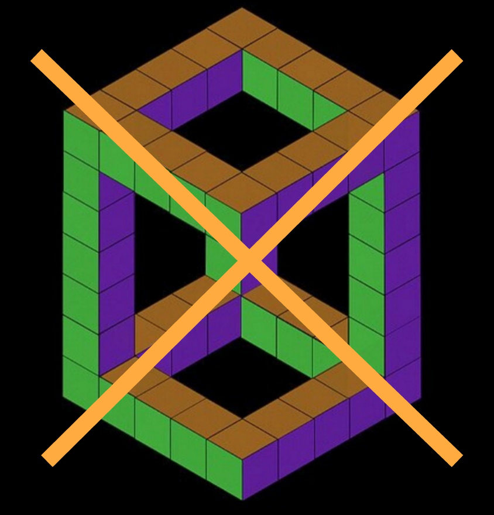
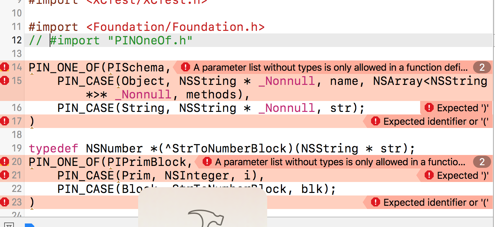

<!-- .slide: data-background="#2aa198" -->
<!-- .slide: data-state="terminal" -->
## Bringing Swift Enums to Objective-C

By <a href="http://bkase.com">Brandon Kase</a> / <a href="https://www.pinterest.com/brandernan/"><i class="fa fa-pinterest" aria-hidden="true"></i>brandernan</a> / <a href="http://twitter.com/bkase_">@bkase_</a>

!!!

### Model mutually exclusive information?


Note: In this case, the homefeed of our app can have pins or users or boards, but one individual item can't be both?

!!!

### Standard Objective-C modelling

```objc
@interface FeedItem : NSObject
```

```objc
@property (nullable, nonatomic, strong) User *user;
@property (nullable, nonatomic, strong) Pin *pin;
```
<!-- .element: class="fragment" data-fragment-index="1" -->

```objc
@end
```

Note: ...and in general we are okay with this. But...

!!!

### Problems with this approach


* Impossible states <!-- .element: class="fragment" data-fragment-index="1" --> *are constructible*
<!-- .element: class="fragment" data-fragment-index="1" -->
* Case analysis is <!-- .element: class="fragment" data-fragment-index="2" --> *not checked for exhaustivity*
<!-- .element: class="fragment" data-fragment-index="2" -->

!!!

### Impossible states are constructible


> https://s-media-cache-ak0.pinimg.com/736x/94/a9/22/94a922f0ad46d8fa583357fa9abb6cbc.jpg

!!!

### FeedItem with no data

```objc
FeedItem *item = [[FeedItem alloc] init];
// oops I forgot to set item.user or item.pin
```

!!!

### FeedItem with too much data

```objc
FeedItem *item = [[FeedItem alloc] init];
item.user = u;
// ...
item.pin = p;
// oops!
```

!!!

### Case analysis is not checked for exhaustivity

(image)

!!!

### Today we handle all the cases

```objc
-(void)render(FeedItem *item) {
```

```objc
  if (item.user) {
    // draw with user
```
<!-- .element: class="fragment" data-fragment-index="1" -->

```objc
  } else if (item.pin) {
    // draw with pin
  }
```
<!-- .element: class="fragment" data-fragment-index="2" -->

```objc
  /* else if { ... etc */
```
<!-- .element: class="fragment" data-fragment-index="3" -->

```objc
}
```

!!!

### Tomorrow we forget

```objc
// add new property
@property (nullable, nonatomic, strong) Board *board;

// don't fix all the usages!
```

!!!

### Problems with this approach

* Impossible states <!-- .element: class="fragment" data-fragment-index="1" --> *are constructible*
<!-- .element: class="fragment" data-fragment-index="1" -->
* Case analysis is <!-- .element: class="fragment" data-fragment-index="2" --> *not checked for exhaustivity*
<!-- .element: class="fragment" data-fragment-index="2" -->

!!!

## Swift Approach

!!!

### How would we do it in Swift?


!!!

### Swift Enums!

```swift
enum FeedItem {
```

```swift
  case user(user: User)
```
<!-- .element: class="fragment" data-fragment-index="1" -->

```swift
  case pin(pin: Pin)
```
<!-- .element: class="fragment" data-fragment-index="2" -->

```swift
}
```

!!!

### Why Swift Enums are good

* Impossible states are impossible <!-- .element: class="fragment" data-fragment-index="1" --> *by construction* <!-- .element: class="fragment" data-fragment-index="1" -->
* <!-- .element: class="fragment" data-fragment-index="2" --> Compiler enforces *exhaustive*  case analysis <!-- .element: class="fragment" data-fragment-index="2" -->

!!!

### Impossible states are impossible by construction



!!!

### User is a user

```swift
let user = .user(data: userData)
```

!!!

### Pin is a pin

```swift
let pin = .pin(data: pinData)
```

!!!

### Mysterious things not possible

```swift
let bothPinAndUser = ???
```

```swift
let neitherPinNorUser = ???
```
<!-- .element: class="fragment" data-fragment-index="1" -->

Note: In other words, your code won't compile if you or your teammates forget some constraint

!!!

### Compiler enforces exhaustive case analysis

(image)

!!!

### Exhaustive case analysis

```swift
func render(item: FeedItem) {
```

```swift
  switch item {
```
<!-- .element: class="fragment" data-fragment-index="1" -->

```swift
    case let .user(userData):
      // draw user
```
<!-- .element: class="fragment" data-fragment-index="2" -->

```swift
    case let .pin(pinData):
      // draw pin
  }
```
<!-- .element: class="fragment" data-fragment-index="3" -->

```swift
  // if you add a new case
  // the compiler will *save* you
```
<!-- .element: class="fragment" data-fragment-index="4" -->

```swift
}
```

!!!

### Why Swift Enums are good

* Impossible states are *impossible by construction*
* Compiler enforces *exhaustive case analysis*

!!!

## Swift Enum - ObjectiveC

!!!

### The aesthetics: ONE_OF

```objc
ONE_OF(FeedItem,
```

```objc
  CASE(Pin, PinData *, pinData)
```
<!-- .element: class="fragment" data-fragment-index="1" -->

```objc
  CASE(User, UserData *, userData /*, … */)
  /* … */
```
<!-- .element: class="fragment" data-fragment-index="2" -->

```objc
)
```

Note: We can make Swift enums! One of either a pin or a user

!!!

### Aesthetics comparison

```swift
// if you squint they look similar
enum FeedItem {
```

```swift
  case pin(PinData)
  case user(UserData)
```
<!-- .element: class="fragment" data-fragment-index="1" -->

```swift
}
```

```objc
// if you squint they look similar
ONE_OF(FeedItem,
```

```objc
  CASE(Pin, PinData *, pinData),
  CASE(User, UserData *, userData)
```
<!-- .element: class="fragment" data-fragment-index="1" -->

```objc
)
```

!!!

## Aside: Macros 101

!!!

### What is an Objective-C macro

Objective-C macros are compiler directives to expand strings *before* your Objective-C code is actually compiled

!!!

### Simple replacement

```objc
#define FOO @"bar"

FOO
```

```objc
// @"bar"
```
<!-- .element: class="fragment" data-fragment-index="1" -->

Note: Replace with a string

!!!

### Macro functions

```objc
#define FOO(x, y) @"x bar y"

FOO(before, after)
```

```objc
// logs "before bar after"
```
<!-- .element: class="fragment" data-fragment-index="1" -->

!!!

### Token Pasting

```objc
#define FOO(x, y) @"x##y"

FOO(before, after);
```

```objc
// @"beforeafter"
```
<!-- .element: class="fragment" data-fragment-index="1" -->

!!!

### Variadic macros

```objc
#define FOO(...) foo BAR(__VA_ARGS__)
#define BAR(a, b, ...) a##b

FOO(1,2,3,4)
```

```objc
// foo 12
```
<!-- .element: class="fragment" data-fragment-index="1" -->

!!!

## Back to our macro

!!!

### Our macro: ONE_OF

```objc
ONE_OF(FeedItem,
  CASE(Pin, PinData *, pinData)
  CASE(User, UserData *, userData /*, … */)
  /* … */
)
```

!!!

### What does this expand to?


!!!

### Requirements for safe modelling

* Impossible states are *impossible by construction*
* Compiler enforces *exhaustive case analysis*

!!!

### Constructor: Interfaces

```objc
// FeedItemUserTag=0 FeedItemPinTag=1
```

```objc
@interface FeedItem : NSObject
```
<!-- .element: class="fragment" data-fragment-index="1" -->

```objc
-(instancetype)initWithTag:(FeedItemTag *)tag;
```
<!-- .element: class="fragment" data-fragment-index="2" -->

```objc
@end
```
<!-- .element: class="fragment" data-fragment-index="1" -->

```objc
@interface FeedItemUser : FeedItem
```
<!-- .element: class="fragment" data-fragment-index="3" -->

```objc
-(instancetype)initWithUserData:(UserData *)userData;
```
<!-- .element: class="fragment" data-fragment-index="4" -->

```objc
@end
```
<!-- .element: class="fragment" data-fragment-index="3" -->

```objc
@interface FeedItemPin : FeedItem
// etc
```
<!-- .element: class="fragment" data-fragment-index="5" -->

Note: inheritance, Omitting namespace for clarity

!!!

### Constructor: Variant Implementation

```objc
@implementation FeedItemUser
```

```objc
-(id)initWithuserData:(UserData *)userData {
```
<!-- .element: class="fragment" data-fragment-index="1" -->

```objc
  FeedItemTag tag = FeedItemUserTag;
  if (self = [super initWithTag: tag]) {
    _userData = userData;
  }
  return self;
```
<!-- .element: class="fragment" data-fragment-index="2" -->


```objc
}
```
<!-- .element: class="fragment" data-fragment-index="1" -->

```objc
@end
```

!!!

### Constructor: Macro view

```objc
CASE(User, UserData *, user)

// -->
```

```objc

@interface FeedItemUser
-(instancetype)initWithUserData:(UserData *)userData;
@end
```
<!-- .element: class="fragment" data-fragment-index="1" -->

Note: FeedItem appears in the output?

!!!

### How do we get FeedItem?

```objc
ONE_OF(FeedItem,
  CASE(User, UserData *, user)
/* ... */
```

!!!

### How do we get Feeditem?


!!!

### Macro: Exhaustive case analysis?

```objc
ONE_OF(FeedItem,
  CASE(Pin, PinData *, pinData)
  CASE(User, UserData *, userData /*, … */)
  /* … */
)
```

!!!

### Match: Interface

```objc
FeedItem<ValueType>
```

```objc
+ (ValueType)matchWith:(FeedItem *)item
```

```objc
                orUser:(ValueType (^)(FeedItemUser *))caseUser
```
<!-- .element: class="fragment" data-fragment-index="1" -->

```objc
                 orPin:(ValueType (^)(FeedItemPin *))casePin;
```
<!-- .element: class="fragment" data-fragment-index="2" -->

!!!

### Match: Usage

```objc
-(void)render(FeedItem *item) {
```

```objc
  [FeedItem match:item
           orUser:^id(FeedItemUser * user){
    // draw user
  }, orPin:^id(FeedItemPin * pin) {
    // draw pin
  }];
  // if we add another case, this will no longer compile
```
<!-- .element: class="fragment" data-fragment-index="1" -->

```objc
}
```

!!!

### Match: Implementation

```objc
+(ValueType)match:(FeedItem *)item
           orUser:(ValueType(^)(FeedItemUser *))caseUser
            orPin:(ValueType(^)(FeedItemPin *))casePin {
```

```objc
  switch (item.tag) {
```
<!-- .element: class="fragment" data-fragment-index="1" -->

```objc
  case UserFeedItemTag:
    return caseUser((FeedItemUser *)item);
  case PinFeedItemTag:
    return casePin((FeedItemPin *)item);
  /* … */
```
<!-- .element: class="fragment" data-fragment-index="2" -->

```objc
  }
```
<!-- .element: class="fragment" data-fragment-index="1" -->

```objc
}
```

!!!

## Open Sourced

Note: We're using it in a few places, but is it perfect...

!!!

## Downsides

!!!

### Downside: Macros can't capitalize

```objc
// Macros can't capitalize
[PinFeedItem initWithpinData:(PinData *)data]
```

!!!

### Downside: Errors are complicated



!!!

## Upside?

!!!

### Aside: Otherwise known-as

* Algebraic Data Types (or ADTs)
* Sum type (or sum of products)

Note: See appendix for more information

!!!

### Case 1: Data is inheritantly mutually exclusive

!!!

### Data: Heterogenous feed


!!!

### Data: Barcodes

```swift
enum Barcode {
```

```swift
case upc(Int, Int, Int, Int)
```
<!-- .element: class="fragment" data-fragment-index="1" -->

```swift
case qr(String)
```
<!-- .element: class="fragment" data-fragment-index="2" -->

```swift
}
```

!!!

### Case 2: Can capture soon-to-be invalid control flow

!!!

### Bad case: Not capturing

```swift
func tableNode(/*...*/, nodeBlockForRowAt indexPath: IndexPath)
      -> ASCellNodeBlock {
```

```swift
  return {
```
<!-- .element: class="fragment" data-fragment-index="1" -->

```swift
    if indexPath.row == 0 {
      return getCellForHeader()
    } else if indexPath.row < 5 {
      return getCellForMid(self.middleItems[indexPath.row-1])
    } else {
      return getCellForLast(self.lastItems[indexPath.row-5])
    }
```
<!-- .element: class="fragment" data-fragment-index="2" -->

```swift
  }
```
<!-- .element: class="fragment" data-fragment-index="1" -->

```swift
}
```

!!!

### Good case: Capturing the data associated with an indexPath

```swift
func tableNode(/*...*/, nodeBlockForRowAt indexPath: IndexPath)
      -> ASCellNodeBlock {
```

```swift
  if indexPath.row == 0 {
    dataForNode = .Header
  } else if indexPath.row < 5 {
    dataForNode = .Mid(self.middleItems[indexPath.row-1])
  } else {
    dataForNode = .Last(self.lastItems[indexPath.row-5])
  }
```
<!-- .element: class="fragment" data-fragment-index="1" -->

```swift
  return {
    switch dataForNode {
    case .Header: return getCellForHeader()
    case let .Mid(item): return getCellForMid(item)
    case let .Last(item): return getCellForLast(item)
    }
  }
```
<!-- .element: class="fragment" data-fragment-index="2" -->

```swift
}
```

Note: In ASDK, we need to extract the model on the UI thread but we don't create the underlying view holder until the background; ADTs let us capture the conditionals so we don't need to check the same things twice

!!!

## One last thought


> https://upload.wikimedia.org/wikipedia/commons/thumb/3/36/Tim_Berners-Lee_in_thought.jpg/683px-Tim_Berners-Lee_in_thought.jpg

Note: I've done this across many languages I've worked with. Go, Kotlin (before kotlin had it), and now Objective-C. If there's one thing you take away from this talk, it's not the macro it's that...

!!!

## Algebraic Data Types are awesome

and you should use them.

!!!

<!-- .slide: data-background="#2aa198" -->
<!-- .slide: data-state="terminal" -->

# Thanks!

By <a href="http://bkase.com">Brandon Kase</a> / <a href="https://www.pinterest.com/brandernan/"><i class="fa fa-pinterest" aria-hidden="true"></i>brandernan</a> / <a href="http://twitter.com/bkase_">@bkase_</a>

Slide Deck: TODO

