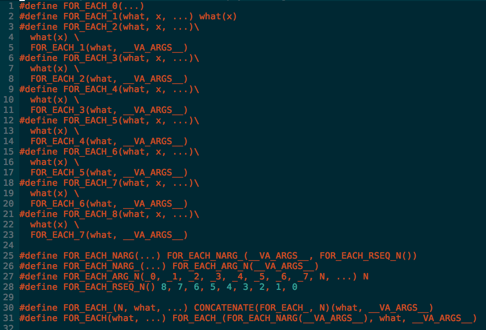

<!-- .slide: data-background="#2aa198" -->
<!-- .slide: data-state="terminal" -->
## Bringing Swift Enums to Objective-C

By <a href="http://bkase.com">Brandon Kase</a> / <a href="https://www.pinterest.com/brandernan/"><i class="fa fa-pinterest" aria-hidden="true"></i>brandernan</a> / <a href="http://twitter.com/bkase_">@bkase_</a>

!!!

### Model mutually exclusive information?


Note: In this case, the homefeed of our app can have pins or users or boards, but one individual item can't be both?

!!!

### Standard Objective-C modelling

```objc
@interface FeedItem
@property (nullable, nonatomic, strong) User *user;
@property (nullable, nonatomic, strong) Pin *pin;
@end
```

Note: ...and in general we are okay with this. But...

!!!

## Problems with this approach

!!!

### Problems with this approach

* Impossible states *are constructible*
* Case analysis is *not checked for exhaustivity*

!!!

### Impossible states are constructible

(image)

!!!

### FeedItem with no data

```objc
FeedItem *item = [[FeedItem alloc] init];
// oops I forgot to set item.user or item.pin
```

!!!

### FeedItem with too much data

```objc
FeedItem *item = [[FeedItem alloc] init];
item.user = u;
// ...
item.pin = p;
// oops!
```

!!!

### Case analysis is not checked for exhaustivity

(image)

!!!

### Today we handle all the cases

```objc
-(void)render(FeedItem *item) {
  if (item.user) {
    // draw with user
  } else if (item.pin) {
    // draw with pin
  } /* else if { ... etc */
}
```

!!!

### Tomorrow we forget

```objc
// add new property
@property (nullable, nonatomic, strong) Board *board;

// don't fix all the usages!
```

!!!

### Problems with this approach

* Impossible states *are constructible*
* Case analysis is *not checked for exhaustivity*

!!!

#### Aside: Immutability doesn't solve the problems (but is still good)

```objc
// public interface
@interface FeedItem
@property (nullable, readonly, nonatomic, strong) User *user;
@property (nullable, readonly, nonatomic, strong) Pin *pin;
@end
// we can do readonly, but we still need nullable!
```

!!!

## Swift Approach

!!!

### How would we do it in Swift?


!!!

### Swift Enums!

```swift
enum FeedItem {
  case user(user: User)
  case pin(pin: Pin)
}
```

!!!

### Why Swift Enums are good

* Impossible states are impossible *by construction*
* Compiler enforces *exhaustive* case analysis

!!!

### Impossible states are impossible by construction

(image)

!!!

### User is a user

```swift
let user = .user(data: userData)
```

!!!

### Pin is a pin

```swift
let pin = .pin(data: pinData)
```

!!!

### Mysterious things not possible

```swift
let bothPinAndUser = ???
let neitherPinNorUser = ???
```

Note: In other words, your code won't compile if you or your teammates forget some constraint

!!!

### Compiler enforces exhaustive case analysis

(image)

!!!

### Exhaustive case analysis

```swift
func render(item: GoodFeedItem) {
  switch item {
    case let .user(userData):
      // draw user
    case let .pin(pinData):
      // draw pin
  }
  // if you add a new case
  // the compiler will *save* you
}
```

!!!

### Why Swift Enums are good

* Impossible states are *impossible by construction*
* Compiler enforces *exhaustive case analysis*

!!!

### How often does this really happen?


!!!

## Swift enums in the real world

!!!

### Aside: Apple didn't invent this

!!!

### Aside: Apple didn't invent this

Other names for this construct:

* Algebraic data types
* Sum-of-products

!!!

### Examples of Algebraic Data Types

(image)

!!!

### Actions on a view-controller (1/3)

```swift
enum Action {
  case longPress(whichButton: ButtonTag)
  case submit(text: String)
  case cancel
}
```

!!!

### Barcode (2/3)

```swift
enum Barcode {
  case upc(Int, Int, Int, Int)
  case qr(String)
}
```

!!!

### Success or failure (3/3)

```swift
enum Result<Value,Error> {
  case Success(Value)
  case Failure(Error)
}
```

!!!

### Intuition about ADTs


> https://upload.wikimedia.org/wikipedia/commons/thumb/1/17/Yin_yang.svg/1200px-Yin_yang.svg.png

Note: Dual to a class with properties, or tuple or struct in swift

!!!

## Safe modelling in Objective-C

!!!

### Requirements for safe modelling

* Impossible states are *impossible by construction*
* Compiler enforces *exhaustive case analysis*

!!!

### Step 1: Impossible states are impossible by construction

* No way to make a Pin and user at the same time
* No way to create some object that has neither a Pin nor a user.

!!!

### Step 1: Impossible states are impossible by construction

```objc
// inheritance and constructor specialization
// UserFeedItemTag=0 PinFeedItemTag=1
@interface FeedItem : NSObject
-(instancetype)initWithTag:(FeedItemTag *)tag;
@end
@interface UserFeedItem
-(FeedItem)initWithUserData:(UserData *)userData;
@end
@interface PinFeedItem // etc
```

Note: Omitting namespace for clarity

!!!

### Step 2: Compiler enforces all cases are handled


> http://www.justingary.com/wp-content/uploads/2016/07/Enforcement.jpg

Note: we can use a method with parameters for each case

!!!

### Step 2: Compiler enforces all cases are handled

```objc
// take 1
- (void)matchCaseUser:(void (^)(UserData *))caseUser
                orPin:(void (^)(PinData *))casePin;
```

!!!

### Step 2: Compiler enforces all cases are handled

```objc
// take 1
-(void)render {
  [feedItem matchCaseUser:^(UserData * userData){
    // draw user
  }, orPin:^(PinData * pin) {
    // draw pin
  }];
  // if we add another case, this will no longer compile
}
```

!!!

### Step 2: Compiler enforces all cases are handled

We can one-up `Swift enums`!

!!!

### Step 2: Compiler enforces all cases are handled

```objc
// take 2
FeedItem<ValueType>
+(ValueType)match:(FeedItem *)item
           orUser:(ValueType (^)(UserData *))caseUser
            orPin:(ValueType (^)(PinData *))casePin;
```

!!!

### Step 2: Compiler enforces all cases are handled

```objc
// take 1
-(NSNumber *)render {
  return [FeedItem<NSNumber *>
     match:item
    orUser:^NSNumber *(UserData *userData){
    // draw user
    return @1
  }, orPin:^NSNumber *(PinData *pin) {
    // draw pin
    return @2
  }];
  // we can return something as long as type
  // is the same in all branches
}
```

!!!

## Why do we need ADTs?

!!!

### This code is not good enough

* Too much boilerplate
* Case analysis not exhaustive everywhere

!!!

### Too much boilerplate


> http://www.myfreewallpapers.net/abstract/wallpapers/code-matrix.jpg

Note: Constrast with...

!!!

### No boilerplate

```objc
// compare to this
@interface FeedItem
@property (nullable, nonatomic, strong) user;
@property (nullable, nonatomic, strong) pin;
@end
// that's it!
```

Note: It's so much easier to do it this way

!!!

### Case analysis not exhaustive everywhere

(image)

!!!

### Implementation of match

```objc
+(ValueType)match:(FeedItem *)item
           orUser:(ValueType(^)(UserData *))caseUser
            orPin:(ValueType(^)(PinData *))casePin {
  switch (item.tag) {
  case UserFeedItemTag:
    return caseUser((UserData *)item);
  case PinFeedItemTag:
    return casePin((PinData *)item);
  /* … */
  }
  // we have the branch tree!
  // We can't forget to update this!
}
```

Note: And we still have the same sort of problem as before to manage this boilerplate

!!!

## Fix: Macros

Note: Macros can manage boilerplate and couple exhaustivity checks

!!!

### Macros can manage boilerplate


> http://www.eylean.com/blog/wp-content/uploads/2014/06/project-manager-multitasking.jpg

!!!

### The macro: ONE_OF

```objc
ONE_OF(FeedItem,
  CASE(Pin, PinData *, pinData)
  CASE(User, UserData *, userData /*, … */)
  /* … */
)
```

Note: We can make Swift enums! One of either a pin or a user

!!!

### Swift enum in Objective-C

```swift
// if you squint they look similar
enum FeedItem {
  case pin(PinData)
  case user(UserData)
}
```

```objc
// if you squint they look similar
ONE_OF(FeedItem,
  CASE(Pin, PinData *, pinData),
  CASE(User, UserData *, userData)
)
```

!!!

### How can we build it?


> http://clipart-library.com/clipart/385426.htm

Note: Let's talk about macros

!!!

## Macros 101

!!!

### Simple replacement

```objc
#define FOO @"bar"

NSLog(FOO); // logs "bar"
```

Note: Replace with a string

!!!

### Macro functions

```objc
#define FOO(x, y) @"x bar y"

NSLog(FOO(before, after));
// logs "before bar after"
```

!!!

### Token Pasting

```objc
#define FOO(x, y) @"x##y"

NSLog(FOO(before, after));
// logs "beforeafter"
```

!!!

### Variadic macros

```objc
#define BAZ(a, b, c, ...) a##b##c
#define BAR(a, b, ...) a##b
#define FOO(...) BAR(__VA_ARGS__) BAZ(__VA_ARGS__)

FOO(1,2,3,4) // replaced with "12 123"
```

!!!

### Building out of nothing


> http://s535395661.websitehome.co.uk/wp-content/uploads/2011/12/San-Fran-Toothpick-Model-41.jpg

Note: This seems like it's not enough

!!!

## Going deeper

!!!

### What do we need?

```objc
ONE_OF(FeedItem,
  CASE(Pin, PinData *, pinData),
  CASE(user, UserData *, userData)
)
```

Note: variadic within the case, variadic across the cases, we need to communicate between the macros

!!!

### What do we need?

1. Variadic within the case
2. Variadic across the cases
3. Send the FeedItem prefix down to the cases
4. Send the case info up to the parent to put in match and constructors

!!!

## Handling the inside of CASE

!!!

### Concatenate

```objc
// This macro lets you x##y but x and/or y
// can be nested macro calls.
#define CONCATENATE(x, y) CONCATENATE1(x, y)
#define CONCATENATE1(x, y) CONCATENATE2(x, y)
#define CONCATENATE2(x, y) x##y
```

> http://stackoverflow.com/questions/1872220/is-it-possible-to-iterate-over-arguments-in-variadic-macros

!!!

### Concatenate

```objc
#define FOO_1(x) hello##x

CONCATENATE(FOO, _1)(world)
// helloworld
```

!!!

### Foreach

```objc
#define PREPEND(x) pre##x

FOR_EACH(PREPEND, a, b, c)
// prea preb prec
```

!!!

### Foreach



!!!

### Foreach

```objc
#define FOR_EACH_0(...)
#define FOR_EACH_1(what, x, ...) what(x)
#define FOR_EACH_2(what, x, ...)\
  what(x) \
  FOR_EACH_1(what, __VA_ARGS__)
#define FOR_EACH_3(what, x, ...)\
  what(x) \
  FOR_EACH_2(what, __VA_ARGS__)
// etc
```

TODO attribute the stack overflow

Note: one of these will be called, and cascades downwards

!!!

### Foreach

```objc
#define FOR_EACH_NARG(...) \
  FOR_EACH_NARG_(__VA_ARGS__, FOR_EACH_RSEQ_N())
#define FOR_EACH_NARG_(...) \
  FOR_EACH_ARG_N(__VA_ARGS__)
#define FOR_EACH_ARG_N(_0, _1, /* … */, _7, N, ...) N
#define FOR_EACH_RSEQ_N() 8, 7, 6, 5, 4, 3, 2, 1, 0
```

Note: NARG will be invoked to select the suffix of the correct spot in the waterfall, the trick is that the numbers push back the others

!!!

### Foreach

```objc
#define ARG_N(_0, _1, _2, _3, N, ...) N
ARG_N(4, 3, 2, 1, 0) // yeilds 0
ARG_N(x, 4, 3, 2, 1, 0) // yeilds 1
ARG_N(x, y, 4, 3, 2, 1, 0) // yeilds 2
```

!!!

### For double each

```objc
CASE(Pin, PinData *, pinData, NSNumber *, otherStuff)
// we want to run a macro on the type and value in a pairs
// FOO(type, value) FOO(type, value)
```

!!!

### For double each

```objc
#define FOR_DOUBLE_EACH_0(...)
#define FOR_DOUBLE_EACH_1(what, x, y, ...) what(x, y)
#define FOR_DOUBLE_EACH_2(what, x, y, ...)\
  what(x, y) \
  FOR_DOUBLE_EACH_1(what, __VA_ARGS__)
```

Note: Similar but we're invoking the inner macro with two params

!!!

### Case is handled

```objc
CASE(Pin, PinData *, pinData, NSNumber *, otherStuff)
```

Note: Now we can run through the type and values and expand that to what we need

!!!

## Passing data upwards

```objc
#define CHILD(a, b) a , b , using##a##b 
#define PARENT(secret, c) RUN (c, secret)
#define RUN(x, y, z, secret) x woo secret y woo z
PARENT(password, CHILD(a, b))
```

Note: we return a list of arguments to be evaulated by another macro

!!!

## Passing data upwards

```objc
// name, (typ, arg)...
// returns:
//    (name, ifaceChunk, implChunk, privateChunk)...
#define CASE(name, typ, var, ...) \
/* … */
```

Note: Case returns it's name so the parent can use it, and a few chunks of code that rely on the knowledge of the parameters inside case

!!!

## Passing data down

We can do this by including an extra parameter inside our `FOR_EACH`

!!!

## Passing data

```objc
// returns:
//    (name, ifaceChunk, implChunk, privateChunk)...
#define CASE(name, typ, var, ...) \
/* … */
#define ONE_OF(prefix, ...) \
```

Note: We pass up 4 things from each case; that means we want to run a macro over groups of 4 things + we need the prefix (a constant)

!!!

## FOR_QUAD_CONST_EACH

```objc
#define ONE_OF(prefix, ...) \
  FOR_QUAD_CONST_EACH(FOO, prefix, __VA_ARGS__) \
  /* … */
```

Note: Invoke ONE_FORWARD_DECLARATION macro with the constant `prefix` parameter over every 4 arguments in va args

!!!

## FOR_QUAD_CONST_EACH

```objc
#define FOR_QUAD_CONST_EACH_0(...)
#define FOR_QUAD_CONST_EACH_1(what, c, x, y, z, w, ...)\
  what(c, x, y, z, w)
#define FOR_QUAD_CONST_EACH_2(what, c, x, y, z, w, ...)\
  what(c, x, y, z, w) \
  FOR_QUAD_CONST_EACH_1(what, c, __VA_ARGS__)

#define FQCE_ARG_N(/* … */, _1, F1, F11, F111, /* … */
#define FQCE_RSEQ_N() 8, 8, 8, 8, 7, 7, 7, 7, 6, 6, 6, 6, /* … */
```

Note: Same story as before

!!!

## Macro

The rest is simple!

!!!

## Downsides

Debugging?

!!!

## Downsides

```objc
// Macros can't capitalize
[PinFeedItem initWithpinData:(PinData *)data]
```

!!!

## Pinterest usage

!!!


