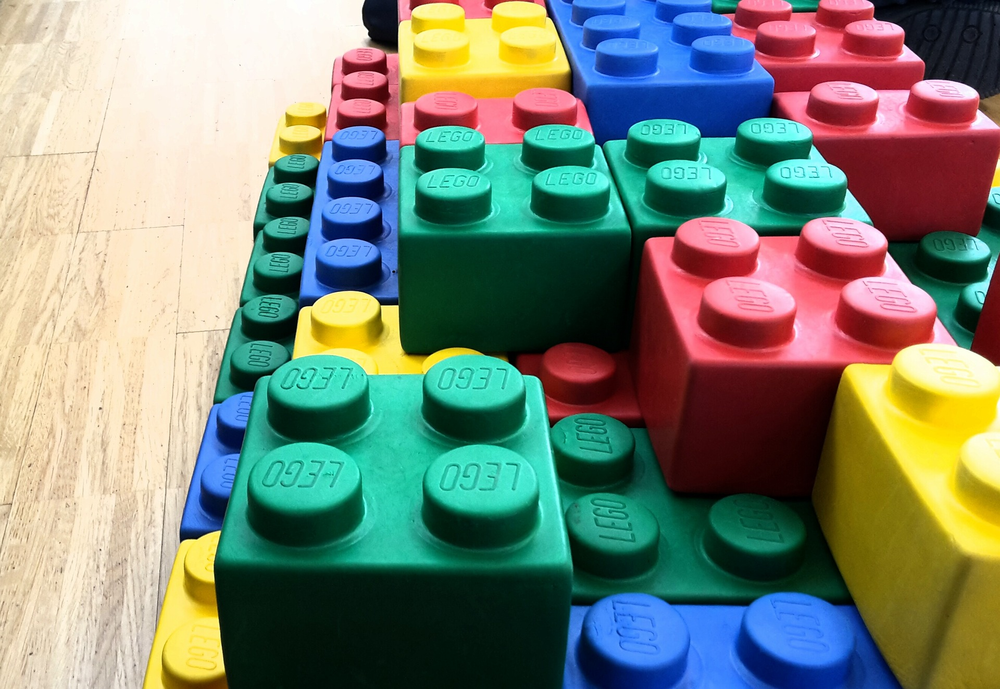

<div class="vidcode">
  <video playsinline autoplay muted loop>
    <source src="vids/title.mp4" type="video/mp4">
  </video>
</div>


!!!

### Natural description

```ideal
let left =
  grow v1 from radius 10 to 100 with an ease-in-out
```

```ideal
let right =
  rotate v2 from 0 to 2*pi degrees with a high ease-out
```
<!-- .element: class="fragment" data-fragment-index="1" -->

```ideal
let animations = left || right
```
<!-- .element: class="fragment" data-fragment-index="2" -->

```ideal
let final = fadeIn all views ; animations
```
<!-- .element: class="fragment" data-fragment-index="3" -->

!!!

### The real code

```swift
let left =
  linear(from: 10, to: 100, in: 2.0).time(easeInOut)
    .do(resize(v1))
```

```swift
let right =
  linear(from: 0, to: 2*CGFloat.pi, in: 2.0).time(easeOut(1.5))
    .do(rotate(v2))
```
<!-- .element: class="fragment" data-fragment-index="1" -->

```swift
let fadeIn =
  linear(from: 0, to: 1, in: 1.0).time(easeInOut)
    .bind(container, with: \.alpha)
```
<!-- .element: class="fragment" data-fragment-index="2" -->

```swift
let animations = left + right
let final = fadeIn * animations
```
<!-- .element: class="fragment" data-fragment-index="3" -->

Note: How would we go about designing a library for this?

!!!

### Uncontroversial Goals

1. Minimize Complexity (Simple)
2. Maximize Expressivity

!!!

### Complexity: How to measure

Complexity increases as public interface primitive count increases

Note: Primitive means a parameters to a function, a new type in the library, a side-effect, hidden mutation. A very simple library has one type and one method with one parameter for example. Yes this can actually be useful, we'll see later.

!!!

### Expressivity: How to measure

Expressivity increases as problem solutions increase

Note: Empower to write clean code in applications. But it's hard to do more things with fewer things...

!!!

### Tradeoff


> created with https://jakevdp.github.io/blog/2012/10/07/xkcd-style-plots-in-matplotlib/

Note: Tradeoff, we want to impact simplicity very trivially and extremely raise expressivity. ; now before we start designing this animation library...

!!!

### Looking at other approaches


> https://www.goodfreephotos.com/albums/people/woman-with-glasses-looking-at-screen.jpg

!!!

### iOS UIView animations

```swift
UIView.animate(withDuration: /* ... */, animate: () -> {
```

```swift
  /* parallel */
  self.button.color = blue
  self.x = 4
```
<!-- .element: class="fragment" data-fragment-index="1" -->

```swift
} {
  /* sequence */
  UIView.animate(withDuration: /* .. */, animate: () -> {
    ...
  }
}
```
<!-- .element: class="fragment" data-fragment-index="2" -->

Note: simple on the surface, but relies too heavily on effects and requires callbacks that don't compose easily for sequencing, hard to choreograph, there is hidden complexity as this function is overloaded like crazy to get all the expressive power you'd want (easing curves etc)

!!!

### Android Animations

<div class="vidcode">
  <video playsinline autoplay muted loop>
    <source src="vids/android_animation.mp4" type="video/mp4">
  </video>
</div>

Note: Has a solution for choreographing animations explicitly in a non-effectful way, but is *very complicated*. Adjusting duration / easing curves are effectful.

!!!

### Composable APIs: Expressive and Simple

Necessary and sufficient

Note: In other words, a way to increase expressiveness without harming simplicity as much

!!!

### Composable Animations



> https://pixabay.com/en/lego-building-blocks-colorful-2285065/

Note: Composable animations let us describe primitives once and then re-use them like lego bricks to make complex reusable layer two primitives.....

!!!

### Okay we want composition... how can we find it in animations


> http://maxpixel.freegreatpicture.com/Face-Female-Girl-Looking-Adult-Isolated-Cute-15814

!!!

### Sequencing animations

<div class="vidcode">
  <video playsinline autoplay muted loop>
    <source src="vids/grow-then-fade.mp4" type="video/mp4">
  </video>
  ```
  grow ; fadeout
  ```
</div>

!!!

### Simultaneous animations

<div class="vidcode">
  <video playsinline autoplay muted loop>
    <source src="vids/fade-grow-parallel.mp4" type="video/mp4">
  </video>
  ```
  grow || fadeout
  ```
</div>

!!!

### Changing time


> https://upload.wikimedia.org/wikipedia/commons/8/88/CSS3_Ease-in-out_timing_function_curve.svg

!!!

### What do we do now?


> http://maxpixel.freegreatpicture.com/Face-Female-Girl-Looking-Adult-Isolated-Cute-15814


Note: You could stop here, and build out a library, if you use purity, you'll already create something better than the other things out there. But we can do better...

!!!

### Math!


> https://upload.wikimedia.org/wikipedia/commons/b/b8/Lots_of_math_symbols_and_numbers.svg


Note: But there's a secret, we can do more thinking up-front; look to mathematics

!!!

### Category Theory?


> https://pixabay.com/p-724096

Note: Category Theory is the obvious place, but I think category theory is hard to comprehend and express in certain languges. There is something more primitive, easier to understand, and possible to instantiate in "every-day" modern languages (like swift) not just Haskell/Scala

!!!

<!-- .slide: data-background="#2aa198" -->
<!-- .slide: data-state="terminal" -->

# Abstract-algebra-driven Design

## Animation in Swift as Semirings

By <a href="http://bkase.com">Brandon Kase</a> / <a href="http://twitter.com/bkase_">@bkase_</a>

!!!

### Binary Operation

```swift
func ;(lhs: A, rhs: A) -> A {
  // implement this for some A
}

// Usage: `x ; y ; z`
```

Note: So general

!!!

### Sequence Animations

<div class="vidcode">
  <video playsinline autoplay muted loop>
    <source src="vids/grow-then-fade.mp4" type="video/mp4">
  </video>
  ```
  grow ; fadeout
  ```
</div>

Note: So general ... We give it meaning using laws

!!!

### Using Laws!


> https://upload.wikimedia.org/wikipedia/commons/b/b7/Law3.jpg

!!!

### Laws?

A law is an _equivalence_ between two programs<br> that should _always be true_

Note: I will show you how laws are the secret that gives us the guide-rails to build an expressive interface without losing simplicity

!!!

## Law 1: Associativity

!!!

### Review from high-school: Associativity

```
(x + y) + z = x + (y + z)
// ex: (1 + 2) + 3 = 1 + (2 + 3)
```

Note: These are equivalent for any x,y,z for integer addition

!!!

### Associativity

```
(x ; y) ; z = x ; (y ; z)
```

Note: On our closed binary operation, we can reason about associativity with this: any x,y,z under some type with the operation `<>`)

!!!

### Associativity

```
/// Law: (x ; y) ; z = x ; (y ; z) (associativity)
protocol Semigroup {
  static func ;(lhs: Self, rhs: Self) -> Self
}
```

!!!

### Sequencing Animations

<div class="vidcode">
  <video playsinline autoplay muted loop>
    <source src="vids/grow-red-fade.mp4" type="video/mp4">
  </video>
  ```
  (grow ; red) ; fade = grow ; (red ; fade)
  ```
</div>

!!!

### Associativity power: Freedom to chunk work

```swift
let moveAndFade = translate ; fade
let all = moveAndFade ; appear
// or
let all = translate ; fade ; appear
```

Note: It's up to the consumers of the API. They get more expressive power!

!!!

### Associativity power: Paralellization is safe

```swift
// work I need to do: x ; y ; z ; w
let a = x ; y // on thread1
let b = z ; w // on thread2
return a ; b
```

Note: Not so important in the animation domain, but very useful for other domains

!!!

## Law 2: Left-right identity

!!!

### Identity

```
empty + x = x
x + empty = x
// ex: 0 + 1 = 1
// ex: 1 + 0 = 1
```

Note: Some element that when combined on the left or right is the same

!!!

### Identity power: Capture conditional effects

```swift
let maybeFadeout = didUserWin ? fadeOut : empty
```

Note: Again this is up to the client to decide if the inlining will make the code cleaner at the client's callsite. More expressive power!

!!!

## Idenity + Semigroup = Monoid

```swift
/// Law: empty ; x = x ; empty = x (identity)
/// and is a Semigroup
/// (x ; y) ; z = x ; (y ; z) (associativity)
protocol Monoid: Semigroup {
  static var empty: Self { get }
}
```

Note: Just extending semigroup with the identity constant

!!!

### Sequence Animations Monoid

<div class="vidcode">
  <video playsinline autoplay muted loop>
    <source src="vids/grow-seq-identity.mp4" type="video/mp4">
  </video>
  ```
  grow ; empty = empty ; grow = grow
  ```
</div>

Note: This is a little tougher, but if we think really carefully, we can make sure to include some notion of duration in our animation primitive

!!!

### Law 3: Annihilation

!!!

### Annihilation

```
x * 0 = 0
0 * x = 0
// ex: 0 * 1 = 0
// ex: 1 * 0 = 0
```

Note: Annihilation erases information

!!!

### Sequencing Animations with Cancel

```swift
.cancelled ; transparent = .cancelled
```

Note: Once you cancel, it's a no-op over sequence

!!!

## Law 4: Commutativity

!!!

### Commutativity

```swift
x + y = y + x
```

!!!

### Commutative Monoid

```swift
/// Law: x ; y = y ; x (commutativity)
/// and the Monoid laws:
/// empty ; x = x ; empty = x (identity)
/// (x ; y) ; z = x ; (y ; z) (asociativity)
protocol CommutativeMonoid: Monoid {}
```

!!!

### Sequencing animations NOT a commutative monoid

<div class="vidcode">
  <video playsinline autoplay muted loop>
    <source src="vids/fade-then-grow.mp4" type="video/mp4">
  </video>
  ```
  fade ; grow != grow ; fade
  ```
</div>


!!!

### Parallel composition?

<div class="vidcode">
  <video playsinline autoplay muted loop>
    <source src="vids/fade-grow-parallel.mp4" type="video/mp4">
  </video>
  ```
  fade || grow = grow || fade
  ```
</div>

Note: This IS commutative, but is it also a monoid?

!!!

### Parallel composition -- semigroup

<div class="vidcode">
  <video playsinline autoplay muted loop>
    <source src="vids/grow-red-fade-par.mp4" type="video/mp4">
  </video>
  ```
  grow || (red || fade) = (grow || red) || fade
  ```
</div>

Note: It's a semigroup

!!!

### Parallel composition -- monoid?

<div class="vidcode">
  <video playsinline autoplay muted loop>
    <source src="vids/grow-par-identity.mp4" type="video/mp4">
  </video>
  ```
  grow || .cancelled = grow || .cancelled = grow
  ```
</div>

Note: What's the identity?

!!!

### Parallel Composition Commutative Monoid


> https://upload.wikimedia.org/wikipedia/commons/3/31/Emojione_1F389.svg

Note: Thus parallel composition does form a commutative monoid

!!!

### More laws


> https://pixabay.com/en/hammer-books-law-court-lawyer-719066/


Note: There are more common laws for a single operation but let's skip that for now ; such as idempotence

!!!

### Consider how sequence interacts with parallel

!!!

### Law 4: Distributivity

!!!

### Distributivity

```
// left
x * (y + z) = x*y + x*z
// right
(y + z) * x = y*x + z*x

// ex: 2 * (3 + 1) = 2*3 + 2*1 = 8
// ex: (3 + 1) * 2 = 3*2 + 1*2 = 8
```

!!!

### Distributivity Power

```
// reduce work!
x*y + x*z = x*(y + z)
// 3 operations vs 2 operations
```

!!!

### Sequence distributes over parallel

<div class="vidcode">
  <video playsinline autoplay muted loop>
    <source src="vids/right-distributive.mp4" type="video/mp4">
  </video>
  ```
  grow ; (red || fade) = (grow ; red) || (grow ; fade)
  ```
</div>

!!!

### Sequence distributes over parallel

<div class="vidcode">
  <video playsinline autoplay muted loop>
    <source src="vids/left-distributive.mp4" type="video/mp4">
  </video>
  ```
  (grow || red) ; fade = (grow ; fade) || (red ; fade)
  ```
</div>

!!!

### Semiring

```swift
// || forms a commutative monoid (empty = 0)
// ; forms a monoid (empty = 1)
// ; distributes over || (left and right)
// 0; annihalates (0 ; x = x ; 0 = 0)
protocol Semiring {
  func ||(lhs: Self, rhs: Self) -> Self
  func ;(lhs: Self, rhs: Self) -> Self
  var zero: Self { get }
  var one: Self { get }
}
```

!!!

### Animations are semirings!

!!!

### Finally, we can think about implementing


> http://maxpixel.freegreatpicture.com/Face-Female-Girl-Looking-Adult-Isolated-Cute-15814

Note: Now we have our abstract model in our head. We know how we want it to behave. Now we can start implementing it.

!!!

### Creativity with guide-rails

Note: I sat down with very smart people and we played around with different representations for a bit until we found one that works

!!!

### What is an animation

A value changing over time

!!!

### Animation at a high-level

```swift
/*
Animation :=
  | Value changing over time AND a non-zero duration
  | A cancelled animation (additive identity)
  | A trivial animation with no duration (multiplicative identity)
*/
```

Note: Remember, we need to keep the duration to get all our laws to work

!!!

### We use the algebra of datatypes and parametricity

```swift
public enum Animation<A> {
```

```swift
  case cancelled
```
<!-- .element: class="fragment" data-fragment-index="1" -->

```swift
  case trivial
```
<!-- .element: class="fragment" data-fragment-index="2" -->

```swift
  case runnable(
    duration: CFAbsoluteTime,
    value: (Progress) -> A)
}
```
<!-- .element: class="fragment" data-fragment-index="3" -->

!!!

### Identities

```swift
  /// A multiplicative identity
  public static var one: Animation {
    return .trivial
  }
```

```swift
  /// An additive identity
  public static var zero: Animation {
    return .cancelled
  }
```
<!-- .element: class="fragment" data-fragment-index="1" -->

!!!

### Sequence composition (mulitiplication)

```swift
static func ;(lhs: Animation, rhs: Animation) -> Animation {
```

```swift
   switch (lhs, rhs) {
   case (.cancelled, _),
          (_, .cancelled):
         return .cancelled
```
<!-- .element: class="fragment" data-fragment-index="1" -->

```swift
   case (.trivial, let x),
        (let x, .trivial):
       return x
   /* ... */
}
```
<!-- .element: class="fragment" data-fragment-index="2" -->

!!!

### Sequence composition (multiplication)

```swift
static func ;(lhs: Animation, rhs: Animation) -> Animation {
    switch (lhs, rhs) {
    /* ... */
    case (._runnable(let duration1, let value1),
      ._runnable(let duration2, let value2)):
```
<!-- .element: class="fragment" data-fragment-index="1" -->

```swift
        let sum = duration1 + duration2
        let ratio = duration1 / sum
```
<!-- .element: class="fragment" data-fragment-index="2" -->

```swift
        return Animation.runnable(duration: sum) { t in
```
<!-- .element: class="fragment" data-fragment-index="3" -->

```swift
            t <= ratio
                ? value1(t / ratio)
                : value2((t - ratio) / (1 - ratio))
        }
    }
}
```
<!-- .element: class="fragment" data-fragment-index="4" -->

!!!

### Parallel Composition

```swift
extension Animation where A: CommutativeSemigroup {
```

```swift
public static func ||(lhs: Animation, rhs: Animation) -> Animation {
```
<!-- .element: class="fragment" data-fragment-index="1" -->

```swift
   switch (lhs, rhs) {
   case (.cancelled, .trivial),
        (.trivial, .cancelled),
        (.trivial, .trivial):
       return .trivial
```
<!-- .element: class="fragment" data-fragment-index="2" -->

```swift
   case (.cancelled, .cancelled):
       return .cancelled
   /* ... */
   }
}
```
<!-- .element: class="fragment" data-fragment-index="3" -->

!!!

### Parallel Composition

```swift
public static func ||(lhs: Animation, rhs: Animation) -> Animation {
    /* ... */
    case (._runnable(let duration1, let value1),
    ._runnable(let duration2, let value2)):
```
<!-- .element: class="fragment" data-fragment-index="1" -->

```swift
        let newDuration = max(duration1, duration2)
```
<!-- .element: class="fragment" data-fragment-index="2" -->

```swift

        return .runnable(duration: newDuration) { t in
            let a1 = value1(min(1, t * newDuration / duration1))
            let a2 = value2(min(1, t * newDuration / duration2))
            return a1 + a2
        }
```
<!-- .element: class="fragment" data-fragment-index="3" -->

```swift
    case (_, ._runnable(let d, let v)),
         (._runnable(let d, let v), _):
        return .runnable(duration:d, value:v)
    }
}
```
<!-- .element: class="fragment" data-fragment-index="4" -->

Note: This is the almost part (the semigroup constraint on the A)

!!!

### Validate laws!


Note: You can use quickcheck for the this, here is a not proof, but something at least

!!!

### Extra bits

```swift
func map<B>(_ f: (A) -> B) -> Animation<B>

```

```swift
func zip<B>(_ other: Animation<B>) -> Animation<(A, B)>
```
<!-- .element: class="fragment" data-fragment-index="1" -->

Note: It turns out we do some category-theoretic composition as well, so we can animate As and Bs

!!!

### Layer2 primitives

```swift
public var reversed: Animation

```

```swift
public var looped: Animation

```
<!-- .element: class="fragment" data-fragment-index="1" -->

```swift
public func delayed(by delay: CFAbsoluteTime) -> Animation

```
<!-- .element: class="fragment" data-fragment-index="2" -->

```swift
public func linear(
    from a: CGFloat,
    to b: CGFloat,
    in duration: CFAbsoluteTime
) -> Animation<CGFloatAverage>
```
<!-- .element: class="fragment" data-fragment-index="3" -->

!!!

### Layer3 primitives

```swift
public static var fadeOut: Animation

```

```swift
public static var translate: Animation

```
<!-- .element: class="fragment" data-fragment-index="1" -->

```swift
public static var rotate: Animation

```
<!-- .element: class="fragment" data-fragment-index="2" -->

!!!

### API Consumers are empowered

<div class="vidcode">
  <video playsinline autoplay muted loop style="width:60%;">
    <source src="vids/actors.mp4" type="video/mp4">
  </video>
  ```
  scene = .times(/*...*/, .plus(/*...*/))
  ```
</div>

!!!

### Scene

```swift
struct Scene {
  let fragments : FreeSemiring<SceneFragment>
  let actors : [UIView]
}
```

```swift
struct SceneFragment {
  let name : String
  let animation : Animation<Unit>
}
```
<!-- .element: class="fragment" data-fragment-index="1" -->

Note: Mostly drawing logic using iOS UIViews, the actual timeline calculations is a 15line recursive function!

!!!

### Secret Sauce

```swift
func intervals(_ frags: FreeSemiring<SceneFragment>)
  -> [(String, Double, Double)]
```

!!!

### Scenes

<div class="vidcode">
  <video playsinline autoplay muted loop style="width:60%;">
    <source src="vids/actors.mp4" type="video/mp4">
  </video>
  ```
  scene = .times(/*...*/, .plus(/*...*/))
  ```
</div>

!!!

### Take-away

* <!-- .element: class="fragment" data-fragment-index="1" --> API design is about maximizing simplicity and expressivity
<!-- .element: class="fragment" data-fragment-index="1" -->
* <!-- .element: class="fragment" data-fragment-index="2" --> Composable APIs maximize these properties
<!-- .element: class="fragment" data-fragment-index="2" -->
* <!-- .element: class="fragment" data-fragment-index="3" --> We can find composition in animations
<!-- .element: class="fragment" data-fragment-index="3" -->
* <!-- .element: class="fragment" data-fragment-index="4" --> Don't stop at composition. More laws = More expressivity
<!-- .element: class="fragment" data-fragment-index="4" -->
* <!-- .element: class="fragment" data-fragment-index="5" --> These libraries empower API consumers to do amazing things!
<!-- .element: class="fragment" data-fragment-index="5" -->

!!!

<!-- .slide: data-background="#2aa198" -->
<!-- .slide: data-state="terminal" -->

# Thanks!

By <a href="http://bkase.com">Brandon Kase</a> / <a href="http://twitter.com/bkase_">@bkase_</a> 

Slide Deck: [https://is.gd/Qv7rC6](https://is.gd/Qv7rC6)

!!!

## Appendix

!!!

## The interval function

```swift
    private static func intervals(_ frags: FreeSemiring<SceneFragment>) -> [(String, Double, Double)] {

        func helper(_ a: FreeSemiring<SceneFragment>, _ currDuration: CFAbsoluteTime, _ build: [(String, CFAbsoluteTime, CFAbsoluteTime)]) -> [(String, CFAbsoluteTime, CFAbsoluteTime)] {
            switch a {
            case ._one: return build
            case ._zero: return []
            case .single(let a): return build + [(a.name, currDuration, currDuration+a.animation.duration)]
            case .plus(let l, let r):
                let lBuild = helper(l, currDuration, build)
                return helper(r, currDuration, lBuild)
            case .times(let l, let r):
                let lBuild = helper(l, currDuration, build)
                let next = longestTime(lBuild)
                return helper(r, currDuration+next, lBuild)
            }
        }

        return helper(frags, 0, [])
    }
```


