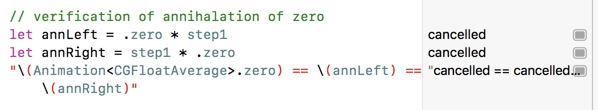

<!-- .slide: data-background="#2aa198" -->
<!-- .slide: data-state="terminal" -->

# Algebraic Animations

By <a href="http://bkase.com">Brandon Kase</a> / <a href="http://twitter.com/bkase_">@bkase_</a>

!!!

### Animations are important


> https://pixabay.com/en/important-stamp-imprint-1705212/

Note: Delightful animations make your users happy, and it makes your app standout.

!!!

### Principled Animations more important


> https://pixabay.com/en/hammer-books-law-court-lawyer-719066/

Note: Being consistent is extremely important. Large organizations even build out an official design language: these are the colors you should use, these are the curves, etc. All buttons should do the following...

!!!

### Let's try it

<div class="vidcode">
  <video playsinline autoplay muted loop>
    <source src="vids/basic.mp4" type="video/mp4">
  </video>
</div>

Note: A very simple animation. Break it down.

!!!

### Natural description

```ideal
let left =
  shrink circle from radius 100 to 10 with an ease-in-out
```

```ideal
let right =
  rotate square from 0 to 2*pi degrees with a high ease-out
```
<!-- .element: class="fragment" data-fragment-index="1" -->

```ideal
let animations = (left + right) looped once
```
<!-- .element: class="fragment" data-fragment-index="2" -->

```ideal
let final = fadeIn all views * animations
```
<!-- .element: class="fragment" data-fragment-index="3" -->

!!!

### Why this description

* <!-- .element: class="fragment" data-fragment-index="1" --> Think about pieces separately
<!-- .element: class="fragment" data-fragment-index="1" -->
* <!-- .element: class="fragment" data-fragment-index="2" --> Combine the pieces later to build more complex things
<!-- .element: class="fragment" data-fragment-index="2" -->
* <!-- .element: class="fragment" data-fragment-index="3" --> Scales <!-- .element: class="fragment" data-fragment-index="3" -->
* <!-- .element: class="fragment" data-fragment-index="4" --> Video: [Beyond Types in Swift](https://www.youtube.com/watch?v=6z9QjDUKkCs) <!-- .element: class="fragment" data-fragment-index="4" -->

Note: I hope you can see that this approach lets you scale. Scale in terms of people touching the code, scale in terms of power and complexity of output without hurting simplicity of code.

!!!

### Natural description

```ideal
let left =
  shrink circle from radius 100 to 10 with an ease-in-out

let right =
  rotate square from 0 to 2*pi degrees with a high ease-out

let animations = (left + right) looped once

let final = fadeIn all views * animations
```

Note: Once again

!!!

### Simple Animation

<div class="vidcode">
  <video playsinline autoplay muted loop>
    <source src="vids/basic.mp4" type="video/mp4">
  </video>
</div>

Note: A very simple animation. Break it down.

!!!

### Should be easy


> http://maxpixel.freegreatpicture.com/Face-Female-Girl-Looking-Adult-Isolated-Cute-15814

!!!

### Idiomatic iOS Approach


> https://www.goodfreephotos.com/albums/people/woman-with-glasses-looking-at-screen.jpg

Note: UIView.animate

!!!

### Left (description)

```ideal
let left =
  shrink circle from radius 100 to 10 with an ease-in-out
```

!!!

### Left (code)

```swift
func left(_ v: UIView) {
```
<!-- .element: class="fragment" data-fragment-index="3" -->

```swift
  UIView.animate(
```

```swift
    withDuration: 2.0,
    delay:0,
    options:.curveEaseInOut,
```
<!-- .element: class="fragment" data-fragment-index="1" -->

```swift
    animations: {
    resize(v, to: 10)
  }, completion: nil)
```
<!-- .element: class="fragment" data-fragment-index="2" -->

```swift
}
```
<!-- .element: class="fragment" data-fragment-index="3" -->

Note: But this code isn't quite right: we need a function; This code isn't quite right...

!!!

### Left (code)

```swift
func left(_ v: UIView, completion: (() -> ())?) {
  UIView.animate(
    withDuration: 2.0,
    delay:0,
    options:.curveEaseInOut,
    animations: {
    resize(v, to: 10)
  }, completion: completion)
}
```

!!!

### Right (description)

```ideal
let right =
  rotate square from 0 to 2*pi degrees with a high ease-out
```

!!!

### Right (code)

```swift
func right(_ v: UIView, completion: (() -> ())?) {
```

```swift
  let timingFunction = CAMediaTimingFunction(controlPoints: 0, 0, 0.2, 1.0)

  CATransaction.begin()
  CATransaction.setAnimationTimingFunction(timingFunction)
```
<!-- .element: class="fragment" data-fragment-index="3" -->

```swift
  UIView.animate(
    withDuration: 2.0,
    delay:0,
    options:.curveEaseOut,
```
<!-- .element: class="fragment" data-fragment-index="1" -->

```swift
    animations: {
    rotate(v, to: 2*CGFloat.pi)
  }, completion: completion)
```
<!-- .element: class="fragment" data-fragment-index="2" -->

```swift
  CATransaction.commit()
```
<!-- .element: class="fragment" data-fragment-index="3" -->

```swift
}
```

Note: But: We want a particular easeOut curve... Wait a minute! Side-effects, global state changes, we haven't even tried to combine these yet! To reiterate:

!!!

### Parallel composition

<div class="vidcode">
  <video playsinline autoplay muted loop>
    <source src="vids/fade-grow-parallel.mp4" type="video/mp4">
  </video>
  ```
  grow + fadeout
  ```
</div>

!!!

### Parallel animations with UIView.animate

```swift
UIView.animate(/*...*/ {
  self.alpha = 1.0
  self.backgroundColor = .green
} /*...*/)
```

Note: This is what they tell you

!!!

### Parallel composition (description)

```ideal
let animations = (left + right) looped
```

!!!

### Parallel composition (code)

```swift
UIView.animate(/*...*/ {
  left(?)
  right(?)
} /*...*/)
```

Note: This completely doesn't work

!!!

### Parallel composition (code)

```swift
func animations(completion: (() -> ())?) {
```

```swift
  left(circle, completion: nil)
```
<!-- .element: class="fragment" data-fragment-index="1" -->

```swift
  right(square, completion: completion)
}
```
<!-- .element: class="fragment" data-fragment-index="2" -->

Note: We had to know apriori which completion fires second, otherwise this would get really messy. Doesn't handle the looping

!!!

### Stuck


> https://c1.staticflickr.com/2/1618/26663431642_3ee25eb693_b.jpg

Note: We can't do the looping because we can't inspect or manipulate the animations, they're trapped in a function.

!!!

### Sequential composition

<div class="vidcode">
  <video playsinline autoplay muted loop>
    <source src="vids/grow-then-fade.mp4" type="video/mp4">
  </video>
  ```
  grow * fadeout
  ```
</div>

!!!

### Sequential composition (description)

```ideal
let final = fadeIn all views * animations
```

!!!

### Sequential composition (code)

```swift
func final() {
  fadeInAll {
    animations(completion: nil)
  }
}
```

!!!

### Keyframes

```swift
UIView.animateKeyframes(/*...*/, animations: {
```

```swift
    UIView.addKeyframe(
      withRelativeStartTime: 0,
      relativeDuration: 0.5,
      animations: {
      /* put your properties here */
      })
```
<!-- .element: class="fragment" data-fragment-index="1" -->

```swift
    UIView.addKeyframe(
      withRelativeStartTime: 0.5,
      relativeDuration: 0.5,
      animations: {
      /* put your properties here */
      })
}, completion: nil)
```
<!-- .element: class="fragment" data-fragment-index="2" -->

Note: To be fair, I want to call out that you could use keyframes as well; but (1) you have to keep track of relative timing in your head and (2) you can't nest keyframes, so it's not really much better for composability.

!!!

### Simple Animation?

<div class="vidcode">
  <video playsinline autoplay muted loop>
    <source src="vids/basic.mp4" type="video/mp4">
  </video>
</div>

Note: Shouldn't this be simpler?

!!!

### UIView.animate Problems

* <!-- .element: class="fragment" data-fragment-index="1" --> Side-effects <!-- .element: class="fragment" data-fragment-index="1" -->
* <!-- .element: class="fragment" data-fragment-index="2" --> Callback-based sequencing (leads to right-indentation hell) <!-- .element: class="fragment" data-fragment-index="2" -->
* <!-- .element: class="fragment" data-fragment-index="3" --> Animations aren't values, can't manipulate them <!-- .element: class="fragment" data-fragment-index="3" -->

!!!

### Core Animation


> https://pixabay.com/p-724096

Note: More advanced, the implied tradeoff "power" vs "easy" (I say we can have both), but maybe the workarounds we had to do made the easy thing unneccesarily more confusing

!!!

### Left (description)

```ideal
let left =
  shrink circle from radius 100 to 10 with an ease-in-out
```

!!!

### Left (code)

```swift
let a = CABasicAnimation(keyPath: "transform.scale")
```

```swift
a.timingFunction = CAMediaTimingFunction(name: kCAMediaTimingFunctionEaseInOut)
```
<!-- .element: class="fragment" data-fragment-index="1" -->

```swift
a.fromValue = 100
a.toValue = 10
a.duration = 2.0
```
<!-- .element: class="fragment" data-fragment-index="2" -->

```swift
a.fillMode = kCAFillModeForwards
// Note: You have to set this also
a.isRemovedOnCompletion = false
```
<!-- .element: class="fragment" data-fragment-index="3" -->

```swift
circle.layer.add(a, forKey: nil)
```
<!-- .element: class="fragment" data-fragment-index="4" -->

Note: Animations are values now, but at what cost!

!!!

### Right

Omitted for brevity

!!!

### Parallel composition

```swift
func parallel(a1: CAAnimation, a2: CAAnimation) -> CAAnimation {
  fatalError("?")
}
```

!!!

### Parallel composition (description)

```ideal
let animations = (left + right) looped
```

!!!

### Parallel

```swift
func animations() {
  left.autoreverses = true
  circle.layer.add(left, forKey: nil)

  right.autoreverses = true
  square.layer.add(right, forKey: nil)
}
```

Note: Back to side-effect land; (1) we destructively modify left/right (2) we can't say that the composition as a whole loops, we have dig down.

!!!

### Sequential Composition

!!!

### Sequential composition (description)

```ideal
let final = fadeIn all views * animations
```

!!!

### Sequential composition (code)

```swift
let final = CAAnimationGroup()
```

```swift
final.animations = [fadeInAll, animations]
```
<!-- .element: class="fragment" data-fragment-index="1" -->

```swift
final.duration = 4
```
<!-- .element: class="fragment" data-fragment-index="2" -->

Note: (1) assume `animations` is actually a CAAnimation (2) duration has to be manually calculated (3) curves being set overwrite the children's. AND this doesn't even work because the layers are different.

!!!

### Sequential composition (code)

```swift
func final() {
  left.beginTime = CACurrentMediaTime() + fadeInAll.duration
  right.beginTime = CACurrentMediaTime() + fadeInAll.duration
```

```swift
  [circle, square].forEach{ v in v.layer.add(fadeIn) }
```
<!-- .element: class="fragment" data-fragment-index="1" -->

```swift
  animations()
}
```
<!-- .element: class="fragment" data-fragment-index="2" -->

Note: (1) side effects :(, cannot compose sequentially, need to reach in to the underlying animations

!!!

### Core Animation Problems

* <!-- .element: class="fragment" data-fragment-index="1" --> Side-effects / hidden state <!-- .element: class="fragment" data-fragment-index="1" -->
* <!-- .element: class="fragment" data-fragment-index="2" --> Composition is adhoc <!-- .element: class="fragment" data-fragment-index="2" -->
* <!-- .element: class="fragment" data-fragment-index="3" --> Poor reuse <!-- .element: class="fragment" data-fragment-index="3" -->

Note: (1) Animations are values? Sort of, but not really (2) Poor reuse BOTH through destructive modification of animations when combining, and adhoc side-effecty composition.

!!!

### Simple Animation?

<div class="vidcode">
  <video playsinline autoplay muted loop>
    <source src="vids/basic.mp4" type="video/mp4">
  </video>
</div>

Note: Shouldn't this be simpler?

!!!

### Left (description)

```ideal
let left =
  shrink circle from radius 100 to 10 with an ease-in-out
```

!!!

### Left (code)

```swift
let left =
  linear(from: 100, to: 10, in: 2.0).time(easeInOut)
    .do(resize(circle))
```

!!!

### Right (description)

```ideal
let right =
  rotate square from 0 to 2*pi degrees with a high ease-out
```

!!!

### Right (code)

```swift
let right =
  linear(from: 0, to: 2*CGFloat.pi, in: 2.0).time(easeOut(1.5))
    .do(rotate(square))
```

!!!

### FadeIn (description)

```ideal
fadeIn all views
```

!!!

### FadeIn (code)

```swift
let fadeIn =
  linear(from: 0, to: 1, in: 1.0).time(easeInOut)
    .bind(container, with: \.alpha)
```

!!!

### Parallel Composition (description)

```ideal
let animations = (left + right) looped once
```

!!!

### Parallel Composition (code)

```swift
let animations = (left + right).looped
```

Note: Not a typo, this is the code

!!!

### Sequential Composition (description)

```ideal
let final = fadeIn * animations
```

!!!

### Sequential Composition (code)

```swift
let final = fadeIn * animations
```

Note: Literally the same

!!!

### All the code

```swift
let left =
  linear(from: 100, to: 10, in: 2.0).time(easeInOut)
    .do(resize(circle))
```

```swift
let right =
  linear(from: 0, to: 2*CGFloat.pi, in: 2.0).time(easeOut(1.5))
    .do(rotate(square))
```

```swift
let fadeIn =
  linear(from: 0, to: 1, in: 1.0).time(easeInOut)
    .bind(container, with: \.alpha)
```

```swift
let animations = left + right
let final = fadeIn * animations
```

!!!

### Benefits

* <!-- .element: class="fragment" data-fragment-index="1" --> Animations are values <!-- .element: class="fragment" data-fragment-index="1" -->
* <!-- .element: class="fragment" data-fragment-index="2" --> Animations compose cleanly <!-- .element: class="fragment" data-fragment-index="2" -->
* <!-- .element: class="fragment" data-fragment-index="3" --> Rich algebraic structure <!-- .element: class="fragment" data-fragment-index="3" -->

Note: Let me speak a bit about it

!!!

### Library Design


> https://pixabay.com/en/lego-building-blocks-colorful-2285065/

Note: I was more informal about it earlier, but I believe it's important to think about the composition first. In this case, sequence/parallel, think about the algebraic properties of the composition, then think about the concrete representations. This is what I call...

!!!

### Algebra-driven design

Vid: [Beyond Types in Swift](https://www.youtube.com/watch?v=6z9QjDUKkCs)

!!!

### Algebraic laws


> https://upload.wikimedia.org/wikipedia/commons/b/b7/Law3.jpg

Note: We're going to blast through this, ready?

!!!

### Sequence Semigroup (associative)

<div class="vidcode">
  <video playsinline autoplay muted loop>
    <source src="vids/grow-red-fade.mp4" type="video/mp4">
  </video>
  ```
  (grow * red) * fade = grow * (red * fade)
  ```
</div>

!!!

### Sequence Monoid (identity)

<div class="vidcode">
  <video playsinline autoplay muted loop>
    <source src="vids/grow-seq-identity.mp4" type="video/mp4">
  </video>
  ```
  grow * empty = empty * grow = grow
  ```
</div>

Note: Identity property

!!!

### Sequence Cancellation (annihilation)

```swift
.cancelled * anything = .cancelled
```

!!!

### Parallel Semigroup (associtivity)

<div class="vidcode">
  <video playsinline autoplay muted loop>
    <source src="vids/grow-red-fade-par.mp4" type="video/mp4">
  </video>
  ```
  grow + (red + fade) = (grow + red) + fade
  ```
</div>

!!!

### Parallel Monoid (identity)

<div class="vidcode">
  <video playsinline autoplay muted loop>
    <source src="vids/grow-par-identity.mp4" type="video/mp4">
  </video>
  ```
  grow + .cancelled = .cancelled + grow = grow
  ```
</div>

!!!

### Parallel Commutative Monoid

<div class="vidcode">
  <video playsinline autoplay muted loop>
    <source src="vids/fade-grow-parallel.mp4" type="video/mp4">
  </video>
  ```
  fade + grow = grow + fade
  ```
</div>

!!!

### Sequence Distributes over Parallel

<div class="vidcode">
  <video playsinline autoplay muted loop>
    <source src="vids/right-distributive.mp4" type="video/mp4">
  </video>
  ```
  grow * (red + fade) = (grow * red) + (grow * fade)
  ```
</div>

Note: It does so on the left and right

!!!

### Semiring

```swift
// + forms a commutative monoid (empty = 0)
// * forms a monoid (empty = 1)
// * distributes over + (left and right)
// 0* annihalates (0 * x = x * 0 = 0)
protocol Semiring {
  func +(lhs: Self, rhs: Self) -> Self
  func *(lhs: Self, rhs: Self) -> Self
  var zero: Self { get }
  var one: Self { get }
}
```

Note: Now we just need to find a value with which we can implement this protocol

!!!

### Creativity with guide-rails

Note: Now we know what it must do, not how it must be formed. I sat down with very smart people...

!!!

### What is an animation

A value changing over time

!!!

### Animation at a high-level

```swift
/*
Animation :=
  | Value changing over time AND a non-zero duration
  | A cancelled animation (additive identity)
  | A trivial animation with no duration (multiplicative identity)
*/
```

Note: Remember, we need to keep the duration to get all our laws to work

!!!

### We use the algebra of datatypes and parametricity

```swift
public enum Animation<A> {
```

```swift
  case cancelled
```
<!-- .element: class="fragment" data-fragment-index="1" -->

```swift
  case trivial
```
<!-- .element: class="fragment" data-fragment-index="2" -->

```swift
  case runnable(
    duration: CFAbsoluteTime,
    value: (Progress) -> A)
}
```
<!-- .element: class="fragment" data-fragment-index="3" -->

Note: We can drive the animation with CADisplayLink (see the library code), we can drive the animation using a touch gesture, we can drive the animation one frame at a time to generate an mp4 video to embed in a presentation

!!!

### Animation Semiring

```swift
protocol Semiring {
  var one: Self { get }
  var zero: Self { get }
  func *(lhs: Self, rhs: Self) -> Self
  func +(lhs: Self, rhs: Self) -> Self
}

```

```swift
extension Animation : Semiring
```
<!-- .element: class="fragment" data-fragment-index="1" -->

Note: Boom, then we just implement it

!!!

### Identities

```swift
  /// A multiplicative identity
  public static var one: Animation {
    return .trivial
  }
```

```swift
  /// An additive identity
  public static var zero: Animation {
    return .cancelled
  }
```
<!-- .element: class="fragment" data-fragment-index="1" -->

!!!

### Sequence composition (mulitiplication)

```swift
static func *(lhs: Animation, rhs: Animation) -> Animation {
```

```swift
   switch (lhs, rhs) {
   case (.cancelled, _),
          (_, .cancelled):
         return .cancelled
```
<!-- .element: class="fragment" data-fragment-index="1" -->

```swift
   case (.trivial, let x),
        (let x, .trivial):
       return x
   /* ... */
}
```
<!-- .element: class="fragment" data-fragment-index="2" -->

!!!

### Sequence composition (multiplication)

```swift
static func *(lhs: Animation, rhs: Animation) -> Animation {
    switch (lhs, rhs) {
    /* ... */
    case (._runnable(let duration1, let value1),
      ._runnable(let duration2, let value2)):
```

```swift
        let sum = duration1 + duration2
        let ratio = duration1 / sum
```
<!-- .element: class="fragment" data-fragment-index="2" -->

```swift
        return Animation.runnable(duration: sum) { t in
```
<!-- .element: class="fragment" data-fragment-index="3" -->

```swift
            t <= ratio
                ? value1(t / ratio)
                : value2((t - ratio) / (1 - ratio))
        }
    }
}
```
<!-- .element: class="fragment" data-fragment-index="4" -->

Note: SWIFTISM: Recall that we have this trailing closure syntax. This function is part of the .runnable constructor

!!!

### Parallel Composition

```swift
extension Animation where A: CommutativeSemigroup {
```

```swift
public static func +(lhs: Animation, rhs: Animation) -> Animation {
```
<!-- .element: class="fragment" data-fragment-index="1" -->

```swift
   switch (lhs, rhs) {
   case (.cancelled, .trivial),
        (.trivial, .cancelled),
        (.trivial, .trivial):
       return .trivial
```
<!-- .element: class="fragment" data-fragment-index="2" -->

```swift
   case (.cancelled, .cancelled):
       return .cancelled
   /* ... */
   }
}
```
<!-- .element: class="fragment" data-fragment-index="3" -->

!!!

### Parallel Composition

```swift
public static func +(lhs: Animation, rhs: Animation) -> Animation {
    /* ... */
    case (._runnable(let duration1, let value1),
    ._runnable(let duration2, let value2)):
```

```swift
        let newDuration = max(duration1, duration2)
```
<!-- .element: class="fragment" data-fragment-index="2" -->

```swift

        return .runnable(duration: newDuration) { t in
            let a1 = value1(min(1, t * newDuration / duration1))
            let a2 = value2(min(1, t * newDuration / duration2))
            return a1 <> a2
        }
```
<!-- .element: class="fragment" data-fragment-index="3" -->

```swift
    case (_, ._runnable(let d, let v)),
         (._runnable(let d, let v), _):
        return .runnable(duration:d, value:v)
    }
}
```
<!-- .element: class="fragment" data-fragment-index="4" -->

Note: This is the almost part (the semigroup constraint on the A)

!!!

### Validate laws!



Note: You can use quickcheck for the this, here is a not proof, but something at least.. Some extra bits

!!!

### Map

<div class="vidcode">
  <video playsinline autoplay muted loop style="width:60%;">
    <source src="vids/map.mp4" type="video/mp4">
  </video>
  ```
  nums.map{x in setRadius(x)}
  ```
</div>

Note: That's what I call the core

!!!

### Combinator layer 2

```swift
public var reversed: Animation

```

```swift
public var looped: Animation

```
<!-- .element: class="fragment" data-fragment-index="1" -->

```swift
public func delayed(by delay: CFAbsoluteTime) -> Animation

```
<!-- .element: class="fragment" data-fragment-index="2" -->

```swift
public static func linear(
    from a: CGFloat,
    to b: CGFloat,
    in duration: CFAbsoluteTime
) -> Animation<CGFloatAverage>
```
<!-- .element: class="fragment" data-fragment-index="3" -->

!!!

### Combinator layer 3

```swift
public static var fadeOut: Animation

```

```swift
public static var translate: Animation

```
<!-- .element: class="fragment" data-fragment-index="1" -->

```swift
public static var rotate: Animation

```
<!-- .element: class="fragment" data-fragment-index="2" -->

!!!

### API Consumers are empowered

<div class="vidcode">
  <video playsinline autoplay muted loop style="width:60%;">
    <source src="vids/actors.mp4" type="video/mp4">
  </video>
  ```
  scene = .times(/*...*/, .plus(/*...*/))
  ```
</div>

!!!

### Secret Sauce

```swift
func intervals(/*...*/) -> [(String, Double, Double)]
```

Note: Think of "FreeSemiring" as: taking advantage of the algebraic structure of animations to analyze a big animation before evaluating it

!!!

### Scenes

<div class="vidcode">
  <video playsinline autoplay muted loop style="width:60%;">
    <source src="vids/actors.mp4" type="video/mp4">
  </video>
  ```
  scene = .times(/*...*/, .plus(/*...*/))
  ```
</div>

!!!

### Take-away

* <!-- .element: class="fragment" data-fragment-index="1" --> Solving problems by composing small independant pieces is natural and scalable
<!-- .element: class="fragment" data-fragment-index="1" -->
* <!-- .element: class="fragment" data-fragment-index="2" --> Both UIView.animate and Core Animation do not let us compose animations
<!-- .element: class="fragment" data-fragment-index="2" -->
* <!-- .element: class="fragment" data-fragment-index="3" --> We can do better if look towards algebra
<!-- .element: class="fragment" data-fragment-index="3" -->
* <!-- .element: class="fragment" data-fragment-index="4" --> These libraries empower API consumers to do amazing things!
<!-- .element: class="fragment" data-fragment-index="4" -->

Note: 5. Remember the layers

!!!

<!-- .slide: data-background="#2aa198" -->
<!-- .slide: data-state="terminal" -->

# Thanks!

By <a href="http://bkase.com">Brandon Kase</a> / <a href="http://twitter.com/bkase_">@bkase_</a> 

Library: [https://github.com/bkase/swift-fp-animations](https://github.com/bkase/swift-fp-animations)

Slide Deck: [https://is.gd/EijJ6k](https://is.gd/EijJ6k)

!!!

## Appendix

!!!

## The interval function

```swift
    private static func intervals(_ frags: FreeSemiring<SceneFragment>) -> [(String, Double, Double)] {

        func helper(_ a: FreeSemiring<SceneFragment>, _ currDuration: CFAbsoluteTime, _ build: [(String, CFAbsoluteTime, CFAbsoluteTime)]) -> [(String, CFAbsoluteTime, CFAbsoluteTime)] {
            switch a {
            case ._one: return build
            case ._zero: return []
            case .single(let a): return build + [(a.name, currDuration, currDuration+a.animation.duration)]
            case .plus(let l, let r):
                let lBuild = helper(l, currDuration, build)
                return helper(r, currDuration, lBuild)
            case .times(let l, let r):
                let lBuild = helper(l, currDuration, build)
                let next = longestTime(lBuild)
                return helper(r, currDuration+next, lBuild)
            }
        }

        return helper(frags, 0, [])
    }
```

