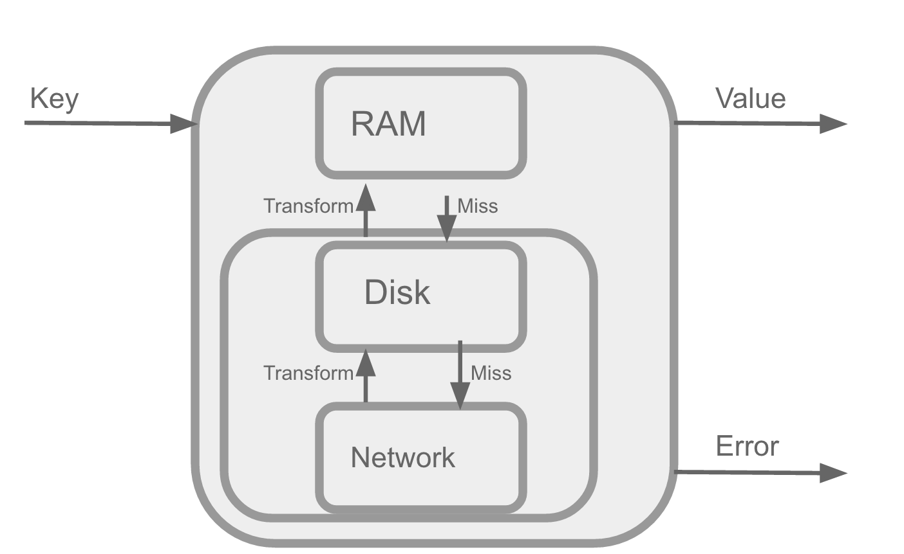
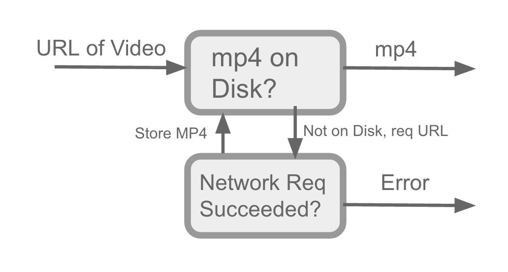
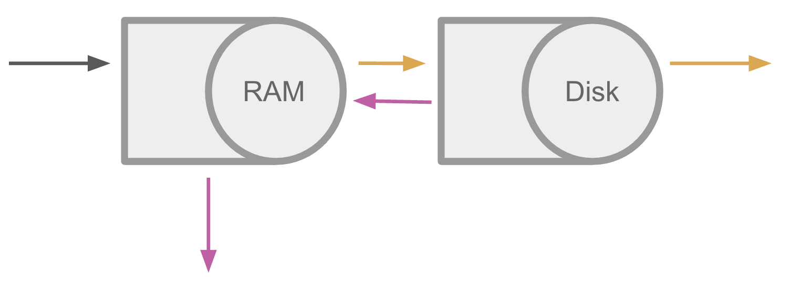
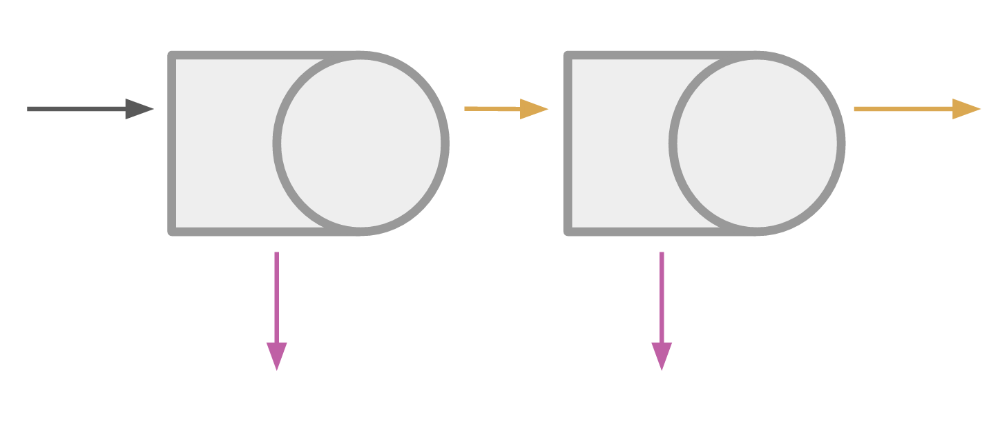
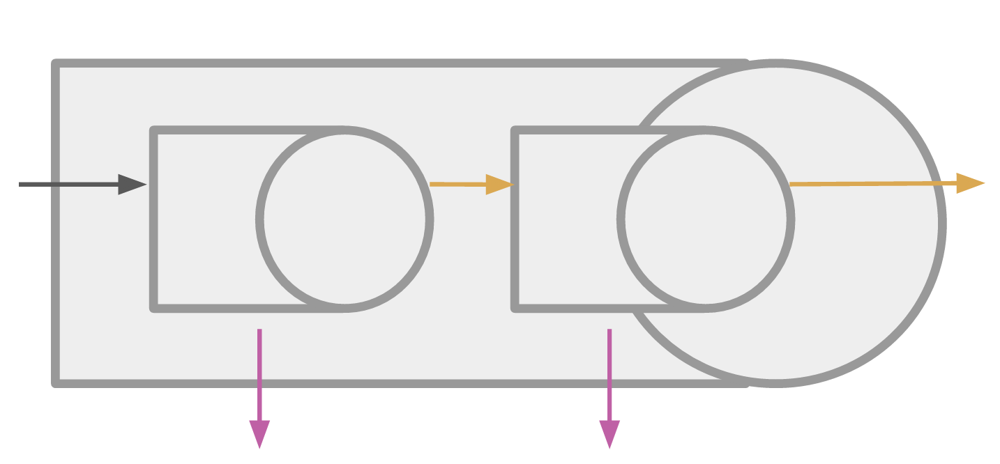
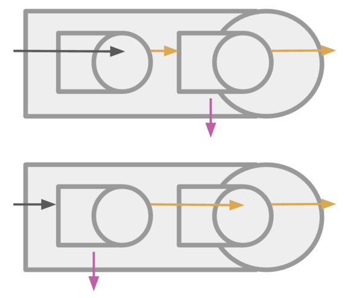
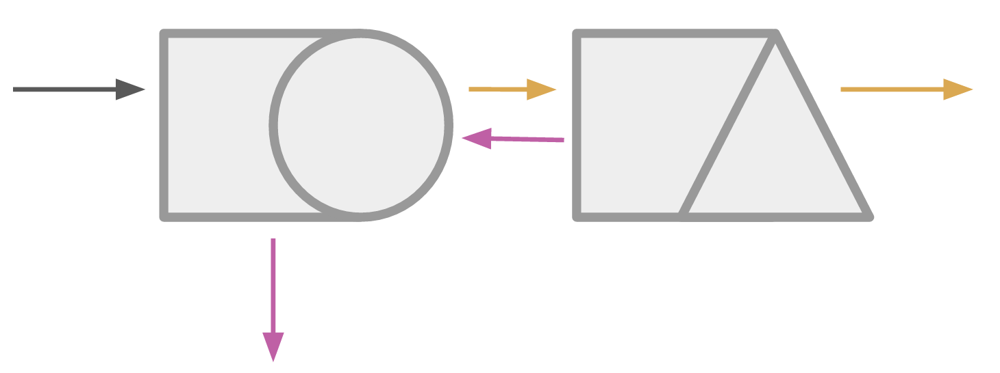
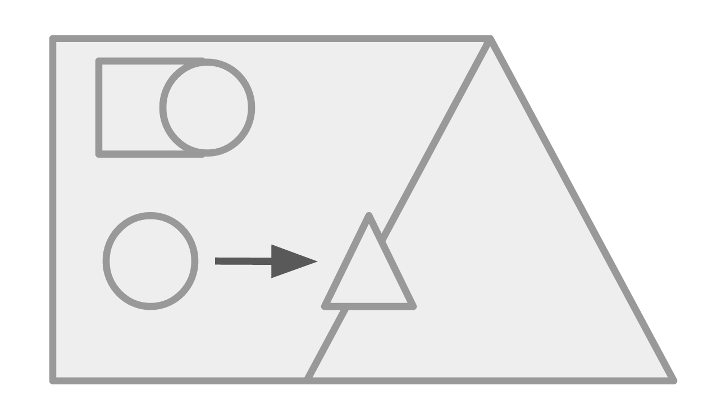
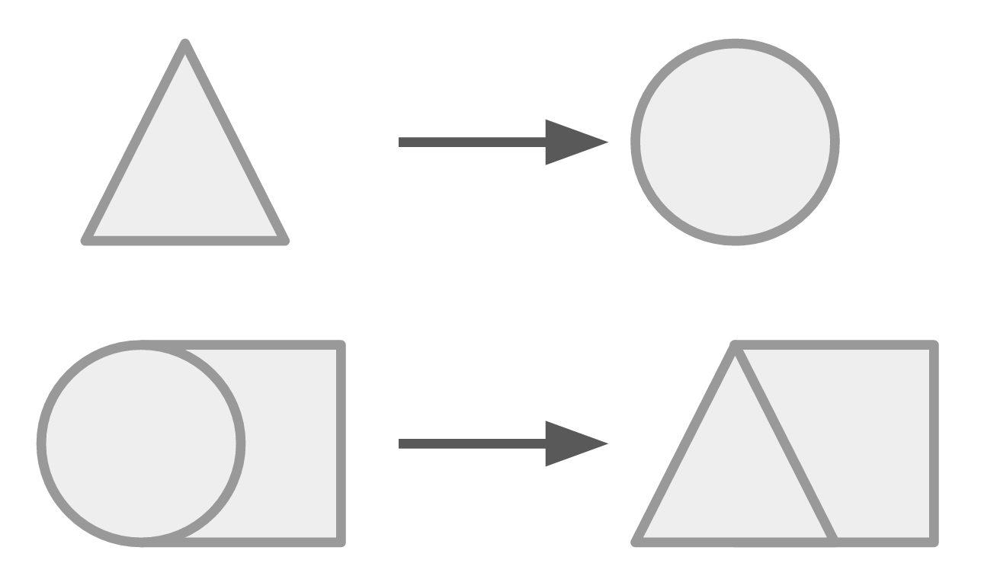

<!-- .slide: data-background="#2aa198" -->
<!-- .slide: data-state="terminal" -->

# Composable Caching in Swift

By <a href="http://bkase.com">Brandon Kase</a> / <a href="https://www.pinterest.com/brandernan/"><i class="fa fa-pinterest" aria-hidden="true"></i>brandernan</a> / <a href="http://twitter.com/bkase_">@bkase_</a> 


!!!

### Aside: Why Caching?

| Action                   | Milliseconds |
| ------------------------ | ------- |
| Downloading over 3g | 500 |
| Reading from disk | 50 |
| Reading from memory | <1 |

!!!

### Goal



!!!

### Image Caching


!!!

### ~~Image~~ Video Caching



!!!

### ~~Image~~ Model Caching


!!!

### Goal


Note: See the inner section, same shape + same instance

!!!

### One Instance to Rule them all

* Sole control of shared resources

Note: Disk; Network

!!!

### One Instance to Rule them all


> https://pixabay.com/en/hard-disk-storage-computer-159264/

!!!

### One Instance to Rule them all


> https://pixabay.com/en/internet-wlan-radio-network-1606099/

!!!

### Cache Protocol

```swift
protocol Cache {
```

```swift
  associatedtype Key
  associatedtype Value
```
<!-- .element: class="fragment" data-fragment-index="1" -->

```swift
  func get(key: Key) -> Future<Value>
```
<!-- .element: class="fragment" data-fragment-index="2" -->

```swift
  func set(key: Key, value: Value) -> Future<Unit>
```
<!-- .element: class="fragment" data-fragment-index="3" -->

```swift
}
```

Note: Blueprint that can be adopted

!!!

### Instance of a cache

```swift
class RamCache<K, V>: Cache where K: Hashable {
  typealias Key = K
  typealias Value = V
```

```swift
  func get(key: Key) -> Future<Value> { /* ... */ }
```
<!-- .element: class="fragment" data-fragment-index="2" -->

```swift
  func set(key: Key, value: Value) -> Future<Unit> { /* ... */ }
```
<!-- .element: class="fragment" data-fragment-index="3" -->

```swift
}
```

!!!

### Disk Cache

```swift
// md5 string key
class DiskCache<K>: Cache where K: StringConvertible {
  typealias Key = K
  typealias Value = NSData // byte array

  func get(key: Key) -> Future<Value> { /* ... */ }
  func set(key: Key, value: Value) -> Future<Unit> { /* ... */ }
}
```

Note: Since we want to treat our system as one unit; one cache...

!!!

## Cache Layering


> https://upload.wikimedia.org/wikipedia/commons/thumb/8/8a/Boxkite.svg/2000px-Boxkite.svg.png

!!!

### Cache Layering



Note: Abstraction

!!!

### Cache Layering



Note: Consider A on-top-of B

!!!

### Cache Layering



!!!

### Cache layering

```swift
extension Cache {
```

```swift
  func compose<B: Cache>(other: B) ->
          BasicCache<Self.Key, Self.Value>
      where Self.Key == B.Key
            Self.Value == B.Value {
```
<!-- .element: class="fragment" data-fragment-index="1" -->

```swift
    return BasicCache(
      get: { k in 
          self.get(k).orElse{
            other.get(k)
              .map{ v in self.set(k, v); return v }
          } }
      }
```
<!-- .element: class="fragment" data-fragment-index="2" -->

```swift
      set: { k, v in
         Future.join(self.set(k, v), other.set(k, v)) }
  }
```
<!-- .element: class="fragment" data-fragment-index="3" -->

```swift
}
```

!!!

### Cache layering

```swift
let c = a.compose(b)
// c is a cache!
```

!!!

### Cache layering

```swift
let c = a.compose(b).compose(x)
// c is a cache!
```

Note: We have RAM and Disk, let's use Network

!!!

### Network Cache

```swift
// always hit the network (no-op set)
class NetworkCache<K>: Cache where K: URLConvertible {
  typealias Key = K
  typealias Value = NSData // byte array
}
```

!!!

### Associative -- Cache layering

```swift
let c1 = (ram.compose(disk))
    .compose(network)
// vs
let c2 = ram.compose(
    (disk.compose(network))
)
```

Note: Proof left as excersise to reader

!!!

### Identity Cache



Note: Cache that always misses

!!!

### Identity Layering


!!!
<!--
### Identity Layering

```swift
let ram1 = ram.compose(identity)
// vs
let ram2 = identity.compose(ram)
// ram == ram1 == ram2
```

Note: Informal proof?
-->

### Cache layering

_Associative binary_ operator + an _identity_ element = _Monoid_

!!!

### Monoidal Caching

```swift

let imageCache = fold(
  ramCache,
  diskCache,
  networkCache
)
```

!!!

### Monoidal Caching


Note: we can compose disk and network first; reuse that instance

!!!

### Layer?



Note: We can't layer two caches together if the types don't match

!!!

### Layer?


Note: We need to make the pieces fit together

!!!

## Transforming Caches


> http://www.publicdomainpictures.net/pictures/170000/velka/wizard-1463307675N9Z.jpg

!!!

### Transforming caches


!!!

### Transforming caches

```swift
// bytesToImage: NSData -> UIImage
// imageToBytes: UIImage -> NSData
let imageNetCache: Cache<Value=UIImage> = 
    netCache.mapValues(bytesToImage, imageToBytes)
```

!!!

### Transforming caches

Note that these transformed caches are _virtual_.

They provide different _projections_ onto the same underlying cache.

!!!

### Transforming caches



!!!

### Transforming caches

```swift
extension Cache {
  func mapValues(
      f: Circle -> Triangle,
      _ fInv: Triangle -> Circle
  ) -> BasicCache<Key, Triangle> {
```

```swift
    return new BasicCache(
      get: { k in self.get(k).map(f) }
```
<!-- .element: class="fragment" data-fragment-index="1" -->

```swift
      set: { k, v in self.set(k, fInv(v)) }
    )
  }
}
```
<!-- .element: class="fragment" data-fragment-index="2" -->

!!!

### Transforming caches

```swift
extension Cache {
  func mapValues(
      f: NSData -> UIImage,
      _ fInv: UIImage -> NSData
  ) -> BasicCache<Key, UIImage> {

    return new BasicCache(
      get: { k in self.get(k).map(f) }
      set: { k, v in self.set(k, fInv(v)) }
    )
  }
}
```

!!!

### Transforming caches

```swift
extension Cache {
  func mapValues<V2>(
      f: Value -> V2,
      _ fInv: V2 -> Value
  ) -> BasicCache<Key, V2> {

    return new BasicCache(
      get: { k in self.get(k).map(f) }
      set: { k, v in self.set(k, fInv(v)) }
    )
  }
}
```

!!!

### Key transformations


> https://pixabay.com/p-30417/?no_redirect

!!!

### Key transformations

```swift
extension Cache {
  func mapKeys<K2>(
      fInv: K2 -> Key,
  ) -> BasicCache<K2, Value> {
```

```swift
    return new BasicCache(
      get: { k in self.get(fInv(k)) }
```
<!-- .element: class="fragment" data-fragment-index="1" -->

```swift
      set: { k, v in self.set(fInv(k), v) }
    )
  }
}
```
<!-- .element: class="fragment" data-fragment-index="2" -->

!!!

### Map Keys



!!!

### Key transformations

```swift
// diskCache: DiskCache<String>
// urlToString: Url -> String
let urlCache = diskCache.mapKeys(urlToString)
```

!!!

### Monoidal Caching


Note: Now it works!

!!!

### Monoidal Caching

```swift
let diskAndNet =
    diskCache.compose(netCache)
let diskAndNetImage =
    diskAndNet.mapValues(bytesToImg, imgToBytes)
return ramCache.compose(diskAndNetImage)
```

!!!

## Problem


Note: For efficiency, we don't want to hit the network 10 times here

!!!

### Optimization: Reusing inflight requests

```swift
extension Cache where K: Hashable {
  func reuseInflight(
      dict: [K: Future<V>]) -> BasicCache<K, V> {
```

```swift
    return new BasicCache {
      get: { k in dict[k] ??
              (let f = self.get(k); dict[k] = f; f) }
      set: self.set
    }
  }
  // logic for freeing the memory elided
}
```
<!-- .element: class="fragment" data-fragment-index="1" -->

!!!

### Optimiziation: Reusing inflight requests

```swift
let smartNetworkCache = networkCache.reuseInflight(dict)
// still conforms to Cache<Key=Url,Value=NSData>
```

```swift
let f = smartNetworkCache.get(url)
let f2 = smartNetworkCache.get(url)
// only one real network request!
// same reference f === f2
```
<!-- .element: class="fragment" data-fragment-index="1" -->

!!!

## Reuse across composed caches!

```swift
let optimizedCache = diskCache.compose(netCache)
    .reuseInflight(dict)
```

Note: This same technique applies for any sort of cache agnostic operations you may want to perform; like concurrency throttling

!!!

### Optimized Caching

```swift
let diskAndNet =
    diskCache.compose(netCache).reuseInflight(dict)
let diskAndNetImage =
    diskAndNet.mapValues(bytesToImg, imgToBytes)
return ramCache.compose(diskAndNetImage)
```

!!!

## Complexity in one place


> https://pixabay.com/p-724096

Note: Taken an inherently complex problem and minimized the surface area of complexity; but it's still there. Fix once, fix everywhere

!!!

### Overall win


!!!

### Carlos Caching

* [Carlos](https://github.com/WeltN24/Carlos) is an open source Swift library
* Created by [@Vittorio_Monaco](https://twitter.com/Vittorio_Monaco) and [@esad](https://twitter.com/esad)

!!!

### Purescript Implementation

[Purescript implementation](https://github.com/bkase/purescript-cache/blob/master/src/Main.purs) created to help formalize these ideas

Note: Profunctor and Contravariant functor

!!!

<!-- .slide: data-background="#2aa198" -->
<!-- .slide: data-state="terminal" -->

# Thanks!

By <a href="http://bkase.com">Brandon Kase</a> / <a href="https://www.pinterest.com/brandernan/"><i class="fa fa-pinterest" aria-hidden="true"></i>brandernan</a> / <a href="http://twitter.com/bkase_">@bkase_</a> 

Slide Deck: [https://is.gd/edLKW7](https://is.gd/edLKW7)

Thanks to [Vittorio Monaco](https://twitter.com/Vittorio_Monaco) for making the [Carlos](https://github.com/WeltN24/Carlos) library

!!!

## Appendix

!!!

### Not so simple

* We want to define the _operators_ on _protocols_ not the concrete instances
* In Swift you _cannot_ return some type with _existentials_ (like our `Cache` protocol)
* We need some type _without_ an existential `associatedtype`.

Note: We need some type with no existential `associatedtype`s.

!!!

### Type erasure

In Swift, type erasure is converting protocol constraints to a concrete struct full of lambdas.
Existential associated types become universally quantified generics.

Type erasure is usually used in Swift to simplify type signatures, but we can also use it to workaround this limitation in the language.
You erase the type information that you had about the specific cache and add a small runtime penalty of an extra function call

```swift
func simplify() -> BasicCache<K, V> {
  return BasicCache(getFn: self.get, setFn: self.set)
}
```

!!!

### Type-erased cache

```swift
struct BasicCache<K, V>: Cache {
  typealias Key = K
  typealias Value = V
```

```swift
  let getFn: K -> Future<V>
  let setFn: (K, V) -> Future<Unit>
```
<!-- .element: class="fragment" data-fragment-index="1" -->

```swift
  func get(key: Key) -> Future<Value> {
    return getFn(key)
  }
  func set(key: Key, value: Value) -> Future<Unit> {
    return setFn(key, value)
  }
}
```
<!-- .element: class="fragment" data-fragment-index="2" -->

Note: Type erasure

!!!

### Monoidal whatever

The ability to _hide "history"_ of the construction anywhere enables the developer to put the information wherever it may make sense to a reader.

(image)

!!!

### Async Transforming caches

```swift
// bytesToImageAsync: NSData -> Future<UIImage>
// imageToBytes: UIImage -> Future<NSData>
let imageNetCache: Cache<Value=UIImage> =
    netCache.asyncMapValues(
        bytesToImageAsync,
        imageToBytesAsync
    )

// asyncMapValues implementation similar to mapValues
```

!!!

### Monoidal Caching


Note: We're able to forget the provenance of the cache's construction

!!!

### Transforming caches

* The `v` appears in _covariant output_ and _contravariant input_ positions
* We need two transformation functions
* Caches are _profunctors_ w.r.t. values

Note: The laws should hold

!!!

### Key transformations

* The `k` appears in _contravariant input_ positions
* Caches are contravariant functors w.r.t. the keys

Note: The laws should hold

!!!

