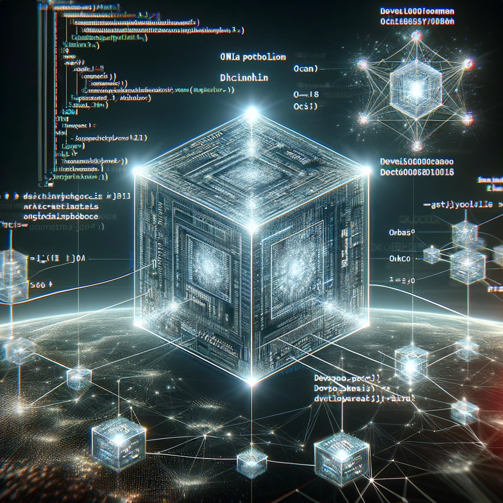
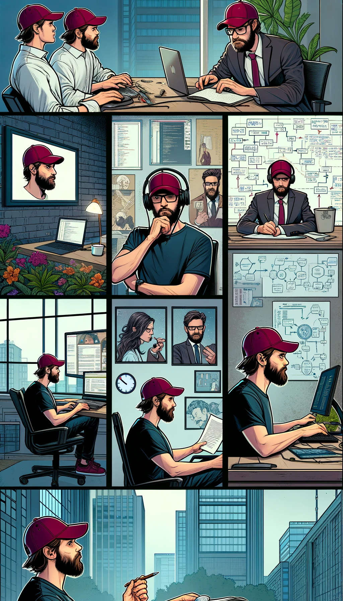
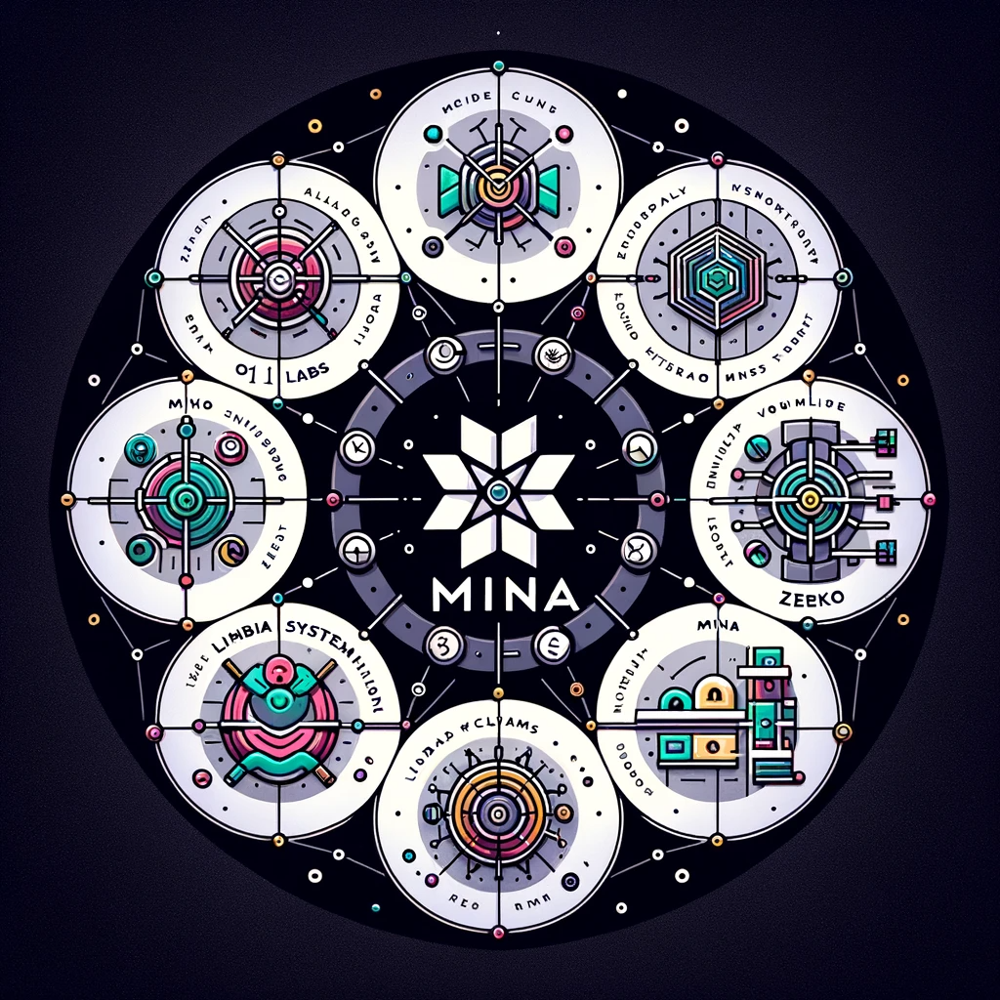

<!-- .slide: data-background="#071448" -->
<!-- .slide: data-state="terminal" -->

# Hello; Brandon

By <a href="http://bkase.com">Brandon Kase</a>  <a href="http://o1labs.org">CTO @ O(1) Labs</a> / <a href="http://twitter.com/bkase_">@bkase_</a>

!!!

### About me

</img>

Note: Obsessed with computers since I was a kid. I knew I wanted to build software early. And then continued to be obsessed with it until I was like 28.

!!!

### About me2

</img>

Note: Studied CS @ CMU (studied with Evan Shapiro)

!!!

### Prefounding

</img>

Note: Started nights and weekends with izzy and Evan

!!!

### First prototype

</img>

Note: The first prototype of Mina was in Flow-typed JavaScript!

!!!

### Company Founded, now OCaml

</img>

Note: But then we moved to OCaml

!!!

### Folks joined

</img>

Note: Lots of protocol engineering for me, and Nacera and the first wave of protocol engineers joined

!!!

### My path

</img>

Note: I went through protocol engineering, ramping up other folks, product engineering, manager of a few folks, early devrel and partner engineering, build tooling, getting obsessesed with defi and learning a lot about competitors and then wearing random hats. And now CTO

!!!

### In this talk

* ~~Intro myself~~
* <!-- .element: class="fragment" data-fragment-index="1" --> Background on the CTO role <!-- .element: class="fragment" data-fragment-index="1" -->

!!!

### CTO what do

</img>

Note: What do I do? CTO is a funny role because it takes different shapes at different organizations. And I'm sure the shape here will continue to evolve. The form that I inhabit is similar to the kind of ways I showed up in other spaces at the company: filling in different gaps and carefully I try to listen to those that I feel are better than me at some specific area and appreciate ideas from everyone.

!!!

### CTO Responsibilities

* Defining and communicating technical vision and stories; to vendors, to the media, to ourselves; thought-leadering
* <!-- .element: class="fragment" data-fragment-index="1" --> Keeping up with competitors/market trends/eng and technology trends <!-- .element: class="fragment" data-fragment-index="1" -->
* <!-- .element: class="fragment" data-fragment-index="2" --> Contributing to the high-level strategy/roadmap <!-- .element: class="fragment" data-fragment-index="2" -->
* <!-- .element: class="fragment" data-fragment-index="3" --> Ensuring our team is building maintainable software (to the best of acceptable constraints) <!-- .element: class="fragment" data-fragment-index="3" -->

Note: And I try hard to do so without being in a vaccuum. I want you to give me your ideas and your feedback and tell me if you disagree with something. Let's argue about it (constructively). I work a lot with Aneesha. and Emre and Steve and many engineers. I come up with ideas and then try to get folks' feedback and convince myself and then others that it makes sense. Then we do it. My day-to-day varies a lot depending on whats going on. ... Enough about me...

!!!

### In this talk

* ~~Intro myself~~
* ~~Background on the CTO role~~
* <!-- .element: class="fragment" data-fragment-index="1" --> Reflections on what we've built <!-- .element: class="fragment" data-fragment-index="1" -->

!!!

### Mina Ecosystem

</img>

Note: It all started with O(1) Labs, but we've grown beyond one company. Mina Foundation, Zeko, Lambdaclass, Viable Systems, Protokit. We currently need to support others, and we'll work on helping soon.

!!!

### And we've built a lot of cool stuff

</img>

!!!

### Snarky v1

</img>

Note: Custom embedded DSL in OCaml for building zero knowledge proofs. Used exentensively within Mina Protocol codebase. Function abstraction and types.

!!!

### Kimchi: Recursive-friendly modular proof system

</img>

Note: A plonkish proof system with an inner-product-argument. Hyper-fine-tuned for efficient recursion. No trusted setup. Super modular. Plonk-to-the-limit: eg supporting logarithmic lookup arguments. Chunking so we can run huge circuits, ramlookup so we can make zkVMs, folding so we can zkVM large execution traces, backends can be hot-swapped to an EVM-friendly kzg-bn254 so we can build the zkVM for OP and it can be used for a Mina bridge.

!!!

### Ourorboros in a Snark

</img>

Note: First implementaiton of ouroroboros in production -- we beat cardano whose paper we uses and ours was in a snark!

!!!

### Staged Ledger

</img>

Note: A data structure that tracks transaction applications. Instantiates a parallel scan with user txns, fees, and coinbases. Handles all sorts of complex edge cases.

!!!

### o1js

</img>

Note: o1js the most usable zk sdk (don't ask me, the community says so). Also the most powerful! Now with custom gates! Not just for zkApp smart contracts but for circuits too. Comes with a standard library with merklized structures, nullifiers. As Steve shared, it's faster now too.

!!!

### o1js Accoutrement

</img>

Note: zkApp CLI to makes it easy to get started and deploy and work with zkApps. A Mina signer tool to make it easy to sign transactions. Integrations with wallets. An archive node integration to access actions/events and other chain data. Beautiful documentation and examples and tutorials.

!!!

### Testing tooling

Note: Integration testing framework for the protocol, 

!!!

### Cost-efficient testing substrate

!!!

### Our Team

</img>

Note: Our team is top class and we've built such great stuff! Juraj told me the other day: "Literally every idea we have of something that can go wrong or a bug, we always find an open GitHub issue for it."

!!!

### In this talk

* ~~Intro myself~~
* ~~Background on the CTO role~~
* ~~Reflections on what we've built~~
* <!-- .element: class="fragment" data-fragment-index="1" --> Engineering values: Review and Instantiate <!-- .element: class="fragment" data-fragment-index="1" -->

!!!

### Engineering Values

</img>

Note: Engineering values

!!!

### Engineering Values (that we idealize)

* We keep strong clarity of purpose and high visibility
* <!-- .element: class="fragment" data-fragment-index="1" --> We endeavor for engineering excellence <!-- .element: class="fragment" data-fragment-index="1" -->
* <!-- .element: class="fragment" data-fragment-index="2" --> We strive for excellence over perfection <!-- .element: class="fragment" data-fragment-index="2" -->
* <!-- .element: class="fragment" data-fragment-index="3" --> We are humans first <!-- .element: class="fragment" data-fragment-index="3" -->

Note: 1. Keep work well-defined, visible, using evidence, and sharing work quickly, keeping in mind the end-user as well as developers reading the code. 2. scope goes first, then speed, quality never suffers. High architecture and coding standards. Make sure we have a design and approach through RFCs first! Aggressively favor simplicity. Not easy. Simple. There's a difference. Easy leads to lazy complexity. We finish things. Really finish. Ship them. It's not done until it's in a usable product 3. It's okay to ask for help, to fail, and to take calculated risks given constraints on time. Growth mindset. Always be open to learning. Help your teammates. 4. Make spaces for voices, culture of execution and delivery AND HAVING FUN. ... So this is our ideal, how have we gotten closer to this...

!!!

### Reflections of improvements in recent times

1. Better about PRDs before work starts
2. <!-- .element: class="fragment" data-fragment-index="1" --> More rigorous about RFCs before implementation starts <!-- .element: class="fragment" data-fragment-index="1" -->
3. <!-- .element: class="fragment" data-fragment-index="2" --> More rigorous data driven discourse for making technical decisions <!-- .element: class="fragment" data-fragment-index="2" -->
4. <!-- .element: class="fragment" data-fragment-index="3" --> Share more through demos <!-- .element: class="fragment" data-fragment-index="3" -->
5. <!-- .element: class="fragment" data-fragment-index="4" --> Testing game way up <!-- .element: class="fragment" data-fragment-index="4" -->
6. <!-- .element: class="fragment" data-fragment-index="5" --> Mistakes okay + retro to learn <!-- .element: class="fragment" data-fragment-index="5" -->
7. <!-- .element: class="fragment" data-fragment-index="6" --> Architects more mentoring <!-- .element: class="fragment" data-fragment-index="6" -->
8. <!-- .element: class="fragment" data-fragment-index="7" --> Empowered to put things in place to do our job well <!-- .element: class="fragment" data-fragment-index="7" -->

Note: (1) shoutout to crypto team, (3) shoutout to Deepthi with capturing data on berkeley discussions, (4) shoutout to the sdk team, (5) itn testing / sdk team / established a qa team ; reformated velocity to platform eng team, (6) retro/reflect often; ecdsa is a great example, (7) shoutout Matthew in crypto space, (8) new lead roles and spaces for easier x-team collaboration at the eng level shoutout steven and gregor + devrel guardian rotation + tests to nightlies

!!!

### What we want to go closer to the ideal?

Note: How do we keep getting closer to the end state? We've made this great progress, but there's more to do! We'll keep iterating on the people process space led by Aneesha. I want to dig deeper into the hands-on-the-keyboard part of the process. The software we write and the systems in place to push us to write it better.

!!!

### Writing Software Things

</img>

Note:

!!!

### Wearing Hats (1)

</img>

Note: Problem: We have a lean team. Sometimes we'll have a little extra high priority work on teams with a little bit fewer staff that need help. Sometimes we'll have projects where work crosses teams. 

!!!

### Wearing Hats (2)

</img>

Note: We have a culture where folks from other spaces contribute! and that's great! But what can happen is we end up doing work without getting the right folks involved, the right visibility, because even though we share "with our team", we're not sharing "with the right team". This leads to miscommunication, feeling loss of control, the wrong work getting done and needing to be redone, code not shipping, etc. I can find examples of this within the last few months with almost every pair of teams!

!!!

### Wearing Hats (3)

</img>

Note: Solution: Wear your hat! Continue being proactive, jumping in where you see you can help (tell your manager of course!), but acknowledge your hat. If you are doing work for the platform engineering team. You need to do that work in that context, add those folks for review on your RFC, your pull requests, discuss in the right slack channel. If you're contributing to the protocol team working on berkeley. Share with Deepthi! Work in that space. If you're writing cryptography code, either within Kimchi or o1js or some other tool -- let them know! Follow the crypto team's development process. Ask the managers or tech leads of the other teams if you have questions on how to do this, everyone wants to help you help O(1)!

!!!

### Writing Software Things

* ~~Wearing hats~~
* <!-- .element: class="fragment" data-fragment-index="1" --> [REDACTED] <!-- .element: class="fragment" data-fragment-index="1" -->
* <!-- .element: class="fragment" data-fragment-index="2" --> Brandon actions <!-- .element: class="fragment" data-fragment-index="2" -->

!!!

### Problem

Note: You know when you've rushed to put something together and it struggles.

!!!

### Reality

Note: In many places in our codebases across the different project domains, we've made this mistake in different ways. We've endured years worth of technical debt from tiny shortcuts and underinvested upfront thinking. Pushing this investment to the front improves our producitivity, readability of the code, interest in our work, happiness, ability to onboard our future selves and colleagues, etc.

!!!

### Developer Experience?

Note: I don't mean the DevX that Steve talked about -- we've been focused on that in our products. I mean our own developer experience. We are developers and we experience our own code and the code of our colleagues!

!!!

### RFCs help!

Note: RFCs help push us to invest in upfront thinking, but as is, it doesn't really push us to write our software in any particular way. We're missing a mechanism for highlighting part of the developer experience, and a mechanism for realizing this in a unified way across our engineering organization.

!!!

### Language-driven design

Note: Myself and the architects believe that the mechanism that is most core to our culture to realize a unified devx system is Language-driven design thinking. Because when done properly it emits clear, readable, maintainable, and consistent software that is easy to test. I'll illustrate through examples: There are a few examples of powerful little languages, or DSLs, we've built for ourselves over the years, but rather than focus on those existing ones: I want to highlight three places across three codebases across three languages that could dramatically improve from this kind of thinking

!!!

### Blockchain Builder

Note: Problem: We struggle to represent blocks in a blockchain everytime we want to write a test. We never built a system that can cleanly represent such states. As a consequence, we naturally push tests that should be unit tests to the integration test layer since we have a nice DSL to use there and thus miss many edge cases due to the expensive nature of integration tests. We never should have written even our first feature that depends on blockchain state without building this system from the start.

!!!

### Blockchain Builder DSL

```ocaml
let block1 = [ edge_case_txn1 ; payment2; zkapp3 ] in
let block2 = [ edge_case_txn1 ; payment2; zkapp3 ] in

let chain = block1 + block2
```

Note: Now we can represent blocks, put them in a chain, reuse edge case blocks, and create scenarios in unit tests

!!!

### Kimchi proving logic 

Note: Problem: There are six distinct operations in the proving logic, but our implementation is just a wall of effectful code. This makes it hard to test and hard to reconfigure the system for example between pickles and non-pickles

!!!

### Kimchi proving logic

```rust
fn challenge()
fn witness()
fn fft()

fn prover1() { challenge(); fft(); fft() }
```

Note: Now testing is easier. We can consume this same DSL from pickles and inherit the security properties of kimchi.

!!!

### Pickles -> ZkProgram

Note: Problem: Pickles is one big ball of spaghetti, you can only call it from one place. Not only does this make understanding and testing the pieces of the system difficult, but it becomes hard and LIMITING in the ways that we can express our recursive proof API on the o1js side. o1js suffers because Pickles wasn't language-driven.

!!!

### Pickles -> ZkProgram

```typescript
const addOne = (x: Field) => x.add(1)
const multiplyTwo = (x: Field) => x.add(x)

const proof = recur("calculator", addOne, multiplyTwo)
```

Note: we can reuse branches of proofs easily. we can test pieces. We can assemble them safely on the o1js side to make a more powerful and reusable interface for our end-developers. We can TODO gregor

!!!

### Language-driven design

* Coming soon to an RFC template near you

!!!

### Writing Software Things

* ~~Wearing hats~~
* ~~Language-driven design~~
* <!-- .element: class="fragment" data-fragment-index="1" --> Brandon actions <!-- .element: class="fragment" data-fragment-index="1" -->

!!!

### Brandon Actions

Note: We'll continue experimenting on different teams, RFCing things and asking the right questions in the RFC template, and automating the shit out of everything possible. Over the next few months, I intend on making time to personally push this. That means lots of collaboration with Aneesha + working with teams, iterating on the RFCs, and helping build some automations wearing my platform engineering team hat!

!!!

### Brandon Actions

Note: I want to help guide us to making software better. I know a lot of you have ideas of what you want to change. Please send me ideas. And the best way is to talk to me. And the best way to talk to me, is to talk to me this week or next week in person (but we can also chat remote if we don't find time). What can make your time building more "fun". Tell me!

!!!

### In this talk

* Intro myself
* <!-- .element: class="fragment" data-fragment-index="1" --> Background on the CTO role <!-- .element: class="fragment" data-fragment-index="1" -->
* <!-- .element: class="fragment" data-fragment-index="2" --> Reflections on what we've built <!-- .element: class="fragment" data-fragment-index="2" -->
* <!-- .element: class="fragment" data-fragment-index="3" --> Engineering values: Review and Instantiate <!-- .element: class="fragment" data-fragment-index="3" -->

Note: via two examples: wearing hats, language driven design, and through my intention to help guide us

!!!

<!-- .slide: data-background="#071448" -->
<!-- .slide: data-state="terminal" -->
# Thanks!

By <a href="http://bkase.com">Brandon Kase</a>  <a href="http://o1labs.org">CTO @ O(1) Labs</a> / <a href="http://twitter.com/bkase_">@bkase_</a>

O(1) Labs: [https://o1labs.org](https://o1labs.org)

!!!

## Appendix

!!!

### Nomenclature

Domain-specific-language

Note: In the spirit of language, let's use language to define how we use languages. You'd think this is overkill, but it's not!

!!!

### DSL Kind

* External DSL (no) -- a language with its own syntax/semantics/runtime
* <!-- .element: class="fragment" data-fragment-index="1" --> Embedded DSL (yes) -- embedded in a host languages, leverage the syntax and features of the host language <!-- .element: class="fragment" data-fragment-index="1" -->

!!!

### External DSL

```html
<body>
    <div>
        <button>a button</button>
    </div>
</body>
```

Example: HTML is an external DSL for describing the content of web pages. It is a new language. Don't make this!

!!!

### Embedded DSL

```js
$('div.test')
  .on('click', handleTestClick)
  .addClass('foo');
```

Example: jQuery is an embedded DSL for manipulating web UIs (inside of the host JavaScript)

!!!

### DSL Encoding

* Initial encoding (rare) -- sentences in our language are represented by data and later interpreted
* Final encoding (common) -- sentences in our lanugage run directly

Note: Rare vs common for using these tools for everyday programming in our work.

!!!

### Initial Encoding Example

```ocaml
let%bind previous_state_hash =
  match constraint_constants.fork with
  | Some { previous_state_hash = fork_prev; _ } ->
      State_hash.if_ is_base_case
        ~then_:(State_hash.var_of_t fork_prev)
        ~else_:t.previous_state_hash
  | None ->
      Checked.return t.previous_state_hash
in (*...*)
```

Note: Snarky circuits are encoded initially

!!!

### Initial Encoding Example (pt2)

TODO

!!!

### Final Encoding Example

```typescript
...
```

Note: 

