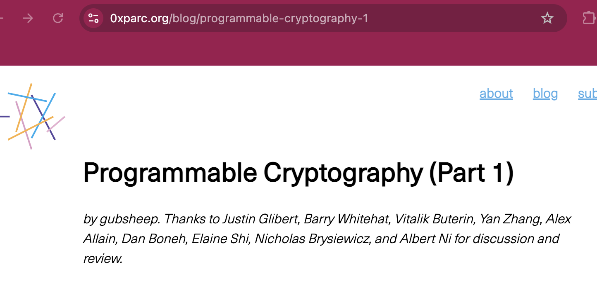
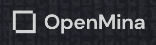
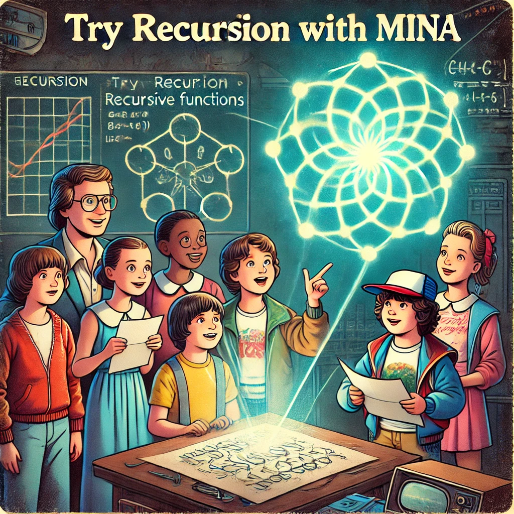

<!-- .slide: data-background="#071448" -->
<!-- .slide: data-state="terminal" -->

## Future of Mina

By <a href="http://bkase.com">Brandon Kase</a>  <a href="http://o1labs.org">CEO @ o1Labs</a> / <a href="http://twitter.com/bkase_">@bkase_</a>

Note: I'm brandon founding engineer & ceo at o1labs

!!!

### Sneak Preview


Note: SNEAK PREVIEW. This thinking actively being developed. Our story is told in the style of a childrens story book illustration of stranger things

!!!

### Early Internet


Note: The internet started in the 70s and was a place where information could be easily shared and accessed around the world.

!!!

### https://


Note: But the internet as we know it today, itself owes its existence to the combiation of infrastructure and cryptography. The early internet's limitations led to the development of security cryptography (HTTPS), ensuring secure communication and privacy.

!!!

### httpz://


Note: Programmable cryptography will enable a new wave of innovation.This flexible cryptography can be programmed to provide security, privacy, and integrity wherever needed, much like we program computers to perform specific tasks (HTTPZ).

!!!

### ZK Proofs


Note: We believe that zk proofs are a great way to bring about the programmable cryptography revolution

!!!

### ZK Proofs

* Privacy by default
* <!-- .element: class="fragment" data-fragment-index="1" --> Trusted execution environment (not TEE) <!-- .element: class="fragment" data-fragment-index="1" -->
* <!-- .element: class="fragment" data-fragment-index="2" --> Small certificates <!-- .element: class="fragment" data-fragment-index="2" -->
* <!-- .element: class="fragment" data-fragment-index="3" --> Self-composable <!-- .element: class="fragment" data-fragment-index="3" -->

Note: zkps don’t reveal any information by default, but can be made to reveal as much or as little information as is needed for the application ;; the steps programmed into the zkp system must be run correctly to produce a result :; a zkp is a type of small certificate for a program that may be much larger, with no restriction on how large the program or long the execution can be :; zkps can take the results of differently programmed zkp systems and combine them together, creating a zkp of the same size that extends the properties of all of its inputs

!!!

### So what

Note: By leveraging zkps, we can create applications that ensure data authenticity, detect manipulation attempts in real-time, and protect users from unwanted tracking.

!!!

### Program with cryptography


Note: Mina pioneered the application of zk proofs in its protocol but also in an easy to use SDK. But there are a lot of ways to work with programmable cryptography these days. They all contribute to this new httpz internet.

!!!

### Just-in-time internet



Note: Independantly of our work exploring httpz, 0xPARC recently published an article on using programmable cryptography in a new just-in-time internet thatis ephemerally powered by zk.

!!!

### Just-in-time internet (0xPARC)

* Hallucinate servers for running computation offchain
* <!-- .element: class="fragment" data-fragment-index="1" --> Adapt to any cryptographic data <!-- .element: class="fragment" data-fragment-index="1" -->
* <!-- .element: class="fragment" data-fragment-index="2" --> Examples: Recommendations, Social networks, Notifications of diseases <!-- .element: class="fragment" data-fragment-index="2" -->

Note: Essentially, you can hallucinated. Discover personalized recommendations for a product, a movie, a job, or even a date with a personalized cryptographic agent that is constantly searching on your behalf, without your data ever leaving your computer. Spin up a new, virtual social media platform "on the fly" for a community you're in, that hooks into all of your data from other social media platforms, without needing to run a server yourself or rely on any centralized intermediary to do so. Automatically get notified that you are at risk of some disease / medical outcome, without needing to share your medical data with anyone.

!!!

### Core Infra Missing

Note: But, there's something missing here!

!!!

### Mina -- The Protocol


Note: the actual protocol. A decentralized censorship-resistant platform by which these proofs can be accessed and built-up-upon. We still have some work to do, but Mina Protocol is the way to get there. Mina is on track to be the purest form of such an internet. 

!!!

### Mina is different

* Decentralized and censorship resistant

!!!

### Scalability/Decentralization


Note: Mina has always kept scalability and decentralization in their purest forms, and is now working to improve performance.

!!!

### Mina is different

* Decentralized and censorship resistant
* Portable, accessible from webnode

!!!

### Portability+Accessibility: Full-nodes in the browser/phone



Note: Coming very soon, by the viable systems team

!!!

### Mina is different

* Decentralized and censorship resistant
* Portable, accessible from webnode
* zk-Native

!!!


### zkNative Proof of Everything


Note: Besides Mina itself being a single ever-updating zk proof, it hosts programmability with recursion and zk smart contract composition so developers have the most power

!!!

### Vision

At o1Labs, we _envision an internet_ where developers _use programmable cryptography_ to create more powerful applications. And that _internet needs Mina_.

Note: At o1Labs, We _envision an internet_ where developers _use programmable cryptography_ to create more powerful applications. And that _internet needs Mina_.

!!!

### Where are we now

* Mainnet and stable. No unexpected outages since mainnet years ago!
* <!-- .element: class="fragment" data-fragment-index="1" --> zkApps are released on mainnet. <!-- .element: class="fragment" data-fragment-index="1" -->

Note: The most mature zk platform. The only general purpose zk programmable platform on Mainnet L1 or L2. And you can actually tap into the underlying proof system, use recursion, custom gates, etc…. It is the first step towards the programmably-powered internet.

!!!

### Next few steps

* Adapter layers (thank Geometry Labs!)
* <!-- .element: class="fragment" data-fragment-index="1" --> Help launch mainnet applications <!-- .element: class="fragment" data-fragment-index="1" -->
* <!-- .element: class="fragment" data-fragment-index="2" --> Make it faster and more stable <!-- .element: class="fragment" data-fragment-index="2" -->
* <!-- .element: class="fragment" data-fragment-index="3" --> Redesign the SDK <!-- .element: class="fragment" data-fragment-index="3" -->

Note: Except rapid bite-sized incremental changes quickly from o1Labs now that the big upgrade is out

!!!

### Let's make an internet of true things


Note: Help shape this future. Help make this internet. Join Discord. We recently changed how we work at o1Labs to have much more direct conversations with the core engineers, talk to us!

!!!

<!-- .slide: data-background="#071448" -->
<!-- .slide: data-state="terminal" -->
# Thanks!

By <a href="http://bkase.com">Brandon Kase</a>  <a href="http://o1labs.org">CEO @ o1Labs</a> / <a href="http://twitter.com/bkase_">@bkase_</a>

O(1) Labs: [https://o1labs.org](https://o1labs.org)
Mina: [https://minaprotocol.com](https://minaprotocol.com)


Note: Join the community. Build zkApps with o1js. Contribute to Mina.

!!!

### ZkProgram

```typescript
const AddOne = ZkProgram({
  publicOutput: Field,
  //...
```

!!!

### ZkProgram

```typescript
  methods: {
    baseCase: {
      privateInputs: [],

      method() {
        return Field(0);
      },
    },
```

!!!

### ZkProgram

```typescript
    step: {
      privateInputs: [SelfProof],

      method(
        pi: SelfProof<undefined, Field>
      ) {
        pi.verify();
        return pi.publicOutput.add(1);
      },
    },
  },
});
```

!!!

### Try it



Note: If you want to play with recursion -- you should really try our stuff!

!!!


### End

