<!-- .slide: data-background="#2aa198" -->
<!-- .slide: data-state="terminal" -->

# Mina Grab Bag

By <a href="http://bkase.dev">Brandon Kase</a> / <a href="http://twitter.com/bkase_">@bkase_</a>

Note: Mina grab bag

<!--

Task:
  * Intro
    * Introduce the talk format, encourage questions, this is just a grab bag of stuff I think is interesting from our protocol, I encourage many detailed questions
    * Introduce myself: who I am + what I understand
    * Start by asking the background of the audience so I know what to focus on
    * Table contents;
  * Mina High level
    * World's lightest blockchain
    * Steal slides from SnarkyJS deck about Mina
  * Subsystems of the implementation
    * take slides from chainsafe talk
  * Zksnarks / zero knowledge proofs, recursive
    * lift this from existing slides, either this one or the parallel scan
  * Snarky v0
    * one slide explaining
    * one slide code snippet
  * SnarkyJS
    * take slides from snarkyjs
    * like snarky but in JS, why?
  * Smart contracts
    * take from snarkyjs slides
  * Mina as web3 hub
    * make a slide digesting Emre's post
  * Parallel Scan slides
    * take slides from parallel scan, steal snark workers
  * Nuances of staged ledger (hinted at)
    * maybe one slide
  * Consensus + Interesting bit about long forks (optional, in other deck)
    * a few slides on consensus, say we can go into on the other deck
-->

!!!

### In this Talk

* A bunch of random topics I think are interesting
* <!-- .element: class="fragment" data-fragment-index="1" --> Please stop me for questions, and I'm happy to go down rabbit holes <!-- .element: class="fragment" data-fragment-index="1" -->
* <!-- .element: class="fragment" data-fragment-index="2" --> I have a lot of content + I want a lot of questions, we can skip around <!-- .element: class="fragment" data-fragment-index="2" -->

!!!

### Brandon


Note: This is me, I don't usually put this kind of slide in but I want to pre-empt types of questions that I will be good and bad at answering

!!!

### Brandon

* Worked on Mina for over 4 years (@ O(1) Labs)
* <!-- .element: class="fragment" data-fragment-index="1" --> Knows details about protocol from early, less details later <!-- .element: class="fragment" data-fragment-index="1" -->
* <!-- .element: class="fragment" data-fragment-index="2" --> Is not a cryptography expert; after the first crypto engineer hire, I stopped reviewing crypto code <!-- .element: class="fragment" data-fragment-index="2" -->

Note: 1. in a variety of roles within or tangential to engineering (management, product, etc), at the moment in an architect-type role now with a focus on product engineering 2. But I know the overview well enough + I am not super familiar with the nuances of our latest snark, but I can talk through some of the capabilities

!!!

### This talk

1. Mina high level
2. <!-- .element: class="fragment" data-fragment-index="1" --> Susbsystems of Mina <!-- .element: class="fragment" data-fragment-index="1" -->
3. <!-- .element: class="fragment" data-fragment-index="2" --> Snarks + recursion <!-- .element: class="fragment" data-fragment-index="2" --> 
4. <!-- .element: class="fragment" data-fragment-index="3" --> Snarky <!-- .element: class="fragment" data-fragment-index="3" --> 
5. <!-- .element: class="fragment" data-fragment-index="4" -->  Snapps + web3 vision <!-- .element: class="fragment" data-fragment-index="4" --> 
6. <!-- .element: class="fragment" data-fragment-index="5" --> Throughput unconstrained from slow proofs / Snark Workers <!-- .element: class="fragment" data-fragment-index="5" -->
7. <!-- .element: class="fragment" data-fragment-index="6" --> Consensus + succinct long forks <!-- .element: class="fragment" data-fragment-index="6" -->

!!!

### Mina

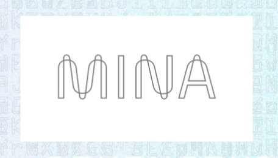

Note: What is mina

!!!

### Problems with Cryptocurrencies

* Blockchains are heavy
* <!-- .element: class="fragment" data-fragment-index="1" --> Decentralization at scale <!-- .element: class="fragment" data-fragment-index="1" -->
* <!-- .element: class="fragment" data-fragment-index="2" --> Privacy + verifiability <!-- .element: class="fragment" data-fragment-index="2" -->

Note: 1. It’s expensive and difficult for users to directly access blockchains without intermediaries. 2. Resource requirements prevent true decentralized participation, especially as throughputs increase. 3. All transactions and data are forced to be public and go on-chain

!!!

### Mina

The world’s lightest blockchain

!!!

### Mina

* Mina is light
* <!-- .element: class="fragment" data-fragment-index="2" --> Unlimited\* consensus participation <!-- .element: class="fragment" data-fragment-index="2" -->
* <!-- .element: class="fragment" data-fragment-index="3" --> Users share _proof_ of their data <!-- .element: class="fragment" data-fragment-index="3" --> 

Note: (1) Full nodes can be just ~10kb. Users can directly and quickly access and verify Mina - making it more secure and trustless than any other chain (2) No cap on number of validators. Probabilistic consensus for maximum decentralization (3) Apps build on Mina - Snapps (SNARK-powered apps) - can privately use off-chain data sources

!!!

### OCaml Mina Client

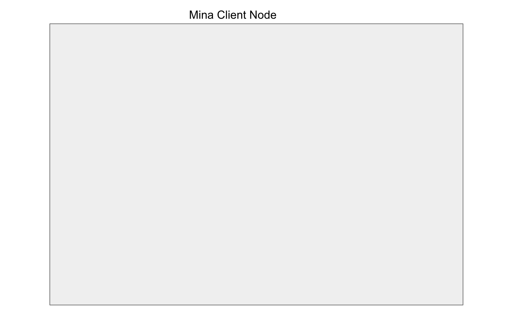

!!!

### OCaml Mina Client

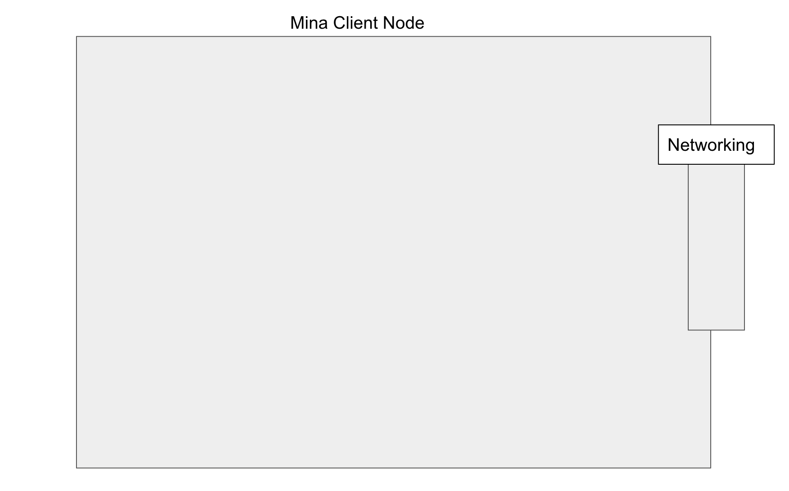

!!!

### OCaml Mina Client

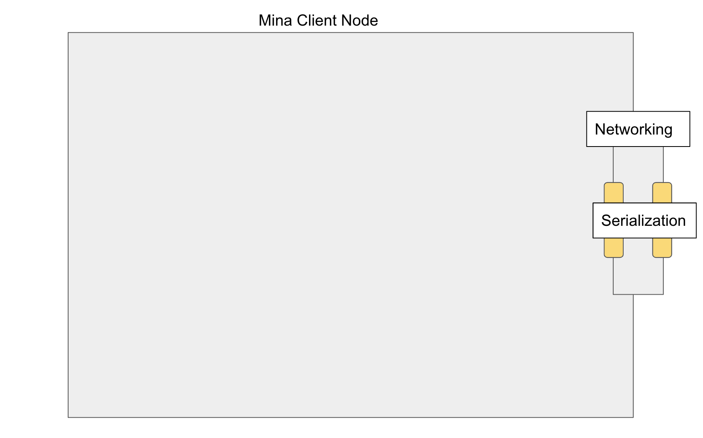

!!!

### OCaml Mina Client

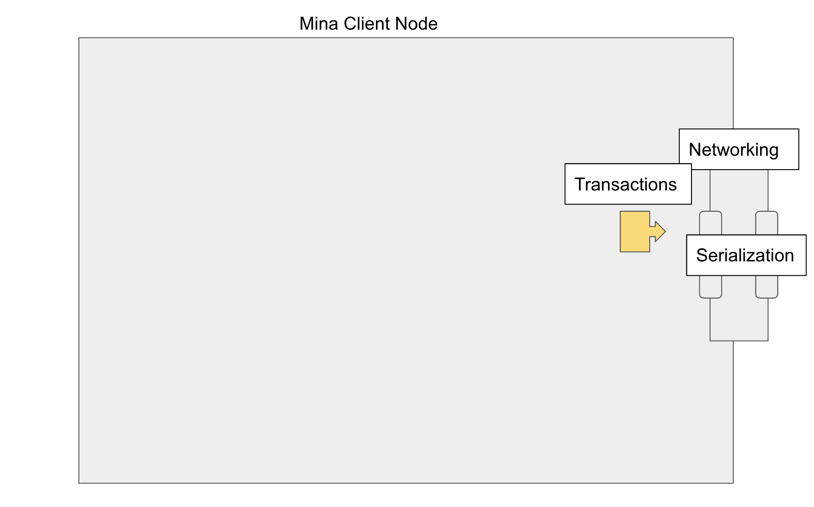

!!!

### OCaml Mina Client

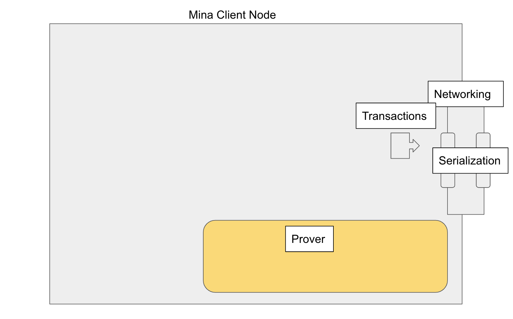

!!!

### OCaml Mina Client

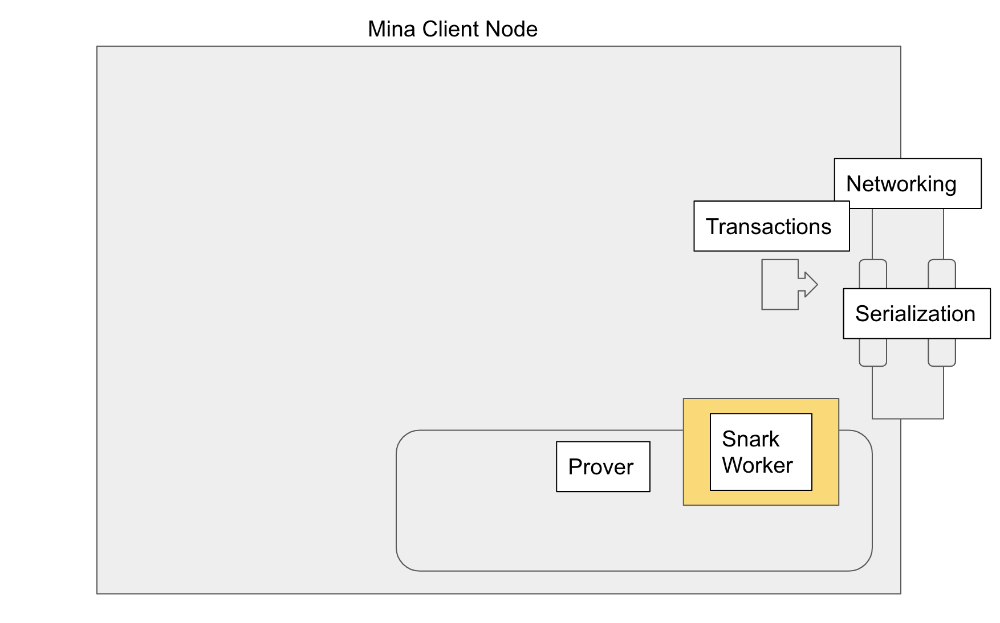

!!!

### OCaml Mina Client

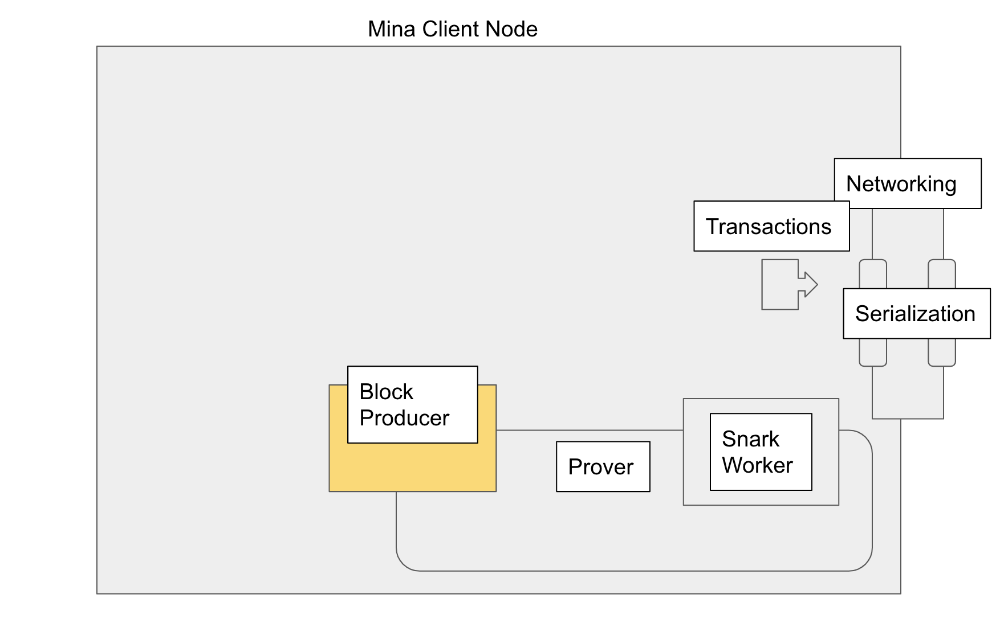

!!!

### OCaml Mina Client

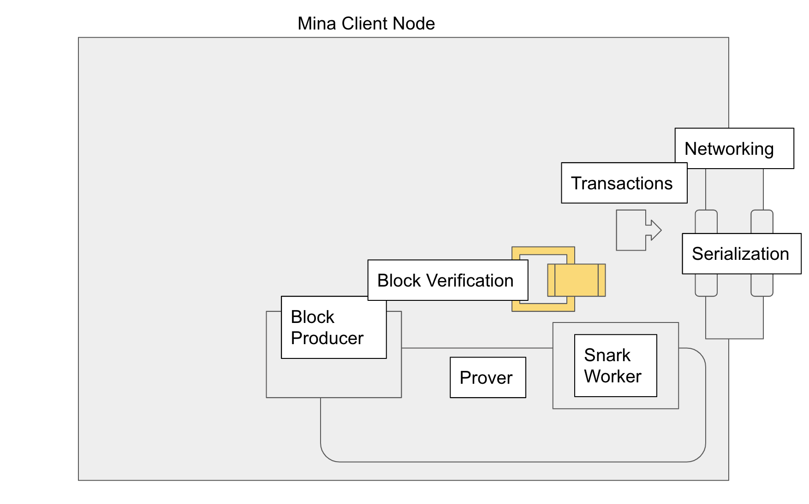

!!!

### OCaml Mina Client

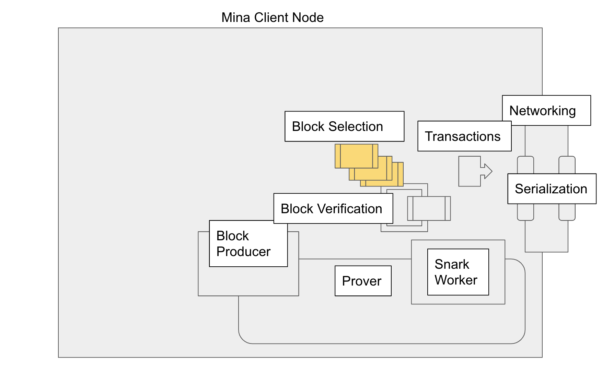

!!!

### OCaml Mina Client

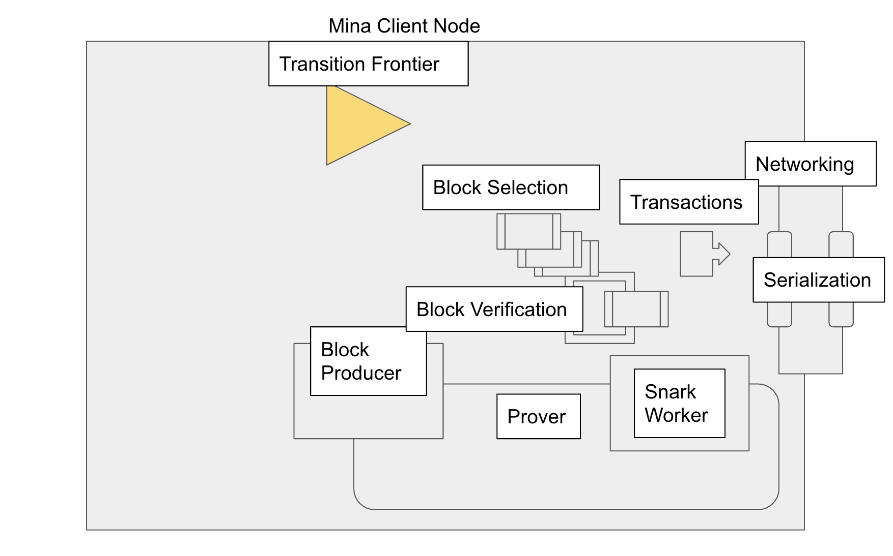

!!!

### OCaml Mina Client

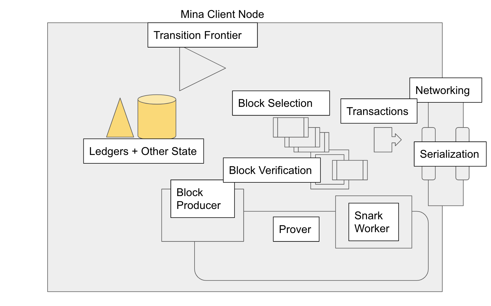

!!!

### OCaml Mina Client

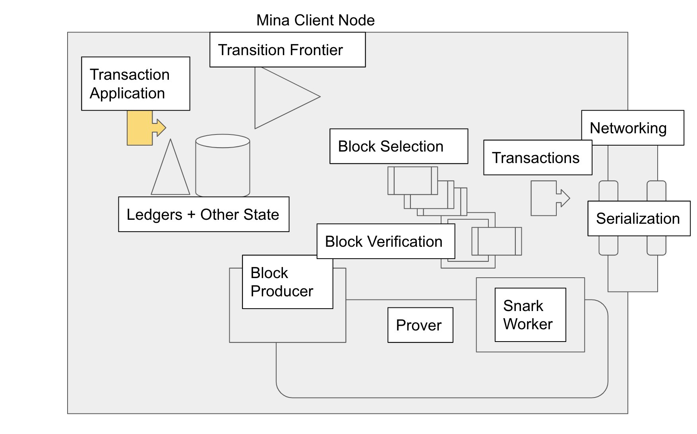

!!!

### OCaml Mina Client

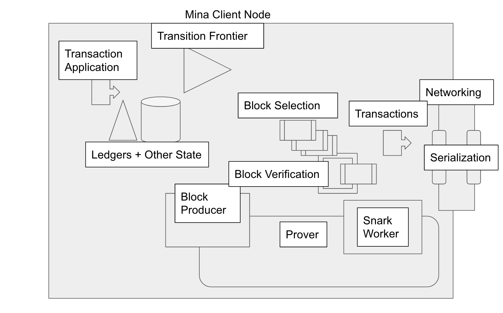

Note: This is only some of the systems, but should give you a sense... and prep for questions

!!!

### Mina: Light

Note: Rather than having all the nodes do the work in processing blocks containing transactions, most of the nodes verify a small cryptographic proof of that work being done instead of doing it themselves. These proofs are called...

!!!

### Zk-Snark Acronym

* Zero
* Knowledge
* Succinct
* Non-interactive
* Argument of
* Knowledge

!!!

### SNARK statements

_There exists_ data _such that_ predicates hold on that data

Note: There exists DATA s.t. PROPERTY

!!!

### Simple SNARK

_There exists_ a pdf file _such that_ the hash of the file is ab3df33...

Note: And the fact that I am able to construct this means I KNOW such a PDF file

!!!

### Recursive composition

_There exists_ a proof of this statement _such that_ that proof verifies

Note: Recursion!

!!!

### Recursive composition

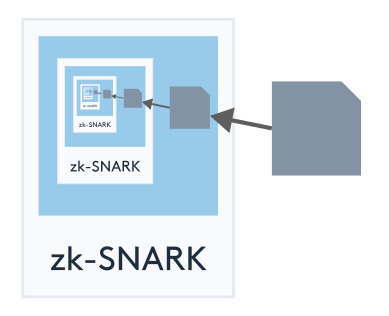</img>

!!!

### Snarks in practice

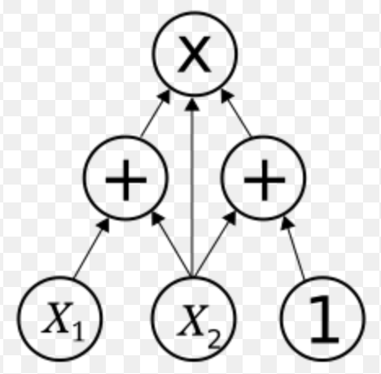

Note: Snark proofs are implemented using arithmatic circuits

!!!

### Snarks in practice

Note: Complexity grows like crazy if you just write complex proofs using raw gates, we have an entire complex consensus algorithm and transaction validation logic implemented

!!!

### Snarky

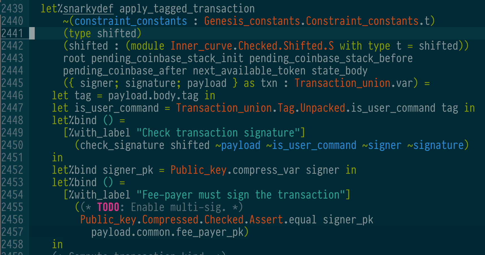

Note: Snarky is our solution to the complexity of writing and maintaining snark circuits

!!!

### Snarky

* Monadic embedded DSL in OCaml
* <!-- .element: class="fragment" data-fragment-index="1" --> Function abstraction <!-- .element: class="fragment" data-fragment-index="1" -->
* <!-- .element: class="fragment" data-fragment-index="2" --> Types <!-- .element: class="fragment" data-fragment-index="2" -->
* <!-- .element: class="fragment" data-fragment-index="3" --> Algebraic effects for modeling "there exists" <!-- .element: class="fragment" data-fragment-index="3" -->
* <!-- .element: class="fragment" data-fragment-index="4" --> Simultaneously define prover and verifier logic <!-- .element: class="fragment" data-fragment-index="4" -->

Note: 2. composition . 3. Provide an isomorphism between field elements and some other typed structure and you can use that structure . 4. prover can do things outside the circuit, returning something in the circuit

!!!

### Snarky

Good for engineers working on Mina, bad for typical devs

Note: OCaml, monads, etc

!!!

### SnarkyJS

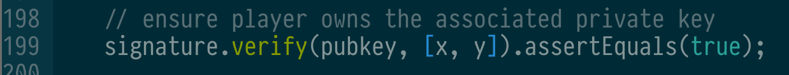

!!!

### SnarkyJS

* (not monadic) Embedded DSL in Typescript
* <!-- .element: class="fragment" data-fragment-index="1" --> Function abstraction <!-- .element: class="fragment" data-fragment-index="1" -->
* <!-- .element: class="fragment" data-fragment-index="2" --> Types <!-- .element: class="fragment" data-fragment-index="2" -->
* <!-- .element: class="fragment" data-fragment-index="3" --> Magically\* weave logic in-and-out of the circuit <!-- .element: class="fragment" data-fragment-index="3" -->
* <!-- .element: class="fragment" data-fragment-index="4" --> Simultaneously define prover and verifier logic <!-- .element: class="fragment" data-fragment-index="4" -->

Note: Why do we want to make Snarky more accessible. Besides contributors to the Mina codebase...

!!!

### Smart contracts: Snapps

Decentralized snark-powered apps

Privately interact with any website and access verified real world data for use on chain. <!-- .element: class="fragment" data-fragment-index="1" -->

Keep users in control by validating and sharing proofs of their data, rather than the data itself <!-- .element: class="fragment" data-fragment-index="2" -->

!!!

### Ethereum: On-chain execution

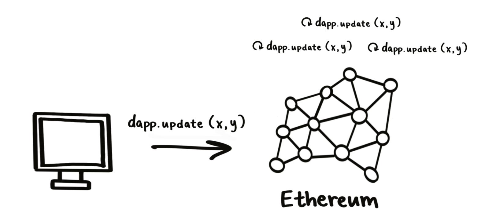

Note: And everything?

!!!

### Mina: Off-chain execution

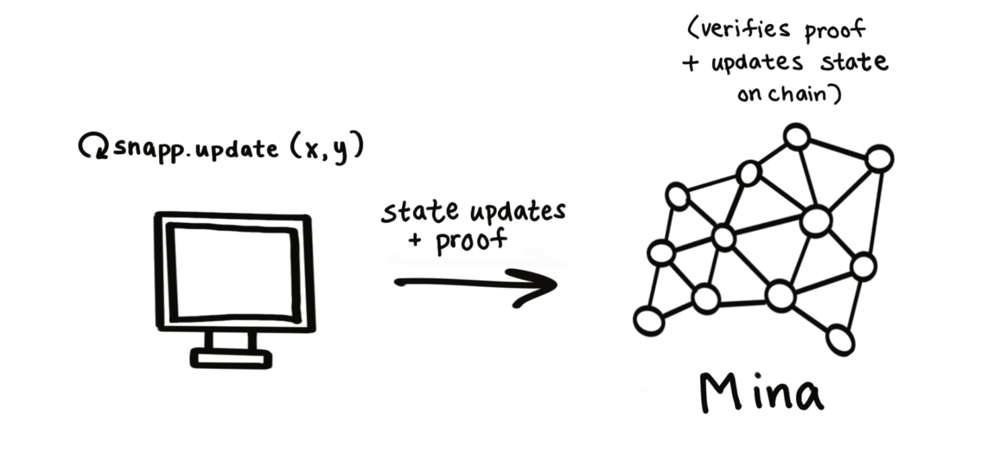

Note: And rolled up into the recursive snark on Mina

!!!

### Snapp methods

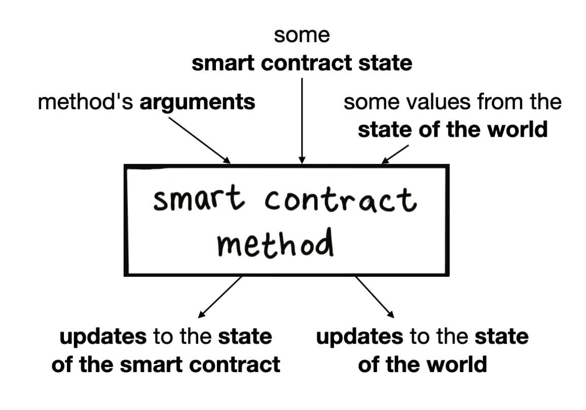

Note: Output is "preconditioned" updates to the world. How do web3 users use snapps?

!!!

### EVM full Mina State verification

Nil foundation creating a full Mina State verification smart contract for EVM networks with reasonable gas. First half of the bridge

Note: This means existing dapps can take advantage of private/off-chain computation applications

!!!

### Users

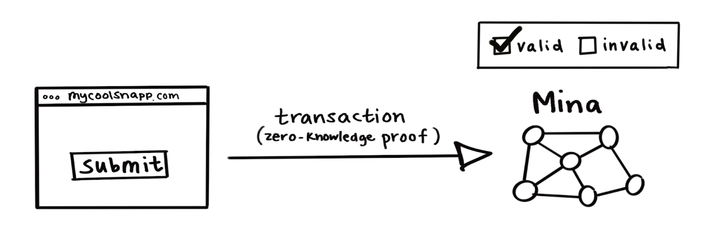

!!!

### Drop the trusted RPCs

Mina light enough for full-nodes in the browser

Note: WIP

!!!

### Browser nodes

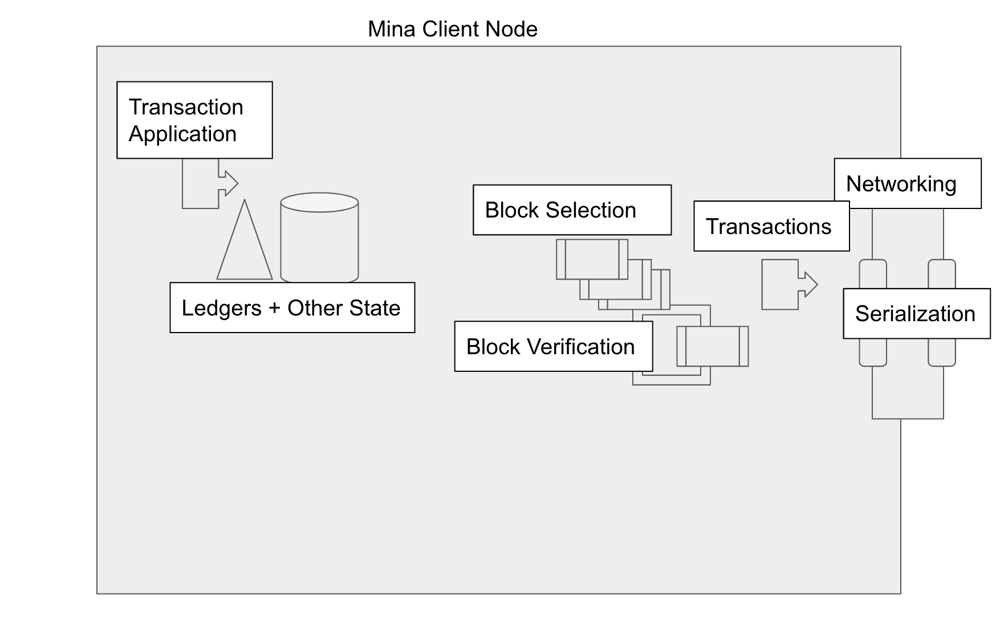

!!!

### Users running full nodes


Note: what about the other nodes...

!!!

### Consensus nodes

Nodes that produce blocks

!!!

### Consensus nodes

Need to create proofs

Creating proofs is _expensive_; therefore _slow_ on commodity hardware

!!!

### Consensus nodes

Desire: capable of including many transactions per block

Problem: Creating proofs is _expensive_; therefore _slow_ on commodity hardware

Note: Let's dig into and iterate on a solution

!!!

### Definition

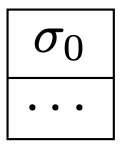

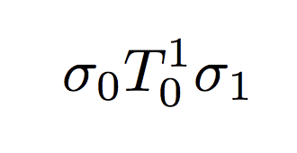
<!-- .element: class="fragment" data-fragment-index="1" -->

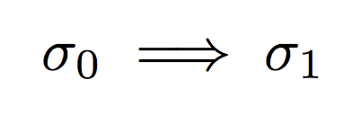
<!-- .element: class="fragment" data-fragment-index="2" -->

Note: Part of that state is the state of everyone's accounts

!!!

### Process Transactions Serially

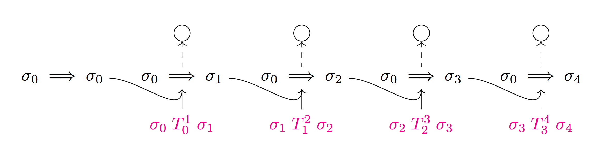

Note: Squint

!!!

### Fold

```ocaml
(* let foldLeft [1,2,3,4]
        ~init:0 ~f:(+) => 10 *)

val foldLeft :
  'a list ->
  ~init:'b ->
  ~f:('b -> 'a -> 'b) ->
  'b
```

Note: This is likely review for most of this audience

!!!

### Scan

```ocaml
(* let scanLeft [1,2,3,4]
        ~init:0 ~f:(+) => [1,3,6,10] *)

val scanLeft :
  'a list ->
  ~init:'b ->
  ~f:('b -> 'a -> 'b) ->
  'b list
```

Note: It's almost like reduce, but you get the intermediate results

!!!

### Scan on a stream

```ocaml
val scan :
  'a Stream.t ->
  ~init:'b ->
  ~f:('b -> 'a -> 'b) ->
  'b Stream.t
```

Note: A push-based async stream

!!!

### Process Transactions Serially


Note: Look again now that you know scan. Okay so properties of the problem

!!!

### Proofs are slow to construct

!!!

### Transactions arrive at some rate R

Note: Constant rate\*: For the purposes of our analysis and that this talk is short,

!!!

### Exists a distributed work pool

Note: That scales with R

!!!

### Merge proofs

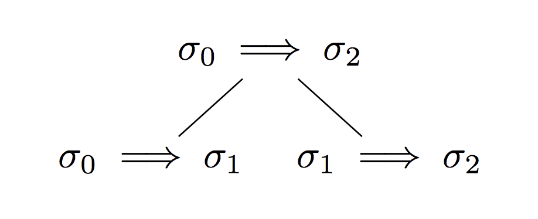

!!!

### Merge Associative

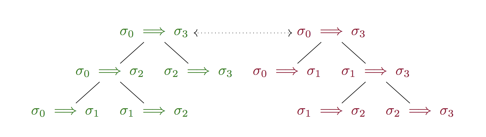

Note: Associativity implies parallelism available for exploitation

!!!

### Properties to exploit

* Expensive accumulation function
* <!-- .element: class="fragment" data-fragment-index="1" --> Input arrives asynchronously over time\* <!-- .element: class="fragment" data-fragment-index="1" -->
* <!-- .element: class="fragment" data-fragment-index="2" --> Plenty of parallel compute available <!-- .element: class="fragment" data-fragment-index="2" -->
* <!-- .element: class="fragment" data-fragment-index="3" --> Associative merge operation <!-- .element: class="fragment" data-fragment-index="3" -->

Note: (\*) for the purposes of this talk, constant ;;; you can also read this as a set of properties that if your accumulation task exhibits it, you can take advantage of the approach we're about to get to...

!!!

### Requirements

* Maximize data throughput
* <!-- .element: class="fragment" data-fragment-index="1" --> Minimize latency <!-- .element: class="fragment" data-fragment-index="1" -->
* <!-- .element: class="fragment" data-fragment-index="2" --> Minimize state size <!-- .element: class="fragment" data-fragment-index="2" -->

Note: Maybe more like priorities, In this order

!!!

### Abstract


> https://wallpaperstudio10.com/wallpaper-abstract_colorful-67718.html

Note: There are just too many sigmas

!!!

### Data

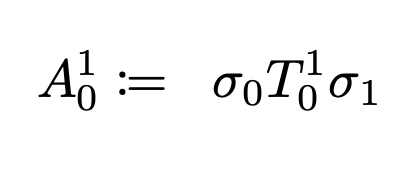

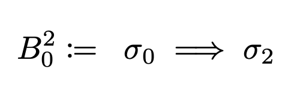
<!-- .element: class="fragment" data-fragment-index="1" -->

Note: You'll see how the notation fits together after our first example

!!!

### Naive Solution

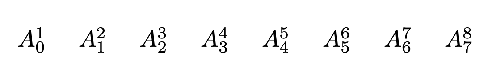

!!!

### Naive Solution

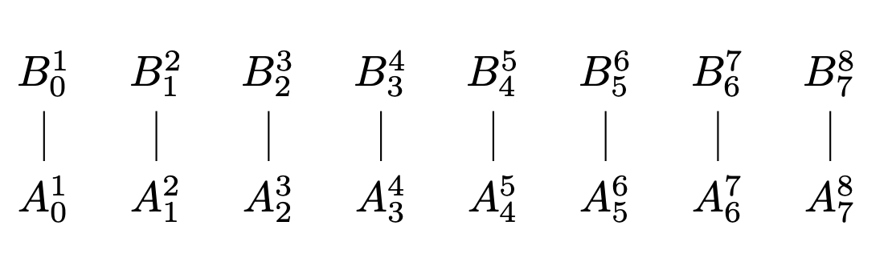

!!!

### Naive Solution

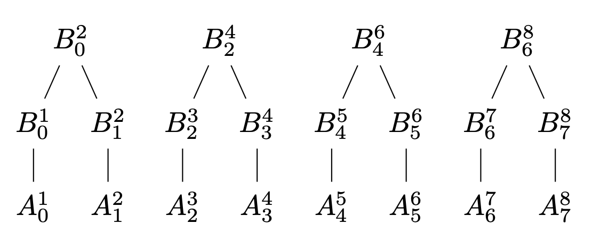

!!!

### Naive Solution

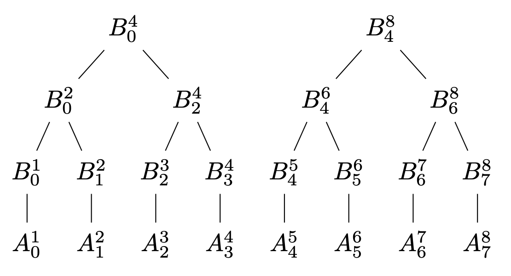

!!!

### Naive Solution

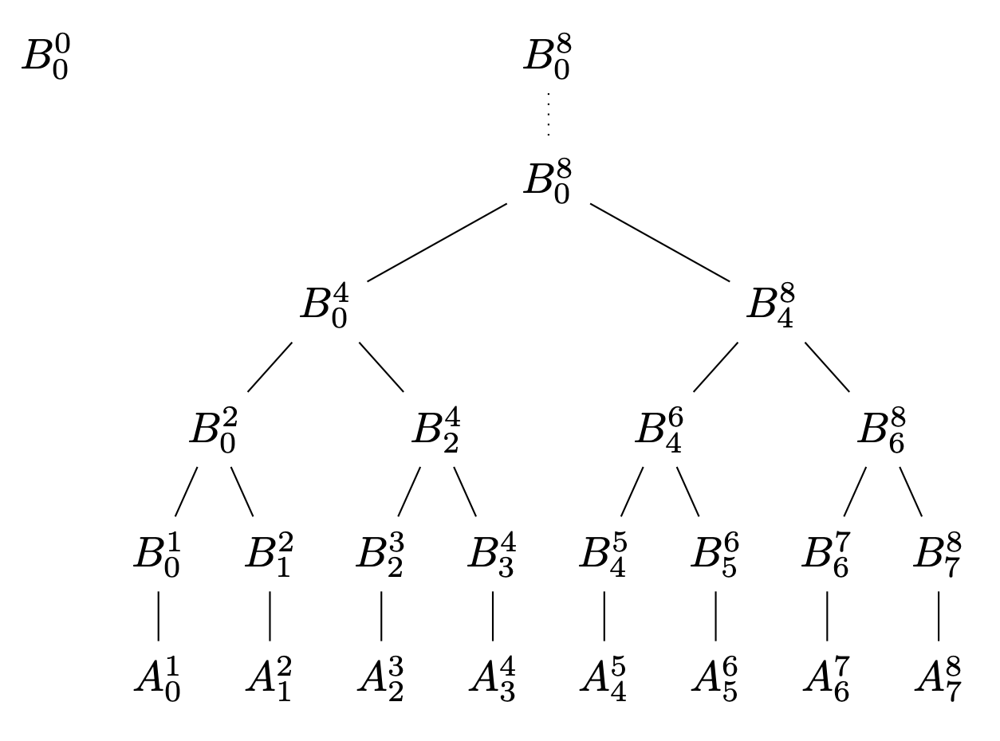</img>

!!!

### Periodic Scan

```ocaml
(* val periodicScan
    ~merge:(+)
    ~lift:id
    ~init:0
    [1,2,3,4,5,6,7,8]
  => 10,36 *)

let periodicScan
  'a Stream.t ->
  ~merge:('b -> 'b -> 'b) ->
  ~lift:('a -> 'b) ->
  ~init:'b ->
  'b Stream.t
```

Note: Some of you may be thinking oh this is like a parallel reduce, and yeah we'll start with that..

!!!

### Naive Solution

</img>

Note: Discuss throughput / latency

!!!

### Analysis

* Throughput increased
* <!-- .element: class="fragment" data-fragment-index="1" --> Latency increased <!-- .element: class="fragment" data-fragment-index="1" -->
* <!-- .element: class="fragment" data-fragment-index="2" --> State size larger <!-- .element: class="fragment" data-fragment-index="2" -->

!!!

### Problem?

</img>

> https://upload.wikimedia.org/wikipedia/commons/a/a4/Moscow_traffic_congestion.JPG

Note: Parallelism is halved every layer!

!!!

### More trees

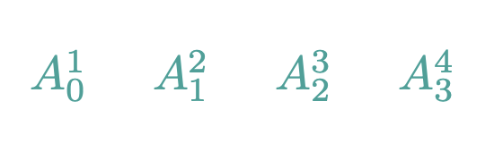

Note: Let's take the R data pieces that are available at every step

!!!

### More trees

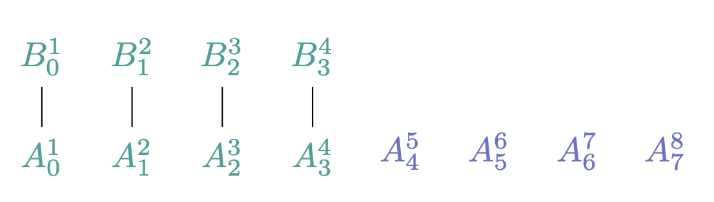

Note: Trace a run through

!!!

### More trees

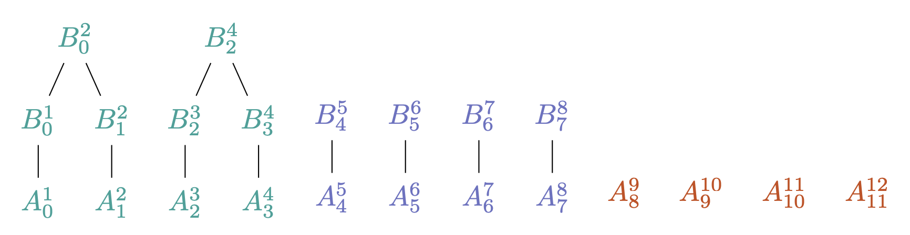

!!!

### More trees

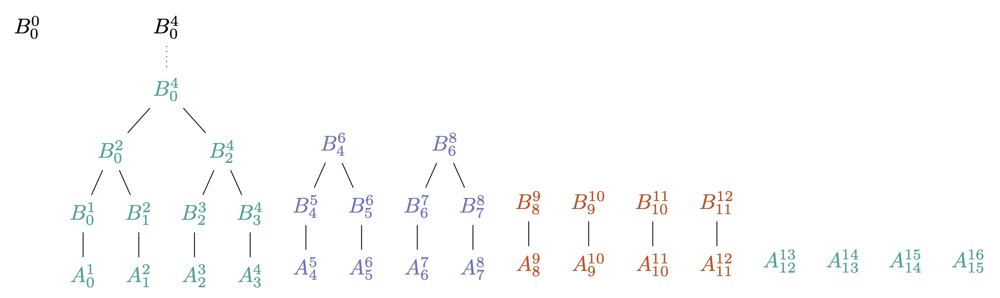

!!!

### More trees

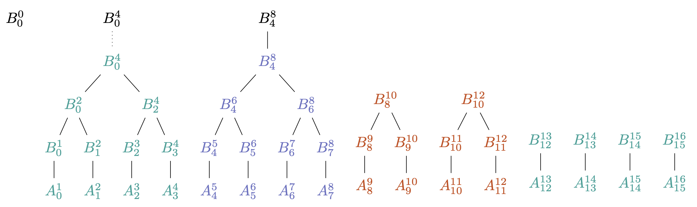

!!!

### More trees

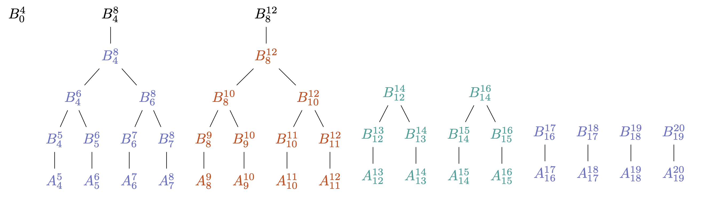

!!!

### Analysis

* Throughput is perfect
* <!-- .element: class="fragment" data-fragment-index="1" --> Latency same <!-- .element: class="fragment" data-fragment-index="1" -->
* <!-- .element: class="fragment" data-fragment-index="2" --> State size larger <!-- .element: class="fragment" data-fragment-index="2" -->

!!!

### Let's do better!


> https://static.pexels.com/photos/269474/pexels-photo-269474.jpeg

!!!

### Waste of space

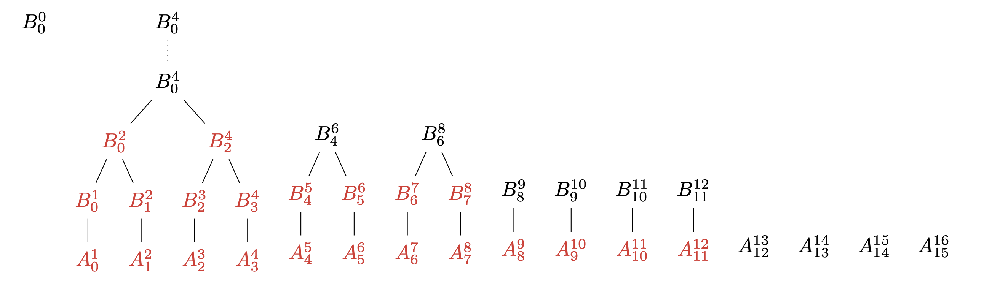</img>

Note: Once we process some layer of the tree, it becomes useless, higher layers are useless. Let's just not store that.

!!!

### Overlay the trees

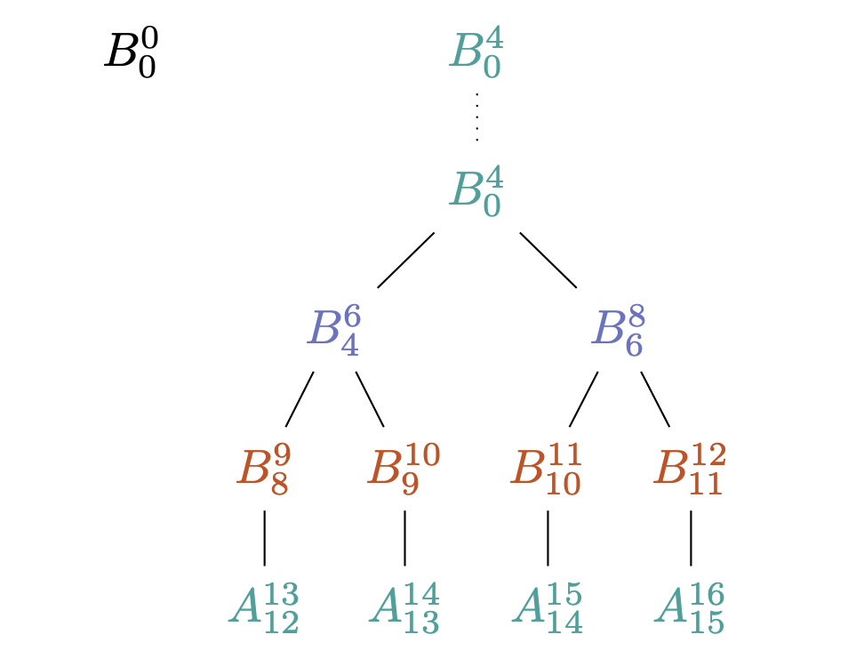</img>

Note: We have the "frontiers" of the log n trees at each layer

!!!

### Overlay the trees

</img>

Note: We have the "frontiers" of the log n trees at each layer

!!!

### Analysis

* Throughput same
* <!-- .element: class="fragment" data-fragment-index="1" --> Latency same <!-- .element: class="fragment" data-fragment-index="1" -->
* <!-- .element: class="fragment" data-fragment-index="2" --> State size smaller <!-- .element: class="fragment" data-fragment-index="2" -->

Note: Same throughput and latency, but now we drastically reduced size

!!!

### More size shrinking!


> https://static.pexels.com/photos/269474/pexels-photo-269474.jpeg

!!!

### Packing information

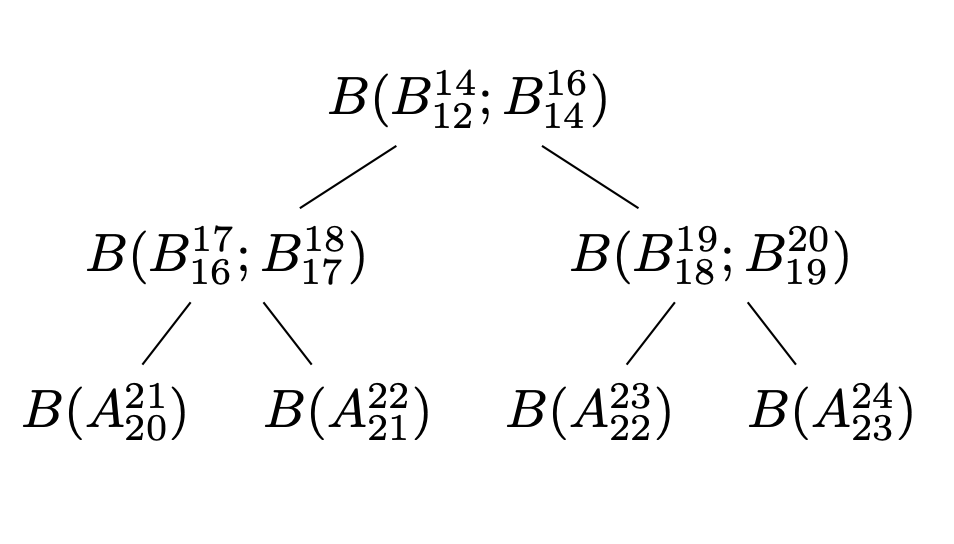</img>

!!!

### Succinct data structures

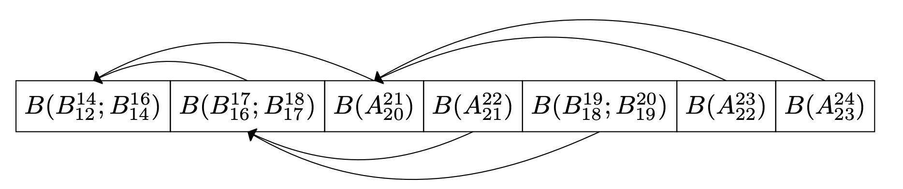

Note: Explain child/parent computable from just the index into the array "Implicit Heap"; I'll post a link to wikipedia at the end

!!!

### Other Applications

* Astronomical Data Processing
* <!-- .element: class="fragment" data-fragment-index="1" --> Livestream Analysis <!-- .element: class="fragment" data-fragment-index="1" -->

Note: Square killometre array in australia.. non-parametric machine learning.. More generally, any online-map-reduce type workloads

!!!

### Consensus

Mina uses Ouroboros Samasika

!!!

### Ouroboros Samasika

* First succinct consensus algorithm
* <!-- .element: class="fragment" data-fragment-index="1" --> Extension of Ouroboros <!-- .element: class="fragment" data-fragment-index="1" --> 
* <!-- .element: class="fragment" data-fragment-index="2" --> Invented by
Joseph Bonneau, Izaak Meckler, Vanishree Rao and Evan Shapiro <!-- .element: class="fragment" data-fragment-index="2" --> 

!!!

### Ouroboros Samasika

* Highly decentralised - uncapped participation and self-bootstrap
* <!-- .element: class="fragment" data-fragment-index="1" --> Proven security and no slashing <!-- .element: class="fragment" data-fragment-index="1" -->
* <!-- .element: class="fragment" data-fragment-index="2" --> Succinctness - full-node security with constant space/time

…Name Samasika from the Sanskrit word meaning “small" or “succinct” <!-- .element: class="fragment" data-fragment-index="2" -->

!!!

### Ouroboros Samasika

In Mina, implemented in a snark circuit

Note: In addition to out

!!!

### Ouroboros Samasika

Nuances to getting it right in the succinct setting (jump to other slides if time)

!!!

### This talk

1. Mina high level
2. <!-- .element: class="fragment" data-fragment-index="1" --> Susbsystems of Mina <!-- .element: class="fragment" data-fragment-index="1" -->
3. <!-- .element: class="fragment" data-fragment-index="2" --> Snarks + recursion <!-- .element: class="fragment" data-fragment-index="2" --> 
4. <!-- .element: class="fragment" data-fragment-index="3" --> Snarky <!-- .element: class="fragment" data-fragment-index="3" --> 
5. <!-- .element: class="fragment" data-fragment-index="4" -->  Snapps + web3 vision <!-- .element: class="fragment" data-fragment-index="4" --> 
6. <!-- .element: class="fragment" data-fragment-index="5" --> Throughput unconstrained from slow proofs / Snark Workers <!-- .element: class="fragment" data-fragment-index="5" -->
7. <!-- .element: class="fragment" data-fragment-index="6" --> Consensus + succinct long forks <!-- .element: class="fragment" data-fragment-index="6" -->

!!!

<!-- .slide: data-background="#2aa198" -->
<!-- .slide: data-state="terminal" -->
# Thanks!

By <a href="http://bkase.com">Brandon Kase</a> / <a href="http://twitter.com/bkase_">@bkase_</a>

