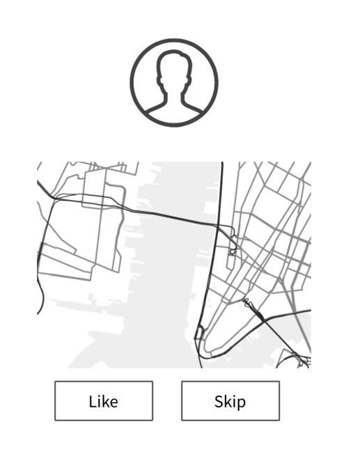

 <!-- .element: class="fragment" data-fragment-index="1" -->

Note: Animate this in, so the thing starts blank

!!!

### How do we build this for iOS


> https://pixabay.com/p-306313/?no_redirect

!!!


Note: The whole thing is a UIStackView (which itself subclasses UIView), then we have UIImageView and UIButtons

!!!

### UIKit Subclassing

```swift
class UIView { /*...*/ }
```

```swift
class UIButton : UIView { /*...*/ }
class UIImageView : UIView { /*...*/ }
```
<!-- .element: class="fragment" data-fragment-index="1" -->

```swift
class UIStackView : UIView { /*...*/ }
//...
```
<!-- .element: class="fragment" data-fragment-index="2" -->

!!!


Note: What about the map, this isn't in UIKit

!!!

### MapView

```swift
class MyMapView: UIView {
  /* ... */
}
```

Note: But this isn't a problem, we can subclass UIView ourselves and make our own view

!!!

### What about a Mac App


> http://maxpixel.freegreatpicture.com/Face-Female-Girl-Looking-Adult-Isolated-Cute-15814

Note: I'd have to do the same thing all over with NSView and NSButton

!!!

### What about a website?


> http://maxpixel.freegreatpicture.com/Face-Female-Girl-Looking-Adult-Isolated-Cute-15814

Note: I'd have to do the same thing all over in HTML/CSS/JS

!!!


Note: I always have an image view, a map view, and two buttons. Why do I need to rewrite the same code over and over again? TRANSITION: Moreover, this doesn't really come up with just views, right? Thisis a more general problem; called the Expression Problem

!!!

# Expression Problem

Note: Not just be able to add new entities, but also new interpretations for those entities; and so

!!!

<!-- .slide: data-background="#2aa198" -->
<!-- .slide: data-state="terminal" -->

# Finally Solving the Expression Problem

By <a href="http://bkase.com">Brandon Kase</a> / <a href="http://twitter.com/bkase_">@bkase_</a> 

!!!

### Subclassing (UIKit) doesn't work


> https://c2.staticflickr.com/2/1354/534849776_dfd2c24092_b.jpg

Note: We can add new views, but we can't change the view hierarchies' interpretation without modifying UIView inside UIKit.

!!!

### How about an Enum?


> http://maxpixel.freegreatpicture.com/Face-Female-Girl-Looking-Adult-Isolated-Cute-15814

!!!

### How about an Enum?


> https://c1.staticflickr.com/4/3198/2683098551_d798ab5f4c.jpg

Note: It turns out this won't get us there either, but we'll run into a separate limitation. Once we understand both, we can think about the reason

!!!

### Pretend we had EnumKit

```swift
indirect enum View {
```

```swift
  case button(text: String, onTap: () -> (), /*...*/)
  case textField(hint: String)
  /* ... */
```
<!-- .element: class="fragment" data-fragment-index="1" -->

```swift
  case stack(axis: Axis, children: [View])
  /* ... */
}
```
<!-- .element: class="fragment" data-fragment-index="2" -->

Note: TableViews etc...

!!!

### Describing a view

```swift
let twoButtons =
```

```swift
  .stack(axis: .horizontal, children: [
```
<!-- .element: class="fragment" data-fragment-index="1" -->

```swift
    .button("Like", likeButton),
    .button("Skip", skipButton)
  ])
```
<!-- .element: class="fragment" data-fragment-index="2" -->

!!!

### Each recursive traversal is a renderer

```swift
extension View {
  func renderSomething() -> Something {
```

```swift
    switch self {
    case let .textField(hint):
      /* ... */
    case let .stack(axis, children):
      let subviews = children.map { $0.renderSomething() }
      /* ... */
    }
  }
}
```
<!-- .element: class="fragment" data-fragment-index="1" -->

!!!

### We can render to a UIView

```swift
extension View {
  func renderUIView() -> UIView {
```

```swift
    switch self {
    case let .textField(hint):
      let tv = UITextField()
      /* ... */
      return tv
```
<!-- .element: class="fragment" data-fragment-index="1" -->

```swift
    case let .stack(axis, children):
      let sv = UIStackView()
      let subViews = children.map{ $0.renderUIView() }
      subViews.forEach{ sv.addSubView($0) }
      /* ... */
      return sv
    }
  }
}
```
<!-- .element: class="fragment" data-fragment-index="2" -->

!!!

### We can render to NSViews

```swift
extension View {
  func renderAppKit() -> NSView {
    switch self {
    /* ... */
    }
  }
}
```

!!!

### How do we add new view types?


> http://maxpixel.freegreatpicture.com/Face-Female-Girl-Looking-Adult-Isolated-Cute-15814

!!!

### We have to modify EnumKit inernals!

```swift
enum View {
  /*...*/
  case newView(/*...*/)
}
```

!!!

### Expression Problem


Note: MAKE SURE TO REFER BACK TO VIEWS. If we cast things and forget about type safety it's not too hard. This is not a talk about a new view framework, this is a talk about solving the expression problem. So let's talk about more...

!!!

### Non-exhaustive Enums?


Note: For those that don't know, this proposal is about making enums open to adding new variants outside it's definition

!!!

### Non-exhaustive-EnumKit

```swift
/*non-exhaustive*/ indirect enum View {
  case button(text: String, onTap: () -> (), /*...*/)
  case textField(hint: String)
  case stack(axis: Axis, children: [View])
}
```

Note: Okay so now we can add an enum case, but...

!!!

### Non-exhaustive-EnumKit

```swift
extension View {
  func renderAppKit() -> NSView {
    switch self {
    case let .button(text: String, onTap: () -> ()): /*...*/
    case let .textField(hint: String): /*...*/
    case let .stack(axis: Axis, children: [View]): /*...*/
```

```swift
    default: // what do I do here???
    }
  }
}
```
<!-- .element: class="fragment" data-fragment-index="1" -->

Note: But what do I do in the default case, how do I adapt my new enum case to the appkit renderer?

!!!

### Protocols?


> http://maxpixel.freegreatpicture.com/Face-Female-Girl-Looking-Adult-Isolated-Cute-15814

!!!

### Protocols


> http://images.medicaldaily.com/sites/medicaldaily.com/files/styles/headline/public/2013/08/04/0/62/6242.jpg

Note: It's always protocols isn't it; But not just "protocols" with hand-waving

!!!

### Solving the expression problem

* <!-- .element: class="fragment" data-fragment-index="1" -->Provide initial views <!-- .element: class="fragment" data-fragment-index="1" -->
* <!-- .element: class="fragment" data-fragment-index="2" -->Adding new views outside the library<!-- .element: class="fragment" data-fragment-index="2" -->
* <!-- .element: class="fragment" data-fragment-index="3" -->Building view-hierarchies<!-- .element: class="fragment" data-fragment-index="3" -->
* <!-- .element: class="fragment" data-fragment-index="4" -->Providing multiple interpretations for the view hierarchies<!-- .element: class="fragment" data-fragment-index="4" -->

!!!

### Provide initial views

```swift
protocol View {
```

```swift
  static func button(text: String, onTap: () -> ()) -> Self
```
<!-- .element: class="fragment" data-fragment-index="1" -->

```swift
  static func stack(axis: Axis, children: [Self]) -> Self
  /*...*/
}
```
<!-- .element: class="fragment" data-fragment-index="2" -->

Note: These are your "UIView subclasses"

!!!

### Protocol Instance Template

```swift
extension REAL : View {
```

```swift
  static func button(text: String, onTap: () -> ()) -> REAL
```
<!-- .element: class="fragment" data-fragment-index="1" -->

```swift
  static func stack(axis: Axis, children: [REAL]) -> REAL
  /*...*/
}
```
<!-- .element: class="fragment" data-fragment-index="2" -->

Note: Protocol instances

!!!

### Adding new views later

```swift
protocol WithMapView: View {
  static func map(initialLatLong: Gps.Point) -> Self
}
```

!!!


!!!

### Describing our view hierarchy

```swift
func twoButtons<V: View>() -> V {
```

```swift
  return V.stack(axis: .horizontal, children: [
```
<!-- .element: class="fragment" data-fragment-index="1" -->

```swift
    .button('Like', likePerson),
    .button('Skip', skipPerson)
  ])
}
```
<!-- .element: class="fragment" data-fragment-index="2" -->

!!!

### Describing our view hierarchy

```swift
func fullView<V: WithMapView>() -> V {
```

```swift
  return V.stack(axis: .vertical, children: [
```
<!-- .element: class="fragment" data-fragment-index="1" -->

```swift
    .image(avatarImage),
    .map(initialLatLong: Gps.Point.here()),
    twoButtons(),
  ])
}
```
<!-- .element: class="fragment" data-fragment-index="2" -->

Note: ... but how do we actually render the views. How do we interpret them:

!!!

### Interpretations are protocol instances

```swift
extension UIView : View {
```

```swift
  static func text(text: String) -> UIView {
```
<!-- .element: class="fragment" data-fragment-index="1" -->

```swift
    let tv = UITextView()
    tv.text = text
    return tv
  }
  /* etc */
}
```
<!-- .element: class="fragment" data-fragment-index="2" -->

!!!

### More Interpretations

```swift
extension HTML : View {
```

```swift
  static func text(text: String) -> HTML {
    // <p>{text}</p>
    return .p([
      .string(text)
    ])
  }
}
```
<!-- .element: class="fragment" data-fragment-index="1" -->

!!!

### Choose an interpretation with an identity function

```swift
func renderUIKit(_ v: UIView) -> UIView { return v }
```

```swift
func renderWeb(_ v: HTML) -> HTML { return v }
```
<!-- .element: class="fragment" data-fragment-index="1" -->

```swift
func renderPdf(_ v: Pdf) -> Pdf { return v }
```
<!-- .element: class="fragment" data-fragment-index="2" -->

```swift
func serialize(_ v: NSData) -> NSData { return v }
```
<!-- .element: class="fragment" data-fragment-index="3" -->

!!!

### Use it

```swift
// inside view-controller
self.view = renderUIKit(fullView())
```

```swift
// ...
showPdf(renderPdf(fullView()))
```
<!-- .element: class="fragment" data-fragment-index="1" -->

Note: But what is this approach called?

!!!

### Final Tagless Style

Note: A protocol is a final tagless dsl, and instance is a final tagless interpreter.

!!!

### More Expression Problem Instances


> https://c1.staticflickr.com/2/1618/26663431642_3ee25eb693_b.jpg

!!!

### Diagrams on a canvas

* <!-- .element: class="fragment" data-fragment-index="1" --> Items: <!-- .element: class="fragment" data-fragment-index="1" -->
  * <!-- .element: class="fragment" data-fragment-index="2" --> Specific shapes <!-- .element: class="fragment" data-fragment-index="2" -->
  * <!-- .element: class="fragment" data-fragment-index="3" -->Layering of shapes <!-- .element: class="fragment" data-fragment-index="3" -->
* <!-- .element: class="fragment" data-fragment-index="4" -->Interpretations: <!-- .element: class="fragment" data-fragment-index="4" -->
  * <!-- .element: class="fragment" data-fragment-index="5" -->CoreGraphics <!-- .element: class="fragment" data-fragment-index="5" -->
  * <!-- .element: class="fragment" data-fragment-index="6" -->CoreAnimation <!-- .element: class="fragment" data-fragment-index="6" -->
  * <!-- .element: class="fragment" data-fragment-index="7" -->Svg <!-- .element: class="fragment" data-fragment-index="7" -->

!!!

### Side-effects

* <!-- .element: class="fragment" data-fragment-index="1" -->Items: <!-- .element: class="fragment" data-fragment-index="1" -->
  * <!-- .element: class="fragment" data-fragment-index="2" -->Post request <!-- .element: class="fragment" data-fragment-index="2" -->
  * <!-- .element: class="fragment" data-fragment-index="3" -->Analytics tracking <!-- .element: class="fragment" data-fragment-index="3" -->
* <!-- .element: class="fragment" data-fragment-index="4" -->Interpretations: <!-- .element: class="fragment" data-fragment-index="4" -->
  * <!-- .element: class="fragment" data-fragment-index="5" -->Perform the effect <!-- .element: class="fragment" data-fragment-index="5" -->
  * <!-- .element: class="fragment" data-fragment-index="6" -->Log the effect, but don't perform it<!-- .element: class="fragment" data-fragment-index="6" -->
  * <!-- .element: class="fragment" data-fragment-index="7" -->Emit a datastructure that you can test against <!-- .element: class="fragment" data-fragment-index="7" -->

!!!

### Arithmetic

* <!-- .element: class="fragment" data-fragment-index="1" -->Items: <!-- .element: class="fragment" data-fragment-index="1" -->
  * <!-- .element: class="fragment" data-fragment-index="2" -->Numbers <!-- .element: class="fragment" data-fragment-index="2" -->
  * <!-- .element: class="fragment" data-fragment-index="3" -->Addition of numbers<!-- .element: class="fragment" data-fragment-index="3" -->
  * <!-- .element: class="fragment" data-fragment-index="4" -->Multiplication of numbers<!-- .element: class="fragment" data-fragment-index="4" -->
* <!-- .element: class="fragment" data-fragment-index="5" -->Interpretations: <!-- .element: class="fragment" data-fragment-index="5" -->
  * <!-- .element: class="fragment" data-fragment-index="6" -->Number<!-- .element: class="fragment" data-fragment-index="6" -->
  * <!-- .element: class="fragment" data-fragment-index="7" -->String <!-- .element: class="fragment" data-fragment-index="7" -->
  * <!-- .element: class="fragment" data-fragment-index="8" -->UIView<!-- .element: class="fragment" data-fragment-index="8" -->

!!!

### Recap

1. <!-- .element: class="fragment" data-fragment-index="1" --> Expression Problem <!-- .element: class="fragment" data-fragment-index="1" -->
  * <!-- .element: class="fragment" data-fragment-index="5" --> Extensibility in two dimensions  <!-- .element: class="fragment" data-fragment-index="5" -->
2. <!-- .element: class="fragment" data-fragment-index="6" --> Final Tagless Approach: <!-- .element: class="fragment" data-fragment-index="6" -->
  * <!-- .element: class="fragment" data-fragment-index="7" --> Items -- Protocols: Methods return Self <!-- .element: class="fragment" data-fragment-index="7" -->
  * <!-- .element: class="fragment" data-fragment-index="8" --> Interpretations -- Protocol Instances <!-- .element: class="fragment" data-fragment-index="8" -->

!!!

### Resources:

* [Oleg's Tagless Final Lecture Notes](http://okmij.org/ftp/tagless-final/course/lecture.pdf)
* [Chris's Side-effects](https://gist.github.com/chriseidhof/a542d0a074cbf8d418d25a8b8253ff33)
* [Tagless Graphics](https://github.com/bkase/tagless-graphics)
* Check out upcoming Swift Talk episodes!

!!!

# Thanks!

By <a href="http://bkase.com">Brandon Kase</a> / <a href="http://twitter.com/bkase_">@bkase_</a> 

Slide Deck: [https://is.gd/Qv7rC6](https://is.gd/Qv7rC6)

!!!

## Appendix

!!!

### That's not all: Recursion done for you!

```swift
extension HTML : View {
  // Self type is replaced recursively
  static func stack(children: [HTML]) -> HTML {
    return .div(style: [.position(absolute)], children)
  }
  /* ... */
}
```

Note: We don't actually do any recursion

!!!


