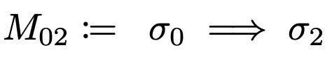
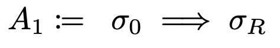
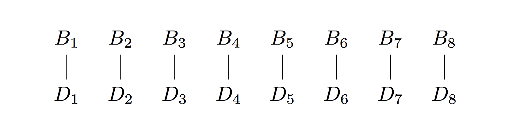

<!-- .slide: data-background="#2aa198" -->
<!-- .slide: data-state="terminal" -->

# Fast Accumulation on Streams

By <a href="http://bkase.com">Brandon Kase</a> / <a href="http://twitter.com/bkase_">@bkase_</a>

Note: Motivated by a concrete problem

!!!

### Coda

</img>

!!!

### Blockchain

PICTURE OF A GIT REPO

!!!

### Succinct blockchain


> https://www.flickr.com/photos/75001512@N00/4450040533

Note: .. powered zksnarks

!!!

### ZkSnark Acronym

* Zero
* Knowledge
* Succinct
* Non-interactive
* Argument of
* Knowledge

Note: There exists DATA s.t. PROPERTY

!!!

### Simple SNARK

_There exists_ a pdf file _such that_ the hash of the file is ab3df33...

Note: And the fact that I am able to construct this means I KNOW such a PDF file

!!!

### Recursive composition

</img>

!!!

### Blockchain SNARK

REPLACE WITH AN IMAGE

_There exists_ ... _such that_ ...

Note: There are (at least) two different proofs floating around

!!!

### SNARKs are slow to construct


> https://pixabay.com/en/snail-slow-shell-mollusk-close-up-1844618/

Note: Not about snarks, it's about dealing with the slowness of SNARK proof construction. So we actually do:

!!!

### Blockchain SNARK

_There exists_ a proof that transactions are valid _and_ ... _such that_ the proof verifies _and_ ...

Note: There are (at least) two different proofs floating around

!!!

### What's the problem?

Note: It's hard for me to describe the transaction proof until we chip away some concrete stuff and get to some symbols...

!!!

### Latex it up


Note: Part of that state is the state of everyone's accounts

!!!

### Latex it up


!!!

### Latex it up


!!!

### Process Transactions Serially


Note: Squint

!!!

### Fold

```ocaml
(* foldLeft [1,2,3,4] ~init:0 ~f:(+) => 10 *)

val foldLeft : 'a list
  -> init:'b
  -> f:('b -> 'a -> 'b)
  -> 'b
```

Note: This is likely review for most of this audience

!!!

### Scan

```ocaml
(* scanLeft [1,2,3,4] ~init:0 ~f:(+) => [1,3,6,10] *)

val scanLeft : 'a list
  -> init:'b
  -> f:('b -> 'a -> 'b)
  -> 'b list
```

Note: It's almost like reduce, but you get the intermediate results

!!!

### Scan on a stream

```ocaml
val scan : 'a Stream.t
  -> init:'b
  -> f:('b -> 'a -> 'b)
  -> 'b Stream.t
```

Note: A push-based async stream

!!!

### Process Transactions Serially


Note: Look again now that you know scan

!!!

### Low throughput


> https://c1.staticflickr.com/1/740/31689460193_18d613a3d8_b.jpg

Note: Now we understand the real problem, great.

!!!

### This talk

1. Concrete / General to identify and solve a problem
2. <!-- .element: class="fragment" data-fragment-index="1" --> An interesting problem and an interesting solution underneath it <!-- .element: class="fragment" data-fragment-index="1" -->

!!!

### This talk specifically

1. <s>Concrete problem</s>
2. <!-- .element: class="fragment" data-fragment-index="1" --> Properties and requirements <!-- .element: class="fragment" data-fragment-index="1" -->
3. <!-- .element: class="fragment" data-fragment-index="2" --> Iterate <!-- .element: class="fragment" data-fragment-index="2" -->

Note: Generalize it, and then iterate improving on various performance aspects..

!!!

### Properties


>  http://dl.maxpixel.freegreatpicture.com/?f=books-1082949_1280.jpg&type=Download&token=0089c38f1e35d52df822cbbcd97116fc&pid=1082949

Note: In order to derive requirements

!!!

### Proofs are slow to construct

!!!

### Transactions arrive at some rate R

!!!

### Proof work can be done by others

!!!

### Merge proofs


!!!

### Merge Associative


!!!

### Requirements


> https://upload.wikimedia.org/wikipedia/commons/thumb/d/d6/Timeless_Books.jpg/1024px-Timeless_Books.jpg

!!!

### Requirements

* Maximize data throughput
* <!-- .element: class="fragment" data-fragment-index="1" --> Minimize latency <!-- .element: class="fragment" data-fragment-index="1" -->
* <!-- .element: class="fragment" data-fragment-index="2" --> Minimize state size <!-- .element: class="fragment" data-fragment-index="2" -->

Note: In this order

!!!

### Abstract


> https://wallpaperstudio10.com/wallpaper-abstract_colorful-67718.html

Note: There are just too many sigmas

!!!

### Data


!!!

### Base


!!!

### Merges



!!!

### Outter value



!!!

### Plan

1. <s>Concrete problem</s>
2. <s>Properties and requirements</s>
3. Iterate

!!!

### Iterate


> https://pixabay.com/en/books-library-knowledge-tunnel-21849/

!!!

### Naive Solution


!!!

### Naive Solution



!!!

### Naive Solution


!!!

### Naive Solution


!!!

### Naive Solution


!!!

### Naive Solution


!!!

### Periodic Scan

```ocaml
(* periodicScan 1->2->3->4->5->6->7->8
   ~init:0
   ~lift:(fun a -> a)
   ~merge:(+) =>
   10->36
*)
val periodicScan :
  'a Stream.t ->
  ~init:'b ->
  ~lift:('a -> 'b) ->
  ~merge:('b -> 'b -> 'b) ->
  'b Stream.t
```

Note: Some of you may be thinking oh this is like a parallel reduce, and yeah we'll start with that..

!!!

### Analysis

* Throughput increased
* <!-- .element: class="fragment" data-fragment-index="1" --> Latency increased <!-- .element: class="fragment" data-fragment-index="1" -->
* <!-- .element: class="fragment" data-fragment-index="2" --> State size larger <!-- .element: class="fragment" data-fragment-index="2" -->

!!!

### Problem?


> http://maxpixel.freegreatpicture.com/Face-Female-Girl-Looking-Adult-Isolated-Cute-15814

Note: Parallelism is halved every layer!

!!!

### More trees


Note: Let's take the R data pieces that are available at every step

!!!

### More trees


Note: Trace a run through

!!!

### More trees


!!!

### More trees


!!!

### More trees


!!!

### Analysis

* Throughput is perfect
* <!-- .element: class="fragment" data-fragment-index="1" --> Latency same <!-- .element: class="fragment" data-fragment-index="1" -->
* <!-- .element: class="fragment" data-fragment-index="2" --> State size larger <!-- .element: class="fragment" data-fragment-index="2" -->

!!!

### Let's do better!


> https://static.pexels.com/photos/269474/pexels-photo-269474.jpeg

!!!

### Waste of space


Note: Once we process some layer of the tree, it becomes useless, higher layers are useless. Let's just not store that.

!!!

### Overlay the trees


Note: We have the "frontiers" of the log n trees at each layer

!!!

### Analysis

* Throughput same
* <!-- .element: class="fragment" data-fragment-index="1" --> Latency same <!-- .element: class="fragment" data-fragment-index="1" -->
* <!-- .element: class="fragment" data-fragment-index="2" --> State size smaller <!-- .element: class="fragment" data-fragment-index="2" -->

Note: Same throughput and latency, but now we drastically reduced size

!!!

### More size shrinking!


> https://static.pexels.com/photos/269474/pexels-photo-269474.jpeg

!!!

### Packing information

</img>

!!!

### Succinct data structures


Note: "Implicit Heap"; I'll post a link to wikipedia at the end

!!!

### Other Applications

* Astronomical Data Processing
* <!-- .element: class="fragment" data-fragment-index="1" --> Livestream Analysis <!-- .element: class="fragment" data-fragment-index="1" -->

Note: More generally, any online-map-reduce type workloads

!!!

### Fast Accumulation on Streams

1. Concrete problem
2. <!-- .element: class="fragment" data-fragment-index="1" --> Properties and requirements <!-- .element: class="fragment" data-fragment-index="1" -->
4. <!-- .element: class="fragment" data-fragment-index="2" --> Iterate <!-- .element: class="fragment" data-fragment-index="2" -->

!!!

<!-- .slide: data-background="#2aa198" -->
<!-- .slide: data-state="terminal" -->
# Thanks!

By <a href="http://bkase.com">Brandon Kase</a> / <a href="http://twitter.com/bkase_">@bkase_</a>

Slide Deck: [https://is.gd/E69TRA](https://is.gd/E69TRA)

Succinct Datastructures: [https://is.gd/1q22MX](https://is.gd/1q22MX)

!!!

## Appendix

!!!

### More use-cases

(picture)

!!!

### Astronomical Telescope Data

(picture)

Note: Non-parametric models, huge firehose of data with expensive compute on it

!!!

### Livestream Analysis

(picture)

Note: Firehose of data; some associative combine

!!!


