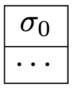
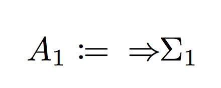
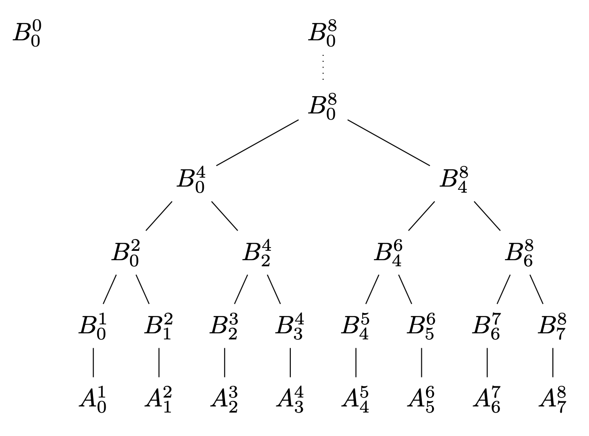
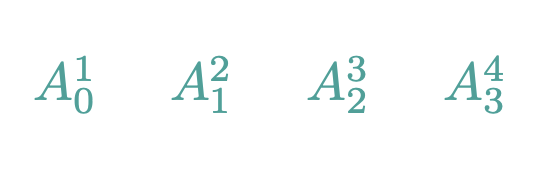
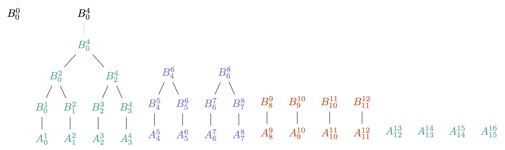
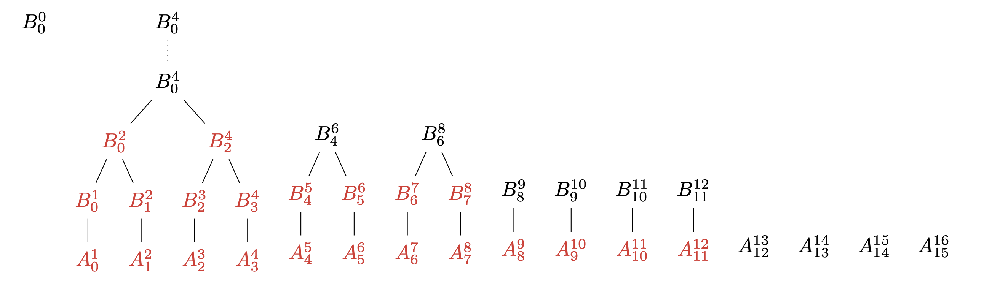
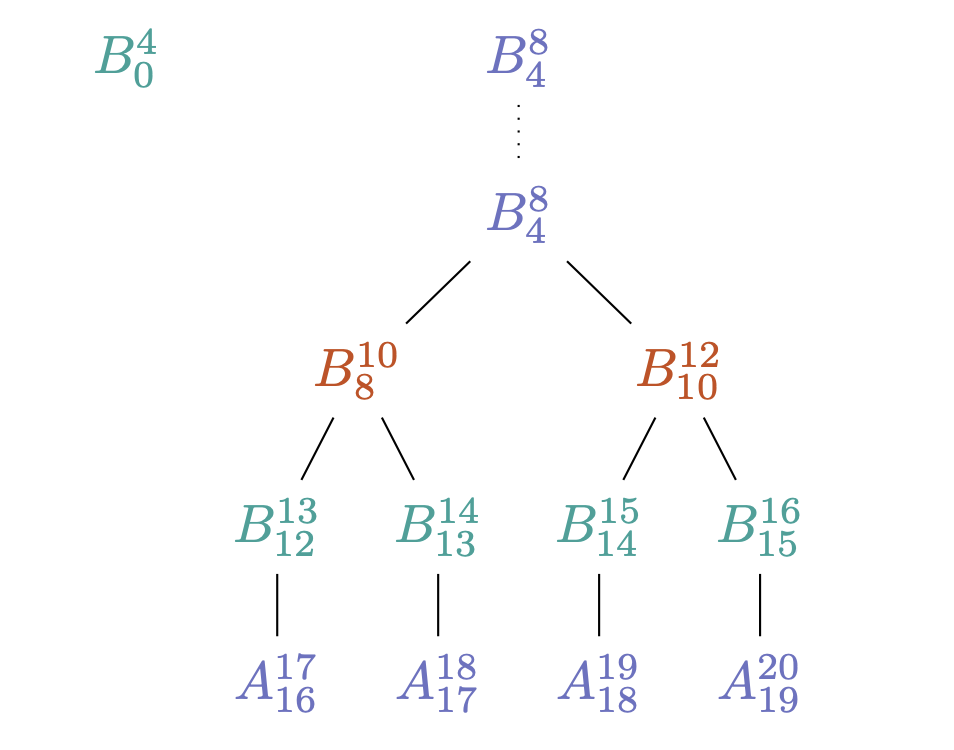

<!-- .slide: data-background="#2aa198" -->
<!-- .slide: data-state="terminal" -->

# Fast Accumulation on Streams

By <a href="http://bkase.com">Brandon Kase</a> / <a href="http://twitter.com/bkase_">@bkase_</a>

Note: I want to structure the talk by first giving context around where I came across this and then going into the story of getting to the solution

!!!

### Coda

</img>

Note: Rather than having all the nodes do the work in processing blocks containing transactions, most of the nodes verify a small cryptographic proof of that work being done instead of doing it themselves. These proofs are called...

!!!

### Zk-Snark Acronym

* Zero
* Knowledge
* Succinct
* Non-interactive
* Argument of
* Knowledge

!!!

### SNARK statements

_There exists_ data _such that_ predicates hold on that data

Note: There exists DATA s.t. PROPERTY

!!!

### Simple SNARK

_There exists_ a pdf file _such that_ the hash of the file is ab3df33...

Note: And the fact that I am able to construct this means I KNOW such a PDF file

!!!

### Recursive composition

_There exists_ a proof of this statement _such that_ that proof verifies

Note: Recursion!

!!!

### Recursive composition

</img>

!!!

### SNARKs are slow to construct

</img>

> https://pixabay.com/en/snail-slow-shell-mollusk-close-up-1844618/

Note: Not about snarks, it's about dealing with the slowness of SNARK proof construction. So we actually do:

!!!

### Latex it up




<!-- .element: class="fragment" data-fragment-index="1" -->


<!-- .element: class="fragment" data-fragment-index="2" -->

Note: Part of that state is the state of everyone's accounts

!!!

### Process Transactions Serially


Note: Squint

!!!

### Fold

```ocaml
(* let foldLeft [1,2,3,4]
        ~init:0 ~f:(+) => 10 *)

val foldLeft :
  'a list ->
  ~init:'b ->
  ~f:('b -> 'a -> 'b) ->
  'b
```

Note: This is likely review for most of this audience

!!!

### Scan

```ocaml
(* let scanLeft [1,2,3,4]
        ~init:0 ~f:(+) => [1,3,6,10] *)

val scanLeft :
  'a list ->
  ~init:'b ->
  ~f:('b -> 'a -> 'b) ->
  'b list
```

Note: It's almost like reduce, but you get the intermediate results

!!!

### Scan on a stream

```ocaml
val scan :
  'a list ->
  ~init:'b ->
  ~f:('b -> 'a -> 'b) ->
  'a Stream.t ->
  'b Stream.t
```

Note: A push-based async stream

!!!

### Process Transactions Serially


Note: Look again now that you know scan

!!!

### Low throughput


> https://c1.staticflickr.com/1/740/31689460193_18d613a3d8_b.jpg

Note: Now we understand the real problem, great.

!!!

### This talk

1. <s>Concrete problem</s>
2. <!-- .element: class="fragment" data-fragment-index="1" --> Properties and requirements <!-- .element: class="fragment" data-fragment-index="1" -->
3. <!-- .element: class="fragment" data-fragment-index="2" --> Iterate <!-- .element: class="fragment" data-fragment-index="2" -->

Note: Generalize it, and then iterate improving on various performance aspects..

!!!

### Properties


>  http://dl.maxpixel.freegreatpicture.com/?f=books-1082949_1280.jpg&type=Download&token=0089c38f1e35d52df822cbbcd97116fc&pid=1082949

Note: In order to derive requirements

!!!

### Proofs are slow to construct

!!!

### Transactions arrive at some rate R

Note: Constant rate\*: For the purposes of our analysis and that this talk is short,

!!!

### Exists a distributed work pool

Note: That scales with R

!!!

### Merge proofs


!!!

### Merge Associative


Note: Associativity implies parallelism available for exploitation

!!!

### Properties to exploit

* Expensive accumulation function
* <!-- .element: class="fragment" data-fragment-index="1" --> Input arrives asynchronously over time\* <!-- .element: class="fragment" data-fragment-index="1" -->
* <!-- .element: class="fragment" data-fragment-index="2" --> Plenty of parallel compute available <!-- .element: class="fragment" data-fragment-index="2" -->
* <!-- .element: class="fragment" data-fragment-index="3" --> Associative merge operation <!-- .element: class="fragment" data-fragment-index="3" -->

Note: (\*) for the purposes of this talk, constant ;;; you can also read this as a set of properties that if your accumulation task exhibits it, you can take advantage of the approach we're about to get to...

!!!

### Requirements


> https://upload.wikimedia.org/wikipedia/commons/thumb/d/d6/Timeless_Books.jpg/1024px-Timeless_Books.jpg

!!!

### Requirements

* Maximize data throughput
* <!-- .element: class="fragment" data-fragment-index="1" --> Minimize latency <!-- .element: class="fragment" data-fragment-index="1" -->
* <!-- .element: class="fragment" data-fragment-index="2" --> Minimize state size <!-- .element: class="fragment" data-fragment-index="2" -->

Note: Maybe more like priorities, In this order

!!!

### Abstract


> https://wallpaperstudio10.com/wallpaper-abstract_colorful-67718.html

Note: There are just too many sigmas

!!!

### Data




<!-- .element: class="fragment" data-fragment-index="1" -->

Note: You'll see how the notation fits together after our first example

!!!

### Plan

1. <s>Concrete problem</s>
2. <s>Properties and requirements</s>
3. Iterate

!!!

### Iterate


> https://pixabay.com/en/books-library-knowledge-tunnel-21849/

!!!

### Naive Solution


!!!

### Naive Solution


!!!

### Naive Solution


!!!

### Naive Solution


!!!

### Naive Solution

</img>

!!!

### Periodic Scan

```ocaml
(* val periodicScan
    ~merge:(+)
    ~f:id
    ~init:0
    [1,2,3,4,5,6,7,8]
  => 10,36 *)

let periodicScan
  'a Stream.t ->
  ~merge:('b -> 'b -> 'b) ->
  ~lift:('a -> 'b) ->
  ~init:'b ->
  'b Stream.t
```

Note: Some of you may be thinking oh this is like a parallel reduce, and yeah we'll start with that..

!!!

### Naive Solution

</img>

Note: Discuss throughput / latency

!!!

### Analysis

* Throughput increased
* <!-- .element: class="fragment" data-fragment-index="1" --> Latency increased <!-- .element: class="fragment" data-fragment-index="1" -->
* <!-- .element: class="fragment" data-fragment-index="2" --> State size larger <!-- .element: class="fragment" data-fragment-index="2" -->

!!!

### Problem?

</img>

> https://upload.wikimedia.org/wikipedia/commons/a/a4/Moscow_traffic_congestion.JPG

Note: Parallelism is halved every layer!

!!!

### More trees



Note: Let's take the R data pieces that are available at every step

!!!

### More trees


Note: Trace a run through

!!!

### More trees


!!!

### More trees



!!!

### More trees


!!!

### More trees


!!!

### Analysis

* Throughput is perfect
* <!-- .element: class="fragment" data-fragment-index="1" --> Latency same <!-- .element: class="fragment" data-fragment-index="1" -->
* <!-- .element: class="fragment" data-fragment-index="2" --> State size larger <!-- .element: class="fragment" data-fragment-index="2" -->

!!!

### Let's do better!


> https://static.pexels.com/photos/269474/pexels-photo-269474.jpeg

!!!

### Waste of space

</img>

Note: Once we process some layer of the tree, it becomes useless, higher layers are useless. Let's just not store that.

!!!

### Overlay the trees

</img>

Note: We have the "frontiers" of the log n trees at each layer

!!!

### Overlay the trees

</img>

Note: We have the "frontiers" of the log n trees at each layer

!!!

### Analysis

* Throughput same
* <!-- .element: class="fragment" data-fragment-index="1" --> Latency same <!-- .element: class="fragment" data-fragment-index="1" -->
* <!-- .element: class="fragment" data-fragment-index="2" --> State size smaller <!-- .element: class="fragment" data-fragment-index="2" -->

Note: Same throughput and latency, but now we drastically reduced size

!!!

### More size shrinking!


> https://static.pexels.com/photos/269474/pexels-photo-269474.jpeg

!!!

### Packing information

</img>

!!!

### Succinct data structures


Note: Explain child/parent computable from just the index into the array "Implicit Heap"; I'll post a link to wikipedia at the end

!!!

### Other Applications

* Astronomical Data Processing
* <!-- .element: class="fragment" data-fragment-index="1" --> Livestream Analysis <!-- .element: class="fragment" data-fragment-index="1" -->

Note: Square killometre array in australia.. non-parametric machine learning.. More generally, any online-map-reduce type workloads

!!!

### Fast Accumulation on Streams

1. Concrete problem
2. <!-- .element: class="fragment" data-fragment-index="1" --> Properties and requirements <!-- .element: class="fragment" data-fragment-index="1" -->
4. <!-- .element: class="fragment" data-fragment-index="2" --> Iterate <!-- .element: class="fragment" data-fragment-index="2" -->

!!!

<!-- .slide: data-background="#2aa198" -->
<!-- .slide: data-state="terminal" -->
# Thanks!

By <a href="http://bkase.com">Brandon Kase</a> / <a href="http://twitter.com/bkase_">@bkase_</a>

Slide Deck: [https://is.gd/MRwvys](https://is.gd/MRwvys)

Coda: [https://codaprotocol.com](https://codaprotocol.com)

Succinct Datastructures: [https://is.gd/1q22MX](https://is.gd/1q22MX)

!!!

## Appendix

!!!

### More use-cases

(picture)

!!!

### Astronomical Telescope Data

(picture)

Note: Non-parametric models, huge firehose of data with expensive compute on it

!!!

### Livestream Analysis

(picture)

Note: Firehose of data; some associative combine

!!!


