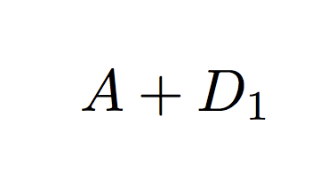
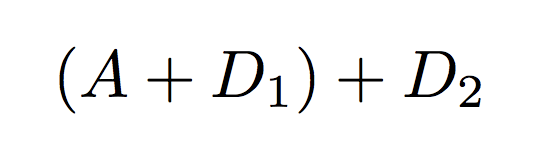
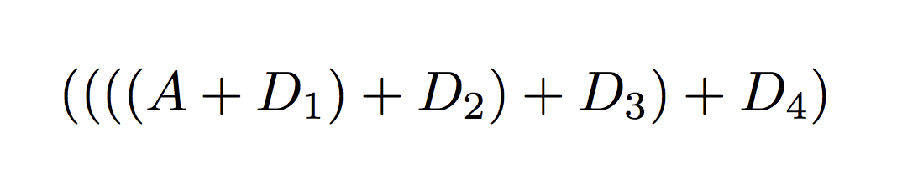

<!-- .slide: data-background="#2aa198" -->
<!-- .slide: data-state="terminal" -->

# Solving a Cool Problem

By <a href="http://bkase.com">Brandon Kase</a> / <a href="http://twitter.com/bkase_">@bkase_</a>

!!!

### Coda

</img>

!!!

### Succinct blockchain

(picture -- from izzy)

Note: .. powered zksnarks

!!!

## zk-SNARKs

</img>

!!!

## ZkSnark definition

* Zero
* Knowledge
* Succinct
* Non-interactive
* Argument of
* Knowledge

Note: There exists DATA s.t. PROPERTY

!!!

## SNARKs are slow to construct

(picture)

Note: Not about snarks, it's about dealing with the slowness of SNARK proof construction

!!!

## Process Transactions


!!!

## Process Transactions


!!!

### Aside: Scan

```swift
extension Array {
  func scan<A>(init: A, f: (A, Element) -> A) -> [A]
}
```

Note: It's almost like reduce, but you get the intermediate results

!!!

### Aside: Scan on a stream

```swift
extension Stream {
  func scan<A>(
    init: A,
    f: (A, Element) -> A
  ) -> Stream<A>
}
```

Note: In Rx this is called: `X` in ReactiveSwift it's called `Y`

!!!

## Throughput is bad

(picture)

Note: and then we have a bad cryptocurrency

!!!

### Plan

1. <s>Concrete problem</s>
2. Abstract
3. Iterate
4. Instantiate

!!!

### Let's Abstract

(picture)

!!!

### Finding the problem

1. Assume things
2. Abstract things
3. State the goal

!!!

### Let's make some assumptions

(picture)

!!!

### Assumption 1: Fixed rate of transactions R

(picture)

Note: We always have more transactions available than we can include in a transition

!!!

### Assumption 2: Infinite cores

(picture)

Note: Since we can farm out work to the network, let's just assume we have an infinite core machine (we want to max out parallelism)

!!!

### Finding the problem

1. <s>Assume things</s>
2. Abstract things
3. State the goal

!!!

### Abstract away details

(picture)

!!!

### Just data

(picture)

Note: No more transactions

!!!

### Expensive computation

(picture)

Note: No more proofs

!!!

## Aside: Periodic scan

```swift
extension Stream {
  func periodicScan<A>(
    init: A,
    lift: Element -> A,
    merge: (A, A) -> A
  ) -> Stream<A>
}
```

Note: It's kind of like this but it helps if we model it differently

!!!

### Associative merge operation

```
merge(merge(x, y), z) = merge(x, merge(y, z))
```

Note: No merge proofs

!!!

### Unit time for compute

(picture)

Note: All units of work take the same amount of time

!!!

### Finding the problem

1. <s>Assume things</s>
2. <s>Abstract things</s>
3. State the goal

!!!

### State the goal

_Efficiently compute a periodic scan on an infinite stream pumping at some target rate, prefer maximizing throughput, then minimizing latency, then minimizing size of state on an infinite core machine._

!!!

### Shared Model

(picture showing stepping)

Note: Work happens out of band -- one step is taken at a time

!!!

### Swift!

(picture)

!!!

### Jobs

```swift
enum Job {
  // a namespace
  enum Incomplete<Data, A> { /* ... */ }
  enum Available<Data, A> { /* ... */ }
  enum Complete<A> { /* ... */ }
}
```

!!!

### Jobs: Incomplete

```swift
enum Incomplete<Data, A> {
  case base(Data?)
  case merge(A?,A?)
}
```

!!!

### Jobs: Available

```swift
enum Available<Data, A> {
  case base(Data)
  case merge(A,A)
}
```


!!!

### Jobs: Complete

```swift
enum Complete<A> {
  case lifted(A)
  case merged(A)
}
```

!!!

### State

```swift
protocol ScanState {
  associatedtype Data
  associatedtype A

  static var start : Self { get }
  /* ... */
}
```

!!!

### State

```swift
  func nextJobs() -> [Job.Available<Data,A>]
```

!!!

### State

```swift
  func enqueueData(data: [Data]) -> Result<()>
```

!!!

### State

```swift
  func step(
    completedJobs: [Job.Complete<Data,A>]
  ) -> Result<A?>
}
```

!!!

### More use-cases

(picture)

!!!

### Astronomic Data Processing

(picture)

Note: Non-parametric models, huge firehose of data with expensive compute on it

!!!

### Livestream Analysis

(picture)

Note: Firehose of data; some associative combine

!!!

### Serial Solution



!!!

### Serial Solution



!!!

### Serial Solution



!!!

### What if we gather some data first?

(picture thinking face)

!!!

### Naive Solution


!!!

### Naive Solution


!!!

### Naive Solution


!!!

### Naive Solution


!!!

### Naive Solution


!!!

### Analysis

1. We are computing a periodic scan on an infinite stream pumping at some rate R
2. We have increased throughput at the cost of some latency when compared with the serial approach

!!!

### Problem?

(picture)

Note: Parallelism is halved every layer!

!!!

### More trees


Note: Let's take the R data pieces that are available at every step

!!!

### More trees


Note: Trace a run through

!!!

### More trees


!!!

### More trees


!!!

### More trees


!!!

### More trees


!!!

### More trees


!!!

### More trees


!!!

### Analysis

We increased throughput again at the cost of some latency

!!!

### Let's do better!

(picture)

!!!

### Waste of space


Note: Once we process some layer of the tree, it becomes useless, higher layers are useless. Let's just not store that.

!!!

### Overlay the trees

</img>

Note: We have the "frontiers" of the log n trees at each layer

!!!

### Overlay the trees

</img>

!!!

### Analysis

(picture)

Note: Same throughput and latency, but now we drastically reduced size

!!!

### Reveal the simplification

</img>

!!!

### More size shrinking!

!!!

### Succinct data structures


Note: But no time for this in details

!!!

### Instantiate


Note: Now we can do the snark proof work for transactions faster, and have higher throughput on the cryptocurrency

!!!

### Future Work

(picture)

!!!

### Take aways

1. Concrete problem
2. Abstract
3. Iterate
4. Instantiate

!!!

<!-- .slide: data-background="#2aa198" -->
<!-- .slide: data-state="terminal" -->
# Thanks!

By <a href="http://bkase.com">Brandon Kase</a> / <a href="http://twitter.com/bkase_">@bkase_</a>

Slide Deck: [https://is.gd/bWsLhD](https://is.gd/bWsLhD)

