<!-- .slide: data-background="#2aa198" -->
<!-- .slide: data-state="terminal" -->

# Scanning for scans

By <a href="http://bkase.com">Brandon Kase</a> / <a href="http://twitter.com/bkase_">@bkase_</a>

!!!

### Coda

</img>

!!!

### Succinct blockchain

(picture -- from izzy)

Note: .. powered zksnarks

!!!

### ZkSnark definition

* Zero
* Knowledge
* Succinct
* Non-interactive
* Argument of
* Knowledge

Note: There exists DATA s.t. PROPERTY

!!!

### Simple SNARK

_There exists_ a pdf file _such that_ the hash of the file is ab3df33...

Note: And the fact that I am able to construct this means I KNOW such a PDF file

!!!

### Recursive composition

</img>

!!!

### Blockchain SNARK

_There exists_ a proof from genesis to now _and_ some new transactions _and_ consensus metadata _such that_ the proof verifies _and_ all transactions are valid _and_ the metadata is consistent.

!!!

### SNARKs are slow to construct

(picture)

Note: Not about snarks, it's about dealing with the slowness of SNARK proof construction. So we actually do:

!!!

### Blockchain SNARK

_There exists_ a proof from genesis to now _and_ a proof that the transactions changed our account state _and_ consensus metadata _such that_ both proofs verifies _and_ the metadata is consistent.

Note: There are (at least) two different proofs floating around

!!!

### Latex it up

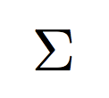

Note: Blockchain state is big sigma

!!!

### Latex it up

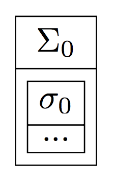

Note: Part of that state is the state of everyone's accounts

!!!

### Latex it up


!!!

### Latex it up


!!!

### Latex it up

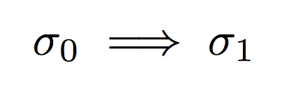

!!!

### Process Transactions Serially

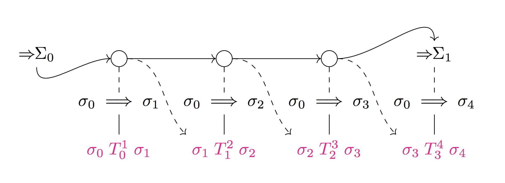

!!!

### Scan

```swift
extension Array {
  func scan<U>(init: U, f: (U, Element) -> U) -> [U]
}
```

Note: It's almost like reduce, but you get the intermediate results

!!!

### Scan on a stream

```swift
extension Stream {
  func scan<U>(
    init: U,
    f: (U, Element) -> U
  ) -> Stream<U>
}
```

Note: In Rx this is called: `X` in ReactiveSwift it's called `Y`

!!!

### Process Transactions Serially


Note: Look again now that you know scan

!!!

### Low throughput


> https://c1.staticflickr.com/1/740/31689460193_18d613a3d8_b.jpg

Note: and then we have a bad cryptocurrency

!!!

### Plan to scan for a scan

1. <s>Concrete problem</s>
2. <!-- .element: class="fragment" data-fragment-index="1" --> Properties and requirements <!-- .element: class="fragment" data-fragment-index="1" -->
3. <!-- .element: class="fragment" data-fragment-index="2" --> Iterate <!-- .element: class="fragment" data-fragment-index="2" -->
4. <!-- .element: class="fragment" data-fragment-index="3" --> Instantiate <!-- .element: class="fragment" data-fragment-index="3" -->

!!!

### Properties


>  http://dl.maxpixel.freegreatpicture.com/?f=books-1082949_1280.jpg&type=Download&token=0089c38f1e35d52df822cbbcd97116fc&pid=1082949

Note: In order to derive requirements

!!!

### Transaction proofs and blockchain proofs are slow

!!!

### Transactions arrive at some rate R

!!!

### Proof work can be done by others

!!!

### Merge proofs

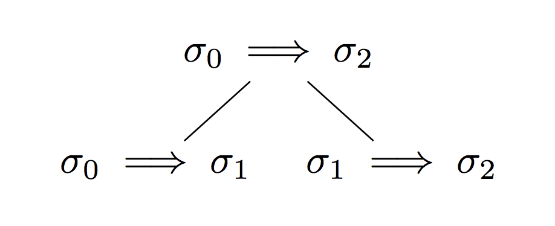

!!!

### Merge Associative

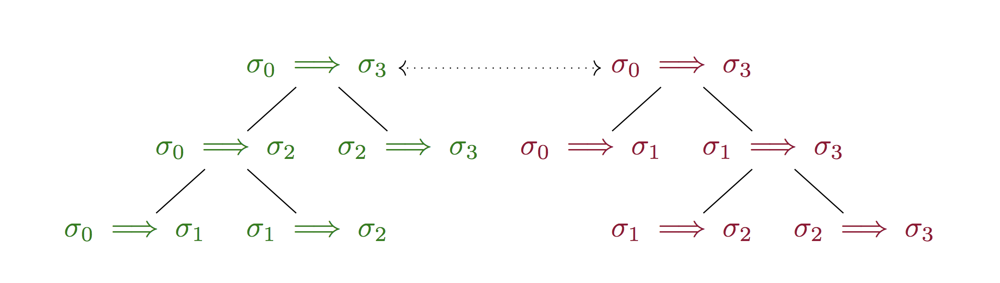

!!!

### Process Transactions


!!!

### Periodic Scan

```swift
extension Stream {
  func periodicScan<P>(
    init: P,
    lift: Element -> P,
    merge: (P, P) -> P
  ) -> Stream<P>
}
```

Note: A scan-like operation that is more optimizable

!!!

### Requirements


> https://upload.wikimedia.org/wikipedia/commons/thumb/d/d6/Timeless_Books.jpg/1024px-Timeless_Books.jpg

!!!

### Requirements

* Maximize throughput
* <!-- .element: class="fragment" data-fragment-index="1" --> Minimize latency <!-- .element: class="fragment" data-fragment-index="1" -->
* <!-- .element: class="fragment" data-fragment-index="2" --> Minimize state size <!-- .element: class="fragment" data-fragment-index="2" -->

!!!

### Abstract


> https://wallpaperstudio10.com/wallpaper-abstract_colorful-67718.html

Note: There are just too many sigmas

!!!

### Data


!!!

### Base


!!!

### Merges


!!!

### Outter value


!!!

### Scanning


!!!

### Plan to scan for a scan

1. <s>Concrete problem</s>
2. <s>Properties and requirements</s>
3. Iterate
4. Instantiate

!!!

### Iterate


> https://pixabay.com/en/books-library-knowledge-tunnel-21849/

!!!

### Naive Solution


!!!

### Naive Solution


!!!

### Naive Solution


!!!

### Naive Solution


!!!

### Naive Solution


!!!

### Naive Solution


!!!

### Analysis

* Throughput up
* <!-- .element: class="fragment" data-fragment-index="1" --> Latency increased <!-- .element: class="fragment" data-fragment-index="1" -->
* <!-- .element: class="fragment" data-fragment-index="2" --> State size larger <!-- .element: class="fragment" data-fragment-index="2" -->

!!!

### Problem?


> http://maxpixel.freegreatpicture.com/Face-Female-Girl-Looking-Adult-Isolated-Cute-15814

Note: Parallelism is halved every layer!

!!!

### More trees

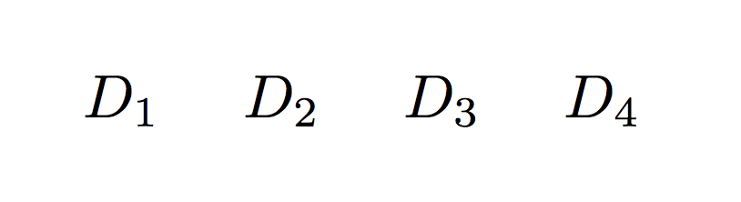

Note: Let's take the R data pieces that are available at every step

!!!

### More trees

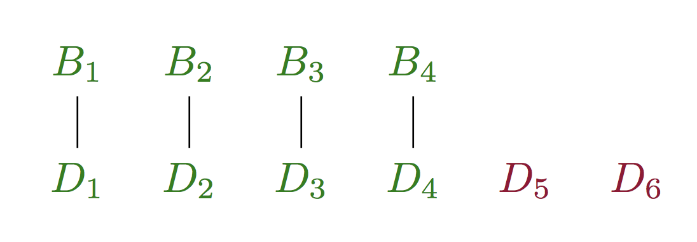

Note: Trace a run through

!!!

### More trees

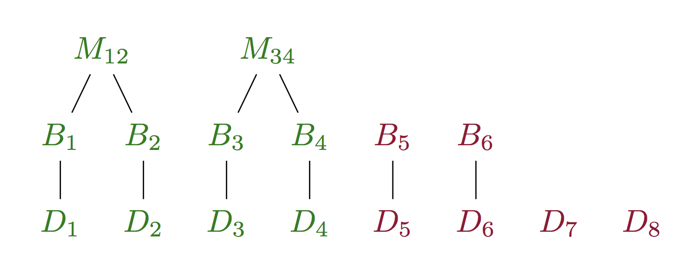

!!!

### More trees

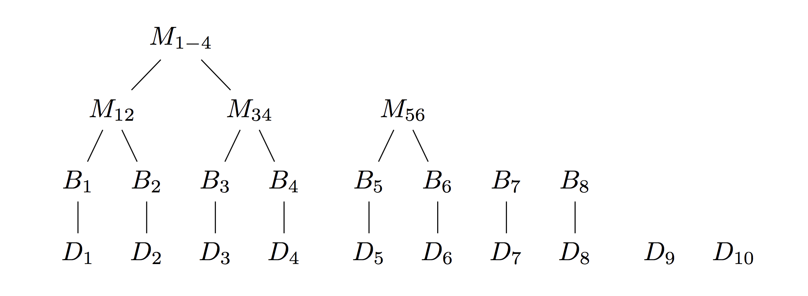

!!!

### More trees

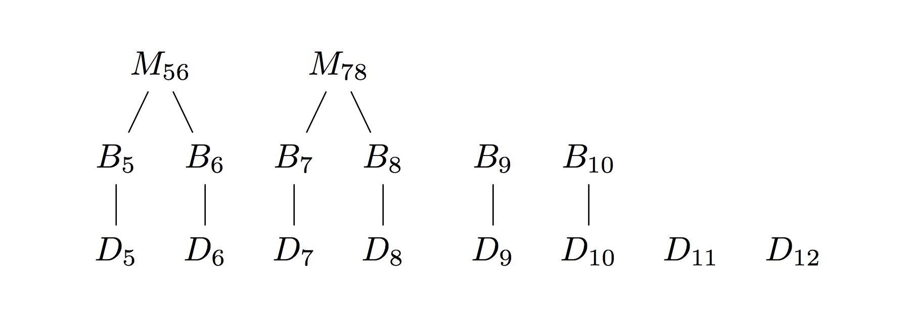

!!!

### More trees

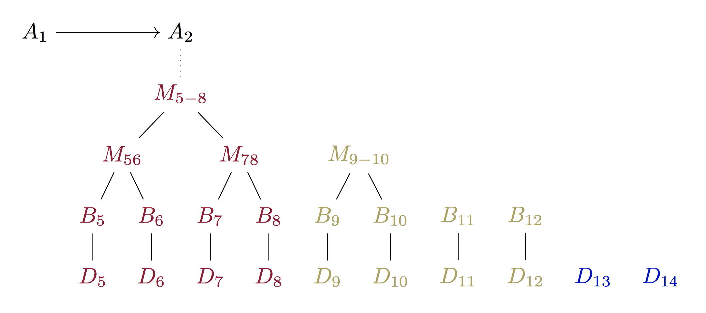

!!!

### More trees

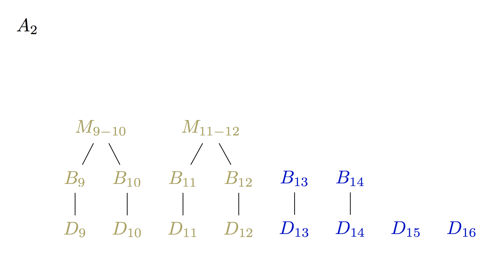

!!!

### More trees

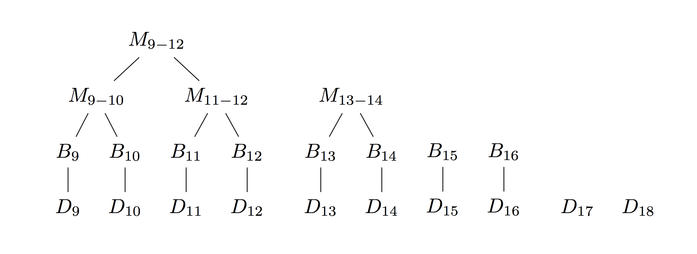

!!!

### Analysis

* Throughput up more
* <!-- .element: class="fragment" data-fragment-index="1" --> Latency same <!-- .element: class="fragment" data-fragment-index="1" -->
* <!-- .element: class="fragment" data-fragment-index="2" --> State size larger <!-- .element: class="fragment" data-fragment-index="2" -->

!!!

### Let's do better!


> https://static.pexels.com/photos/269474/pexels-photo-269474.jpeg

!!!

### Waste of space

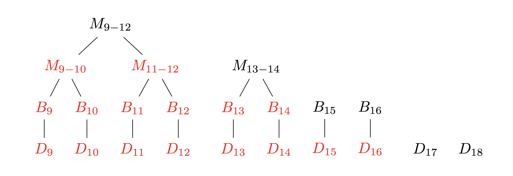

Note: Once we process some layer of the tree, it becomes useless, higher layers are useless. Let's just not store that.

!!!

### Overlay the trees

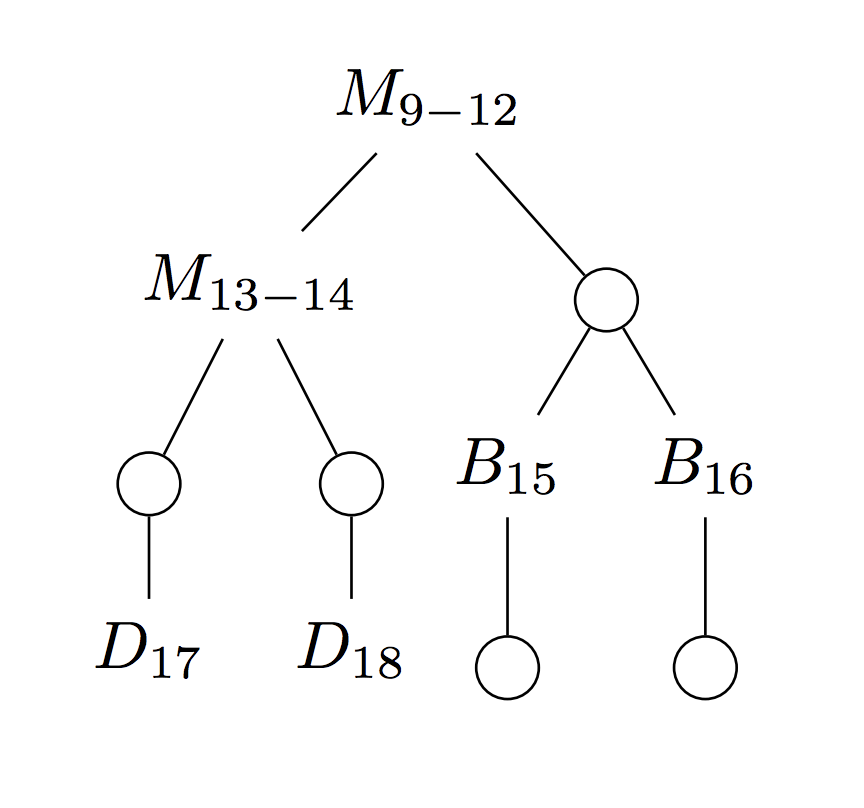</img>

Note: We have the "frontiers" of the log n trees at each layer

!!!

### Overlay the trees

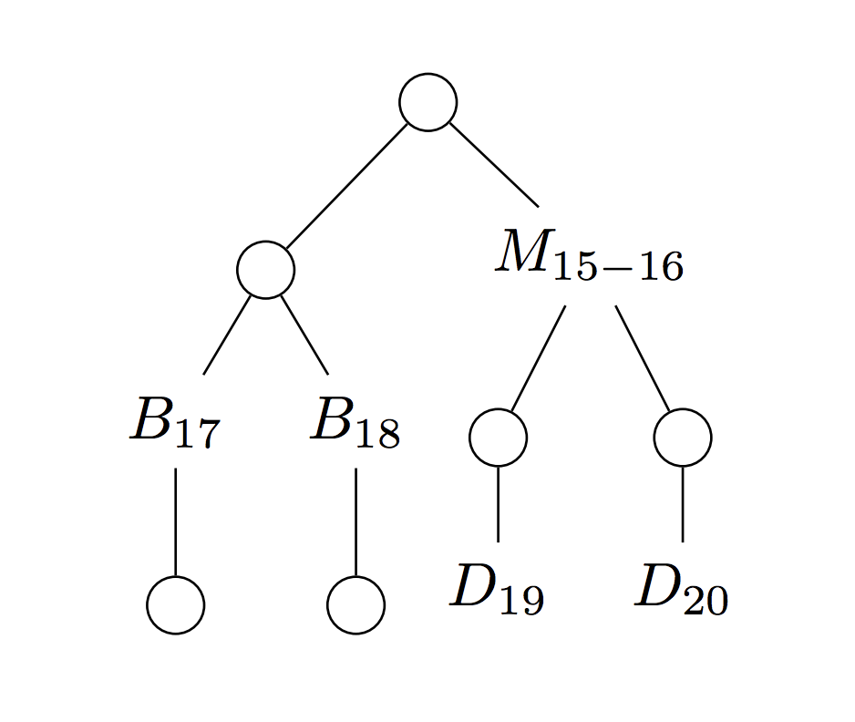</img>

!!!

### Analysis

* Throughput same
* <!-- .element: class="fragment" data-fragment-index="1" --> Latency same <!-- .element: class="fragment" data-fragment-index="1" -->
* <!-- .element: class="fragment" data-fragment-index="2" --> State size smaller <!-- .element: class="fragment" data-fragment-index="2" -->

Note: Same throughput and latency, but now we drastically reduced size

!!!

### More size shrinking!


> https://static.pexels.com/photos/269474/pexels-photo-269474.jpeg

!!!

### Packing information

</img>

!!!

### Succinct data structures

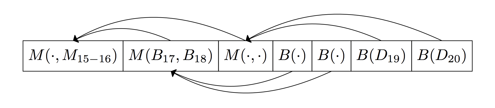

Note: "Implicit Heap"; I'll post a link to wikipedia at the end

!!!

### Instantiate


Note: Now we can do the snark proof work for transactions faster, and have higher throughput on the cryptocurrency

!!!

### We scanned for a scan

1. Concrete problem
2. <!-- .element: class="fragment" data-fragment-index="1" --> Properties and requirements <!-- .element: class="fragment" data-fragment-index="1" -->
3. <!-- .element: class="fragment" data-fragment-index="2" --> Iterate <!-- .element: class="fragment" data-fragment-index="2" -->
4. <!-- .element: class="fragment" data-fragment-index="3" --> Instantiate <!-- .element: class="fragment" data-fragment-index="3" -->

!!!

<!-- .slide: data-background="#2aa198" -->
<!-- .slide: data-state="terminal" -->
# Thanks!

By <a href="http://bkase.com">Brandon Kase</a> / <a href="http://twitter.com/bkase_">@bkase_</a>

Slide Deck: [https://is.gd/bWsLhD](https://is.gd/bWsLhD)

Succinct Datastructures: [https://is.gd/1q22MX](https://is.gd/1q22MX)

!!!

## Appendix

!!!

### More use-cases

(picture)

!!!

### Astronomical Telescope Data

(picture)

Note: Non-parametric models, huge firehose of data with expensive compute on it

!!!

### Livestream Analysis

(picture)

Note: Firehose of data; some associative combine

!!!


