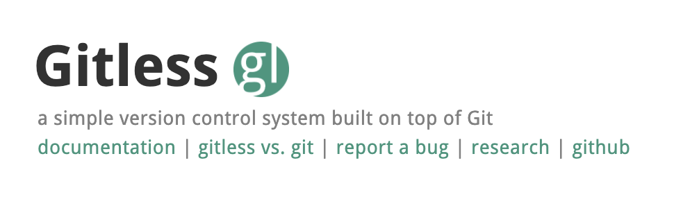

<!-- .slide: data-background="#2aa198" -->
<!-- .slide: data-state="terminal" -->

# Purposes, Concepts, Misfits, and a Redesign of Git (Discussion)

By <a href="http://bkase.com">Brandon Kase</a> / <a href="http://twitter.com/bkase_">@bkase_</a>

!!!

### Why this paper

Why did I pick this paper?

!!!

### Me Background

Git @ Facebook internship in 2012

!!!

### Me Background

Git Student-course as CMU

!!!

### Me Background

The "Git person" at jobs in industry

!!!

### Me Background

I also hate Git's usability, but love it's power

!!!

# The Paper

!!!

### Contributions

* Attempt to improve Git and VCSs in general
* Systematic application of conceptual design to a widely used application\*

Note: Citation needed on how much evidence that provides that it's useful more broadly

!!!

### Contributions

1. List of Operational Misfit scenarios in which Git behaves badly and flaws in the Concepts are to blame
2. The purposes of version control and connection to Git
3. Application of criteria to understand why the Operational Misfits arise
4. Conceptual redesign of Git called Gitless
5. Evaluation in two parts (a) study of StackOverflow questions -- correlating 
Operational Misfits to issues by users and (b) a user study that compares the usability and perceptions of Gitless to Git

!!!

### Conceptual Design

</img>

!!!

### Concept

</img>

Note: Something a user needs to understand in order to use an application

!!!

### Motivating Purpose

</img>

Note: A particular problem that a Concept solves

!!!

### Operational Principle

A scenario that illustrates how the Concept fulfills its Motivating Purpose

!!!

### Operational Misfit

</img>

Note: An Operational Misfit can explain why a Concept may not fit its purpose. Doesn't necessarily conflict with operational principle

!!!

### Criteria for Conceptual Design

</img>

Note: Missing here is "Fulfilment": Motivating Purpose motivates at least one Concept

!!!

### Purposes for VCSs

</img>

Note: See notes if needed

!!!

### Analysis: Git Misfits

</img>

Note: 

!!!

### Analysis: Git Misfits

</img>

Note: 

!!!

### Gitless

</img>

Note: No staging area, File classifications: Tracked, untraked, ignored, in conflict, A branch is an independent line of development (no weirdness swithing branches)

!!!

### Gitless: Usage

</img>

!!!

### Gitless: Break it

</img>

!!!

### Evaluation

1. Find StackOverflow questions that match misfits
2. User study tasks: Success rate + completion time

!!!

### User study results

People did most tasks faster and liked Gitless at least as much as Git

!!!

### Novices

</img>

!!!

### Experts

</img>

!!!

<!-- .slide: data-background="#2aa198" -->
<!-- .slide: data-state="terminal" -->
# Discussion

