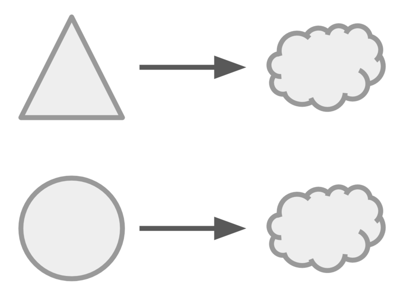
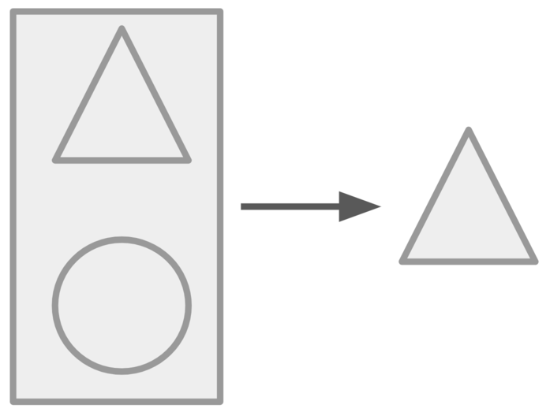
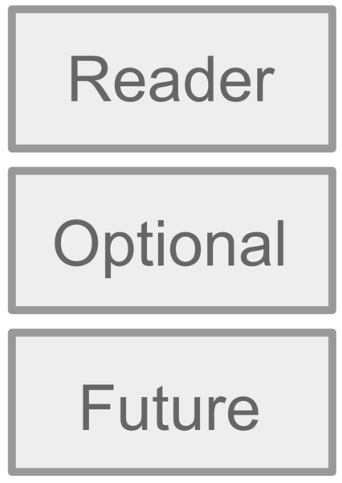
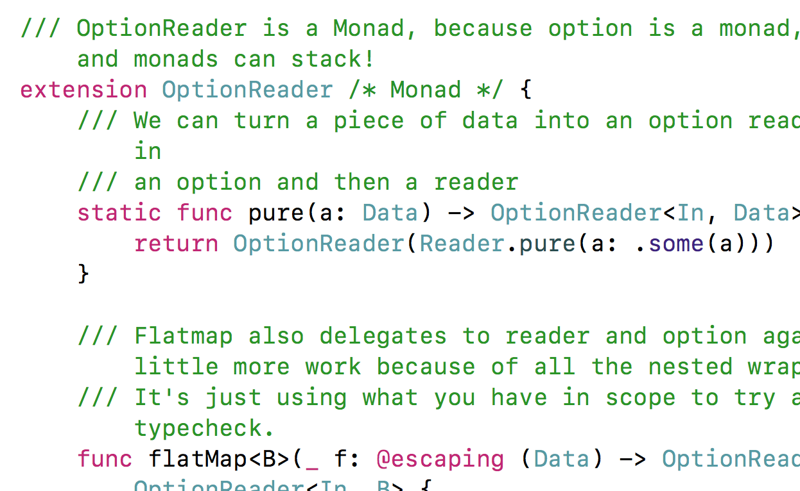

<!-- .slide: data-background="#2aa198" -->
<!-- .slide: data-state="terminal" -->

# Reader or Weep

## Mock-free, Compile-time Checked, Dependency Injection with Reader

By <a href="http://bkase.com">Brandon Kase</a> / <a href="https://www.pinterest.com/brandernan/"><i class="fa fa-pinterest" aria-hidden="true"></i>brandernan</a> / <a href="http://twitter.com/bkase_">@bkase_</a> 

!!!

### This Code is Bad

```swift
class Cache {
  func get(key: Key) -> Value {
    return Data.readFile(key.name) ??
      Network.sharedInstance.get("/api/find", key) ??
      Value.default
  }
  func set(key: Key, value: Value) { /*...*/ }
}
```

```swift
func increment(key: Key) {
  let value = Cache.sharedInstance.get(key: key)
  Cache.sharedInstance.set(key: key, value: value.inc)
}
```
<!-- .element: class="fragment" data-fragment-index="1" -->

!!!

### Why is it bad?

Singletons!

!!!

### singletons?

* A single instance that has mutable state or does side-effects
* Accessed from anywhere via a static property

!!!

### Global Variables

Mutable state that can be accessed from anywhere

Note: These are bad. You learn this early.

!!!

### Singletons are globals!


> https://upload.wikimedia.org/wikipedia/commons/7/73/The_Novel_Reader.jpg

!!!

### Unprincipled usage of state


> http://dl.maxpixel.freegreatpicture.com/?f=books-1082949_1280.jpg&type=Download&token=0089c38f1e35d52df822cbbcd97116fc&pid=1082949

!!!

### The problems:

* Tight _implicit_ coupling to core modules
* <!-- .element: class="fragment" data-fragment-index="1" --> Requires reflection-esque mocking to test (very hard in swift) <!-- .element: class="fragment" data-fragment-index="1" -->

Note: Can't reason about code in small pieces, modularity good for software; You could easily forget a nested dependency and accidentally hit the network in unit tests

!!!

### Let's fix it


> https://pixabay.com/p-1707705/?no_redirect

Note: Instead of implicitly depending on our modules...

!!!

### Dependency Injection


> https://c2.staticflickr.com/8/7005/6636556953_08a05f7fe2_b.jpg

Note: Passing a dependency explicitly. View our dependencies

!!!

### Depend only on that which you say

```swift
// let's say disk and network are protocols
class Cache {
  let disk: Disk
  let network: Network

  init(disk: Disk, network: Network) {
    self.disk = disk
    self.network = network
  }
}
```

Note: This is called dependency injection (if you do it this way, you're already better than most people)

!!!

### Unfortunately, this gets unwieldy fast

```swift
let cache = Cache(disk: disk, network: network)

let module1 = Module1(cache: cache, /*...*/)
// ...
let module2 = Module2(cache: cache, /*...*/)
```

Note: And this doesn't scale to separate compilation units

!!!

### Dependency Injection Frameworks

```swift
let graph = Node()
```

```swift
graph.register(/* ... */)
```
<!-- .element: class="fragment" data-fragment-index="1" -->

```swift
graph.register(/* ... */)
// ...
```
<!-- .element: class="fragment" data-fragment-index="2" -->

```swift
let foo = graph[Foo.self]!
```
<!-- .element: class="fragment" data-fragment-index="3" -->

Note: This is definitely a step up, but see the problem?

!!!

### The problem

```swift
let foo = graph[Foo.self]!
```

Note: You can forget to register a type in your dependency graph and you won't know until runtime! This is not typesafe.

!!!

### Change how we think


> https://c1.staticflickr.com/1/740/31689460193_18d613a3d8_b.jpg

Note: I'm not pitching one particular library, I'm trying to teach you a different way to think about dependencies to hopefully inspire you to create patterns that work for your Swift app/program. What I want to do is show you that the state of the world is bad. We can do better.

!!!

### The solution

Types!

!!!

### Typesafe, just unwieldly

```swift
// let's say disk and network are protocols
class Cache {
  let disk: Disk
  let network: Network

  init(disk: Disk, network: Network) {
    self.disk = disk
    self.network = network
  }
}
```

!!!

### Consider our class with a dependency

```swift
class Cache {
  // ...
  init(data: Data, network: Network)
  // ...
```

```swift
  get //...
  set //...
}
```
<!-- .element: class="fragment" data-fragment-index="1" -->

Note: Key-value cache/store

!!!

### Isomorphic to a collection of functions

```swift
// this is what the cache does
func get(data: Data, network: Network, key: Key) -> Value
func set(data: Data, network: Network, key: Key, value: Value)
```

!!!

### We can group together our dependencies

```swift
struct CacheConfig {
  let data: Data
  let network: Network
}
func get(config: CacheConfig, key: Key) -> Value
func set(config: CacheConfig, key: Key, value: Value)
```

!!!

### Rearrange the parameters

```swift
func get(key: Key, config: CacheConfig) -> Value
func set(key: Key, value: Value, config: CacheConfig)
```

!!!

### Curry the function


> http://maxpixel.freegreatpicture.com/Antiquariat-Antiquarian-Cookbook-Old-Cookbook-Book-1724472

!!!

### Walkthrough of curried get

```swift
// uncurried
func get(key: Key, config: CacheConfig) -> Value {
  return config.findKey(key)
}
let value = get(key: k, config: config)
```

```swift
// curried
func get(key: Key) -> (CacheConfig) -> Value {
  return { config in config.findKey(key) }
}
```
<!-- .element: class="fragment" data-fragment-index="1" -->

```swift
let value = get(key: k)(config)
```
<!-- .element: class="fragment" data-fragment-index="2" -->

```swift
let partialGet = get(key: k)
```
<!-- .element: class="fragment" data-fragment-index="3" -->

```swift
let value1 = partialGet(config1)
let value2 = partialGet(config2)
```
<!-- .element: class="fragment" data-fragment-index="4" -->

!!!

### Curried operations

```swift
func get(key: Key) -> (CacheConfig) -> Value
func set(key: Key, value: Value) -> (CacheConfig) -> ()
```

!!!

### Take a second and think what these operations mean

```swift
func get(key: Key) -> (CacheConfig) -> Value
```

```swift
func set(key: Key, value: Value) -> (CacheConfig) -> ()
```
<!-- .element: class="fragment" data-fragment-index="1" -->

!!!

### Capture the function in a type

```swift
struct Reader<Deps, Data> {
    let run: (Deps) -> Data
}
```

```swift
func get(key: Key) -> Reader<CacheConfig, Value>
func set(key: Key, value: Value) -> Reader<CacheConfig, ()>
```
<!-- .element: class="fragment" data-fragment-index="1" -->


!!!

### Reader me a story


> https://upload.wikimedia.org/wikipedia/commons/6/64/Laura_Muntz_Lyall_-_Interesting_Story_-_Google_Art_Project.jpg

!!!

### Building programs?

```swift
func increment(key: Key) {
  // get the value at the key
  // set the value back incremented
}
```

!!!

### This program depends on the cache

```swift
func increment(key: Key) -> Reader<CacheConfig, ()>
```

!!!

### We need to combine two readers in sequence

```swift
// first get some value
// increment the value
// set the value back in the cache
```

!!!

### Reader flatMap

```swift
// struct Reader<Deps, Data>
func flatMap<NewData>(
```

```swift
  _ f: @escaping (Data) -> Reader<Deps, NewData>
```
<!-- .element: class="fragment" data-fragment-index="1" -->

```swift
) -> Reader<Deps, NewData> {
```
<!-- .element: class="fragment" data-fragment-index="2" -->

```swift
  return Reader<Deps, NewData> { (deps: Deps) -> NewData in
```
<!-- .element: class="fragment" data-fragment-index="3" -->

```swift
    let data: Data = self.run(deps)
```
<!-- .element: class="fragment" data-fragment-index="4" -->

```swift
    let newReader: Reader<Deps, NewData> = f(data)
```
<!-- .element: class="fragment" data-fragment-index="5" -->

```swift
    return newReader.run(deps)
  }
}
```
<!-- .element: class="fragment" data-fragment-index="6" -->

Note: It's saying run the first, then run the second

!!!

### Hooking up increment

```swift
func increment(key: Key) -> Reader<CacheConfig, ()> {
```

```swift
  return get(key: key).flatMap{ value in
    let newValue = value.inc
    return set(key: key, value: newValue)
  }
}
```
<!-- .element: class="fragment" data-fragment-index="1" -->

!!!

### Great it works!


> https://static.pexels.com/photos/269474/pexels-photo-269474.jpeg

!!!

### It's composable!

```swift
func incrementTwice(key: Key) -> Reader<CacheConfig, ()> {
```

```swift
  return increment(key: key).flatMap{ () in
    increment(key: key)
  }
}
```
<!-- .element: class="fragment" data-fragment-index="1" -->

!!!

### It's composable!

```swift
func increment(key: Key, by n: Int) -> Reader<CacheConfig, ()> {
```

```swift
  if n == 0 {
    return Reader.pure( () )
  }
```
<!-- .element: class="fragment" data-fragment-index="1" -->

```swift
  return increment(key: key).flatMap{ () in
    increment(key: key, by: n-1)
  }
}
```
<!-- .element: class="fragment" data-fragment-index="1" -->

!!!

### Combine pure computations

```swift
// struct Reader<Deps, Data>
extension Reader {
```

```swift
  static func pure(a: Data) -> Reader<Deps, Data> {
```
<!-- .element: class="fragment" data-fragment-index="1" -->

```swift
    return Reader<Deps, Data> { _ in a }

  }
}
```
<!-- .element: class="fragment" data-fragment-index="2" -->

Note: If we truly depend on nothing, we can pretend to depend on something

!!!

### Two different dependencies?



!!!

### Use cache and calendar

```swift
func todaysKey() -> Reader<TimeConfig, Key>
func increment(key: Key) -> Reader<CacheConfig, ()>
```

```swift
func incTodaysKey() -> Reader<?, ()> {
  return todaysKey().flatMap{ key in increment(key: key) }
}
```
<!-- .element: class="fragment" data-fragment-index="1" -->

!!!

### Consider the union of the two


!!!

### Lift each one to the global context



!!!

### Lift each into the global

```swift
struct TimeAndCache {
  let time: TimeConfig
  let cache: CacheConfig
}
```

```swift
func incTodaysKey() -> Reader<TimeAndCache, ()> {
```
<!-- .element: class="fragment" data-fragment-index="1" -->

```swift
  return todaysKey().local{ both in both.time }
```
<!-- .element: class="fragment" data-fragment-index="2" -->

```swift
      .flatMap{ key in
```
<!-- .element: class="fragment" data-fragment-index="3" -->

```swift
        increment(key: key).local{ both in both.cache }
      }
}
```
<!-- .element: class="fragment" data-fragment-index="4" -->

!!!

### Local in Reader

```swift
// struct Reader<Deps, Data>
extension Reader {
```

```swift
  func local<Global>(
    _ f: (Global) -> Deps) -> Reader<Global, Data> {
```
<!-- .element: class="fragment" data-fragment-index="1" -->

```swift
    return Reader<Global, Data> { (global: Global) -> Data in
```
<!-- .element: class="fragment" data-fragment-index="2" -->

```swift
      let localDeps: Deps = f(global)
```
<!-- .element: class="fragment" data-fragment-index="3" -->

```swift
      return self.run(localDeps)
    }
  }
}
```
<!-- .element: class="fragment" data-fragment-index="4" -->

!!!

### More effects


> https://pixabay.com/p-1569032/?no_redirect

Note: We can view depending on something as an effect. We may want more effects: our cache maybe will fail to give us a value for example

!!!

### More effects

```swift
func get(key: Key) -> Reader<CacheConfig, Value?>
```

!!!

### How do we combine these?

```swift
// can fail and needs dep
func get(key: Key) -> Reader<CacheConfig, Value?>
// needs dep
func cacheInfo() -> Reader<CacheConfig, Info>
// can fail
func withMetadata(key: Key) -> Key?
```

!!!

### Capture all effects at once

```swift
// capture the failure
func get(key: Key) -> OptionReader<CacheConfig, Value>
```
<!-- .element: class="fragment" data-fragment-index="1" -->

Note: We want to capture this so we flatMap once! The benefits of this will become clear on the next few slides

!!!

### OptionReader

```swift
struct OptionReader<Deps, Data> {
  let reader: Reader<Deps, Data?>
  init(_ reader: Reader<Deps, Data?>) { self.reader = reader }
}
```

```swift
extension OptionReader {
  static func pure(data: Data) -> OptionReader<Deps, Data> {
```
<!-- .element: class="fragment" data-fragment-index="1" -->

```swift
    let someData: Data? = .some(data)
```
<!-- .element: class="fragment" data-fragment-index="2" -->

```swift
    return OptionReader(
```
<!-- .element: class="fragment" data-fragment-index="3" -->

```swift
      Reader<Deps, Data?>.pure( someData )
    )
  }
}
```
<!-- .element: class="fragment" data-fragment-index="4" -->

!!!

### OptionReader map/flatMap

```swift
extension OptionReader {
  func map<NewData>(
      _ f: (Data) -> NewData) -> OptionReader<Deps, Data> {
    /* ... */
  }
```

```swift
  func flatMap<NewData>(
    _ f: (Data) -> OptionReader<Deps, NewData>
  ) -> OptionReader<Deps, NewData> {
    /* ... */
  }
}
```

!!!

### OptionReader reduce noise

```swift
extension OptionReader {
  static func lift(opt: Data?) -> OptionReader {
```

```swift
    return OptionReader(Reader.pure(opt))
  }
```
<!-- .element: class="fragment" data-fragment-index="1" -->

```swift
  static func lift(reader: Reader<Deps, Data>) -> OptionReader {
```
<!-- .element: class="fragment" data-fragment-index="2" -->

```swift
    return OptionReader(reader.map{.some($0)})
  }
}
```
<!-- .element: class="fragment" data-fragment-index="3" -->

!!!

### Less noisy

```swift
typealias O<Value> = OptionReader<CacheConfig, Value>

func loadWithMetadata(key: Key) -> O<Value> {
```

```swift
  O.lift(reader: cacheInfo()).flatMap { info in
```
<!-- .element: class="fragment" data-fragment-index="1" -->

```swift
    O.lift(opt: withMetadata(key: key))
```
<!-- .element: class="fragment" data-fragment-index="2" -->

```swift
  }.flatMap(get)
}
```
<!-- .element: class="fragment" data-fragment-index="3" -->

!!!

### Effects stack



Note: This works for any monad (Future, option, reader, nondeterminism, etc). Unfortunately, in Swift you do have to do this work for your bespoke effect stack in your program, we can't abstract it in a library (unless we codegen)

!!!

### Real life

```swift
// the boilerplate
func foo() -> OptionReader<Config, String> {
  return OptionReader(
    Reader { config in makeFoo(config: config) }
  )
}
```

```swift
private func makeFoo(config: Config) -> String? {
  // your actual logic
}
```
<!-- .element: class="fragment" data-fragment-index="1" -->

Note: Swift's type inference isn't great, and the compiler falls over with errors large closures, so this is a nice model that makes the type checker happy. I used this for a script that needed to make 10 api requests to different services. It worked out really nice because everything just fit together.

!!!

### Real name: Reader Monad


> https://commons.wikimedia.org/wiki/File:Title_page_of_Herodotus%27_history_of_the_Greek_and_Persian_Wars_1502.jpg

Note: bum bum buh

!!!

### Monad?

Do you need to "understand monads" to use Reader? No.

Note: I encourage everyone to try and learn as much as they can, but here you can use Reader without knowing monads. The effects that stack in the way I showed above are all monads

!!!

### Other typesafe DI methods


> https://upload.wikimedia.org/wikipedia/commons/thumb/d/d6/Timeless_Books.jpg/1024px-Timeless_Books.jpg

Note: I have to mention these, for the interested to explore

!!!

### Cake pattern

```swift
protocol Cache: HasData, HasNetwork {
  func get(key: Key) -> Value
  func set(key: Key, value: Value)
}
```

```swift
extension Cache {
  // implementation for get and set
}
```
<!-- .element: class="fragment" data-fragment-index="1" -->

```swift
protocol HasCache {
  var cache: Cache
}
```
<!-- .element: class="fragment" data-fragment-index="2" -->

```swift
protocol Program: HasCache, HasTime {
  func main()
}
extension Program {
  func main() { /*...*/ }
}
```
<!-- .element: class="fragment" data-fragment-index="3" -->

Note: Layers and layers of protocols

!!!

### Free Monads

```swift
enum CacheCommands<Next> {
  case get(key: Key, next: (Value) -> Next)
  case set(key: Key, value: Value, next: () -> Next)
}
```

```swift
// and machinery to make the callbacks
// turn into pures, maps, and flatmaps
// a monad "for free"
```
<!-- .element: class="fragment" data-fragment-index="1" -->

Note: Lots of boilerplate, codegen necessary for use in Swift

!!!

### Swift DI Explorations



> [Swift DI Explorations - https://github.com/bkase/swift-di-explorations ](https://github.com/bkase/swift-di-explorations) Cake, Reader (+ OptionReader), and Free DI patterns

!!!

### Inspire

1. We write code wrong (Singletons)
2. <!-- .element: class="fragment" data-fragment-index="1" --> Singletons are global variables<!-- .element: class="fragment" data-fragment-index="1" -->
3. <!-- .element: class="fragment" data-fragment-index="2" --> Dependency Injection is good (in theory)<!-- .element: class="fragment" data-fragment-index="2" -->
4. <!-- .element: class="fragment" data-fragment-index="3" --> Most DI libraries aren't typesafe<!-- .element: class="fragment" data-fragment-index="3" -->
5. <!-- .element: class="fragment" data-fragment-index="4" --> New ideas!<!-- .element: class="fragment" data-fragment-index="4" -->
6. <!-- .element: class="fragment" data-fragment-index="5" --> Reader provides typesafe DI<!-- .element: class="fragment" data-fragment-index="5" -->
7. <!-- .element: class="fragment" data-fragment-index="6" --> Reader combines with other effects (any monads)<!-- .element: class="fragment" data-fragment-index="6" -->
8. <!-- .element: class="fragment" data-fragment-index="7" --> You can check out Cake and Free for more ideas<!-- .element: class="fragment" data-fragment-index="7" -->
9. <!-- .element: class="fragment" data-fragment-index="8" --> Be inspired<!-- .element: class="fragment" data-fragment-index="8" -->

Note: There is some elegance in the math here. Maybe you can come up with a nice way to fit it in with Protocols!

!!!

# Thanks!

By <a href="http://bkase.com">Brandon Kase</a> / <a href="https://www.pinterest.com/brandernan/"><i class="fa fa-pinterest" aria-hidden="true"></i>brandernan</a> / <a href="http://twitter.com/bkase_">@bkase_</a> 

Slide Deck: [https://is.gd/mjJamZ](https://is.gd/mjJamZ)

[DI Explorations](https://github.com/bkase/swift-di-explorations), [Corridor](https://github.com/symentis/Corridor), [Monads (effect stacks with codegen)](https://github.com/facile-it/Monads)

