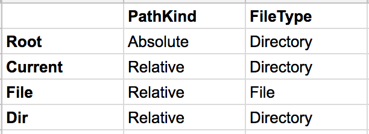

<!-- .slide: data-background="#2aa198" -->
<!-- .slide: data-state="terminal" -->
# Strings Are Evil

A motivation for Phantom Types

By <a href="http://bkase.com">Brandon Kase</a> / <a href="https://www.pinterest.com/brandernan/"><i class="fa fa-pinterest" aria-hidden="true"></i>brandernan</a> / <a href="http://twitter.com/bkase_">@bkase_</a>

!!!

### Strings are sneaky and omnipotent

(picture)

!!!

### Why?

1. <!-- .element: class="fragment" data-fragment-index="1" --> (Sneaky) <!-- .element: class="fragment" data-fragment-index="1" -->
  * <!-- .element: class="fragment" data-fragment-index="1" --> String could be a DB column name? <!-- .element: class="fragment" data-fragment-index="1" -->
  * <!-- .element: class="fragment" data-fragment-index="1" --> String could be a user's name? <!-- .element: class="fragment" data-fragment-index="1" -->

2. <!-- .element: class="fragment" data-fragment-index="2" --> (Omnipotent) There are methods for these distinct things to interact with themselves or each other in strange ways <!-- .element: class="fragment" data-fragment-index="2" -->
  * <!-- .element: class="fragment" data-fragment-index="2" -->Doesn't make sense to concatenate DB column names <!-- .element: class="fragment" data-fragment-index="2" -->
  * <!-- .element: class="fragment" data-fragment-index="2" -->Doesn't make sense to <!-- .element: class="fragment" data-fragment-index="2" -->

Note: (1) too many contexts; database columns, user names, etc (2) We don't want to concatenate database column names, why is that even possible?

!!!

### Conquer the evil strings!


(todo: Add labels nominal, structural, phantom)

> https://www.flickr.com/photos/mypubliclands/28487604443

!!!

### What does this do?

```swift
func mystery(p1: String, p2: String) -> String
```

!!!

### Now what does it do?

```swift
func joinPaths(p1: String, p2: String) -> String
```

Note: Why was this better? We exposed more information with names

!!!

### Now what does it do?

```swift
func joinPaths(p1: String, p2: String) -> String {
  return "<svg>\(p1)\(p2)</svg>"
}
```

!!!

### The example: Joining FilePaths

```swift
func joinPath(p1: String, p2: String) -> String
```

Note: I'm going to focus on file paths throughout this talk as we can cover lots of different options for dealing with strings and it will fit in slides. These same ideas should transfer to other use-cases.

!!!

### How safe are we?

* Humans and compilers don't understand the file path context
* <!-- .element: class="fragment" data-fragment-index="1" --> Invalid file paths can be constructed<!-- .element: class="fragment" data-fragment-index="1" -->
* <!-- .element: class="fragment" data-fragment-index="2" --> Invalid file path joins are permitted<!-- .element: class="fragment" data-fragment-index="2" -->

Note: ... let's make it better

!!!

### Unveil the sneaky String


> https://www.flickr.com/photos/mctrent/4279043790

!!!

### Give it a type

```swift
struct FilePath {
  let s: String
  init(_ s: String) {
    self.s = s
  }
}

func joinPaths(p1: FilePath, p2: FilePath) -> FilePath
```

Note: A sufficiently smart compiler should optimize away the wrapper. Unfortunately, Swift isn't sufficiently smart yet; but it is smart enough to catch the simple mistakes

!!!

### Names not enough

```swift
typealias FilePath = String

func joinPaths(p1: FilePath, p2: FilePath) -> FilePath
```

```swift
func join(
    filePathChunk: String,
    otherFilePathChunk: String
) -> String
```
<!-- .element: class="fragment" data-fragment-index="1" -->

!!!

### Names are unsafe

```swift
let x = user.name
// ... (lots of code and control flow later)
let p = joinPaths(p1: x, p2: "/Hello.swift")
// oops
```

!!!

### Make bad things hard


> https://pixabay.com/p-2399883/?no_redirect

Note: Make it hard to do the wrong thing

!!!

### Path not a string

```swift
struct FilePath {
  let s: String
  init(_ s: String) {
    self.s = s
  }
}

func joinPaths(p1: FilePath, p2: FilePath) -> FilePath
```

!!!

### Compiler saves you from mistakes

```swift
// Compile error!
// cannot convert value of type 'Username' to
// expected argument type 'FilePath'
let p = joinPaths(p1: user.name, p2: user.password)
```

!!!

### Nominal vs Structural typing

```swift
// nominal
struct FilePath { /* ... */ }
```

```swift
// structural
typealias FilePath = String
```

!!!

### But that's not all!

(picture)

!!!

### We get a nice method namespace

```swift
extension FilePath {
  func join(_ other: FilePath) -> FilePath {
    return FilePath(self.s + "/" + other.s)
  }
}
```

Note: We get a space to put domain specific functionality

!!!

### Struct wrapper ergonomics

```swift
extension FilePath:
    ExpressibleByStringLiteral { /* ... */ }

let p: FilePath = "Sources/Hello.swift"
```

!!!

### How safe are we?

* <strike>Humans and compilers don't understand the file path context</strike>
* <!-- .element: class="fragment" data-fragment-index="1" --> Invalid file paths can be constructed<!-- .element: class="fragment" data-fragment-index="1" -->
* <!-- .element: class="fragment" data-fragment-index="1" --> Invalid file path joins are permitted<!-- .element: class="fragment" data-fragment-index="1" -->

Note: ... let's make it better

!!!

### Improper file path

```swift
let p: FilePath = "//Foo//💩/a//.swift"
```

Note: Nothing is stopping the strings from being malformed paths! What about windows style folder slashes?

!!!

### More structured FilePath

(picture)

!!!

### Enums to the rescue

```swift
struct FileName: ExpressibleByStringLiteral { }
struct DirName: ExpressibleByStringLiteral { }
```

```swift
indirect enum FilePath {
```
<!-- .element: class="fragment" data-fragment-index="1" -->

```swift
  case root // /
```
<!-- .element: class="fragment" data-fragment-index="2" -->

```swift
  case current // .
```
<!-- .element: class="fragment" data-fragment-index="3" -->

```swift
  case dirIn(FilePath, DirName)
```
<!-- .element: class="fragment" data-fragment-index="4" -->

```swift
  case fileIn(FilePath, FileName)
```
<!-- .element: class="fragment" data-fragment-index="5" -->

```swift
  // parentIn for ..
}
```
<!-- .element: class="fragment" data-fragment-index="6" -->

Note: This is kind of like a linked list, but there are two base cases and two recursive cases.. it's awkward to deal with these in our programs though

!!!

### Morally, private enum constructors

```swift
struct FileName: ExpressibleByStringLiteral { }
struct DirName: ExpressibleByStringLiteral { }
```

```swift
indirect enum FilePath {
  case _root // /
  case _current // .
  case _dirIn(FilePath, DirName)
  case _fileIn(FilePath, FileName)
}
```
<!-- .element: class="fragment" data-fragment-index="1" -->

!!!

### The public "constructors"

```swift
func file(_ name: FileName) -> FilePath {
  return ._fileIn(._current, escape(name))
}
```

```swift
func dir(_ name: DirName) -> FilePath {
  return ._dirIn(._current, escape(name))
}
```
<!-- .element: class="fragment" data-fragment-index="1" -->

```swift
let root: FilePath = ._root
```
<!-- .element: class="fragment" data-fragment-index="2" -->

```swift
let current: FilePath = ._current
```
<!-- .element: class="fragment" data-fragment-index="3" -->

Note: We can make a nice DSL for file paths for each chunk

!!!

### Then we need to join them

```swift
extension FilePath {
  func join(other: FilePath) -> FilePath {
    switch (self, other) {
    /* ... */
    }
  }
}
```

!!!

### The first join cases

```swift
    case (._current, ._current):
      return ._current
```

```swift
    case (._root, ._current):
      return ._root
```
<!-- .element: class="fragment" data-fragment-index="1" -->

```swift
    case let (._fileIn(p1, f1), ._current):
      return ._fileIn(p1.join(._current), f1)
```
<!-- .element: class="fragment" data-fragment-index="2" -->

```swift
    case let (._dirIn(p1, d1), ._current):
      return ._dirIn(p1.join(._current), d1)
```
<!-- .element: class="fragment" data-fragment-index="3" -->

```swift
    case let (p1, ._fileIn(p2, f2)):
      return ._fileIn(p1.join(p2), f2)
```
<!-- .element: class="fragment" data-fragment-index="4" -->

```swift
    case let (p1, ._dirIn(p2, d2)):
      return ._dirIn(p1.join(p2), d2)
```
<!-- .element: class="fragment" data-fragment-index="5" -->

Note: and there's a few more cases (I'll come back to later)

!!!

### Join on FilePaths: a Semigroup

```swift
// associative (we don't need parentheses)
// closed, binary operation
extension FilePath: Semigroup {
```

```swift
  static func <>(lhs: FilePath, rhs: FilePath) -> FilePath {
    return lhs.join(rhs)
  }
}
```
<!-- .element: class="fragment" data-fragment-index="1" -->

Note: You don't need to know what this means (but you should go watch my last functional swift talk)

!!!

### Finally we can render a path

```swift
extension FilePath {
  func render(pathSeparator: Character = "/") -> String {
    switch self {
      /* recursively go through and render the path */
    }
  }
}
```

!!!

### Enjoy our nice DSL

```swift
let fooPath = dir("Sources") <>
  dir("Models") <>
  file("Foo.swift")

// Sources/Models/Foo.swift
print(fooPath.render())
```

Note: Look at the beauty

!!!

### How safe are we?

* <strike>Humans and compilers don't understand the file path context</strike>
* <strike>Invalid file paths can be constructed</strike>
* <!-- .element: class="fragment" data-fragment-index="1" --> Invalid file path joins are permitted<!-- .element: class="fragment" data-fragment-index="1" -->

Note: Struct wrappers; enums; ... Here's an example of a bad join

!!!

### Joining bad path combinations

```swift
let p = file("Hello.swift") <> dir("/Users/bkase/project")
```

Note: Nothing stops us from joining an absolute path on the right; or a file on the left

!!!


### Make it hard(er) to do the wrong thing

* You can't join with an absolute path on the right
* You can't join with a file on the left

Note: The fundamental problem

!!!

### Unsatisfactory Solution 1

```swift
    case (._current, ._root),
      (._root, ._root),
      (._fileIn(_), ._root),
      (._dirIn(_), ._root):
      // there are a few more cases needed
      // to catch all mismatches

      fatalError("You are appending paths that don't make sense")
    }
  }
}
```

Note: We can runtime fail, but this kind of sucks. We don't want our app to crash. Also, what if I make a mistake and forget some cases?

!!!

### Unsatisfactory Solution 2

```swift
enum AbsolutePathToFile { /* ... */ }
enum AbsolutePathToDirectory { /* ... */ }
enum RelativePathToFile { /* ... */ }
enum RelativePathToDirectory { /* ... */ }

// 16 overloads
func join(/* ... */)
```

Note: Combinatoric explosion of cases to get the safety

!!!

### Phantoms can vanquish our foe

(image of a phantom fighting the evil string)

!!!

### Phantom Path

```swift
indirect enum Path<K: PathKind, T: FileType> {
```

```swift
  case _root // /
  case _current // .
  case _dirIn(Path<K, T>, DirName)
  case _fileIn(Path<K, T>, FileName)
}
```
<!-- .element: class="fragment" data-fragment-index="1" -->

Note: Path is now a phantom type because we don't use K and T in any cases

!!!

### Typesafe Paths

```swift
let p = root <%>
    dir("Users") <%>
    dir("bkase") <%>
    file("Hello.swift")

// Path<Absolute, File>
print(type(of: p))
```

Note: We're going to build up to this

!!!

### Constrain our K and T

```swift
indirect enum Path<K: PathKind, T: FileType>
```

```swift
protocol PathKind {}
```
<!-- .element: class="fragment" data-fragment-index="1" -->

```swift
enum Absolute: PathKind {}
enum Relative: PathKind {}

```
<!-- .element: class="fragment" data-fragment-index="2" -->

```swift
protocol FileType {}
enum Directory: FileType {}
enum File: FileType {}

```
<!-- .element: class="fragment" data-fragment-index="3" -->

Note: You cannot instantiate any PathKind or FileType!

!!!

### Specialize generic type paremeters

```swift
func file(_ name: FileName) -> Path<Relative, File> {
  return ._fileIn(._current, name)
}
```

```swift
func dir(_ name: DirName) -> Path<Relative, Directory> {
  return ._dirIn(._current, name)
}
```
<!-- .element: class="fragment" data-fragment-index="1" -->

```swift
let root: Path<Absolute, Directory> = ._root
```
<!-- .element: class="fragment" data-fragment-index="2" -->

```swift
let current: Path<Relative, Directory> = ._current
```
<!-- .element: class="fragment" data-fragment-index="3" -->

!!!

### Phantom Parameters for Constructors



Note: Fixed Values for our Phantom Parameters

!!!

### Safe join

```swift
extension Path where T == Directory {
```

```swift
  func join<T2>(_ other: Path<Relative, T2>) -> Path<K, T2> {
    switch (self, other) {
      /* same as before */
    }
  }
```

!!!

### Safe join (the rest)

```swift
    // now this is UNREACHABLE
    // assuming no one touches our private cases
    case (._current, ._root),
      (._root, ._root),
      (._fileIn(_), ._root),
      (._dirIn(_), ._root):
      fatalError("Unreachable join cases")
    }
  }
}
```

!!!

### New operator

```swift
// for math reasons
infix operator <%>: TernaryPrecedence
func <%><K, T>(lhs: Path<K, Directory>, rhs: Path<Relative, T2>) -> Path<K, T2> {
  return lhs.join(rhs)
}
```

Note: `<>` is defined on all values within a type

!!!

### Typesafe Paths

```swift
let p = root <%>
    dir("Users") <%>
    dir("bkase") <%>
    file("Hello.swift")

// Path<Absolute, File>
print(type(of: p))
```

!!!

### Typesafe Paths

```swift
// Compile Error!
file("Hello.swift") <%> dir("Sources")
```

```swift
// Compile Error!
dir("Sources") <%> root <%> file("Hello.swift")
```
<!-- .element: class="fragment" data-fragment-index="1" -->

Note: Invariants of file on the left, or absoute on the right unbroken!

!!!

### Typesafe Canonicalization

```swift
extension Path where K == Relative {
  var canonicalize: Path<Absolute, T> {
    /* recursively fixup `..`s */
  }
}
```

!!!

### How safe are we?

* <!-- .element: class="fragment" data-fragment-index="1" --> <strike>Humans and compilers don't understand the file path context</strike> <!-- .element: class="fragment" data-fragment-index="1" -->
* <!-- .element: class="fragment" data-fragment-index="1" --> <strike>Invalid file paths can be constructed</strike> <!-- .element: class="fragment" data-fragment-index="1" -->
* <!-- .element: class="fragment" data-fragment-index="1" --> <strike>Invalid file path joins are permitted</strike> <!-- .element: class="fragment" data-fragment-index="1" -->

Note: struct wrappers, enums, phantoms ... you could say we've

!!!

### Vanquished the evil

(picture of explorer again)

!!!

### Phantoms are powerful

```swift
struct Distance<A> { let v: Int }
let d = Distance<Meters>(4)
let x = Distance<Inches>(3)
```

```swift
struct Tagged<A, B> { let b: B }
```
<!-- .element: class="fragment" data-fragment-index="1" -->

Note: (1) Annotate values with metadata to refine the data, (2) add tags to to things

!!!

### Shout-out

[Purescript pathy library](https://github.com/slamdata/purescript-pathy) invented this representation of file paths

Note: I just succeeded in porting the ideas to Swift

!!!

### What did we explore?

* Raw strings are sneaky and too powerful
* Names/Typealiases (structural typing) are inneficient
* Struct wrappers (nominal typing) prevent mixing up inputs
* Enums prevents invalid states at construction
* Phantom types prevent invalid combinations in operations

!!!

### Strings are evil

(picture)

Note: Strings open us up to preventable logic errors

!!!

<!-- .slide: data-background="#2aa198" -->
<!-- .slide: data-state="terminal" -->

# Thanks!

By <a href="http://bkase.com">Brandon Kase</a> / <a href="https://www.pinterest.com/brandernan/"><i class="fa fa-pinterest" aria-hidden="true"></i>brandernan</a> / <a href="http://twitter.com/bkase_">@bkase_</a> 

Slide Deck: [https://is.gd/edLKW7](https://is.gd/edLKW7)

