<!-- .slide: data-background="#2aa198" -->
<!-- .slide: data-state="terminal" -->

# Rubik's Cubes and Twisty Puzzles

By <a href="http://bkase.com">Brandon Kase</a> / <a href="http://twitter.com/bkase_">@bkase_</a>

Note: Let's begin with a story

!!!

### Ernő Rubik

> https://en.wikipedia.org/wiki/Ern%C5%91_Rubik

Note: Erno Rubik born during WW2, and attended Budapest university of technology becoming Architecture faculty. Then a professor of architecture at Budapest College of Applied Arts.

!!!

### Rubik's Cube

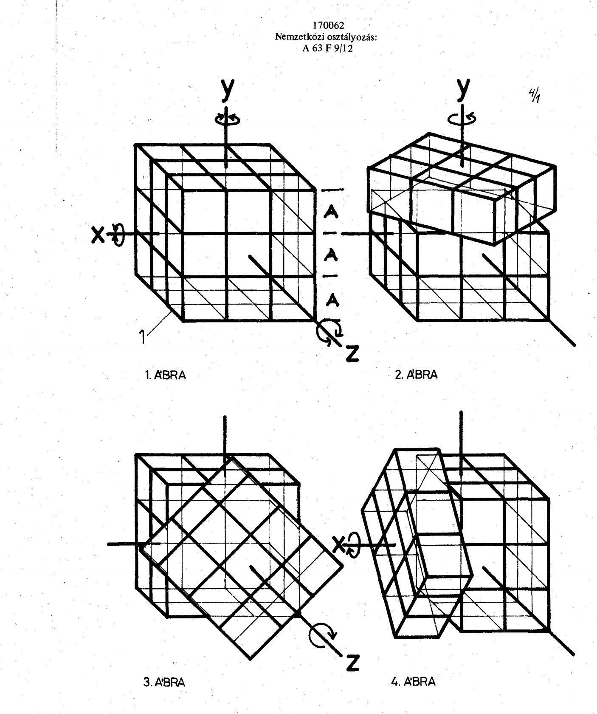</img>

> https://ruwix.com/pics/rubiks-cube/patent/szabadalom.pdf

Note: The rubik's cube was invented and patented in Hungary in 1975. It was released in America in 1980

!!!

### The 80s

<iframe width="80%"
style="height:500px;"
src="https://www.youtube.com/embed/ZcYqApvg4Bc">
</iframe>

Note: in 1980-83 ~200million Rubik's cubes were sold ;; At one stage in 1981 three of the top ten best selling books in the US were books on solving the Rubik's Cube

!!!

### The dead zone 1983-2003

...

!!!

### Early 00s

Note: Explosion of mass appeal because of YouTube -- lots of people using cubes and tutorials

!!!

## Lingo

!!!

### Notation

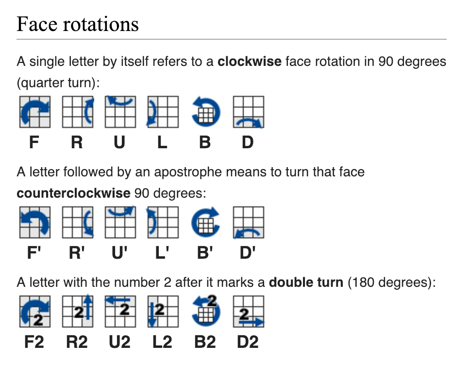</img>

> https://ruwix.com/the-rubiks-cube/notation/

Note: Gives a small name to each of the ways to rotate the cube

!!!

### Algorithm

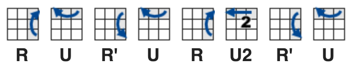

> https://ruwix.com/the-rubiks-cube/notation/

Note: A sequence of rotations to permute your cube from one state to another

!!!

### Solving the 3x3

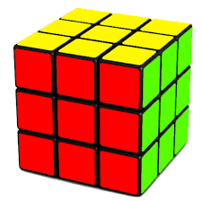

!!!

### Don't take it apart

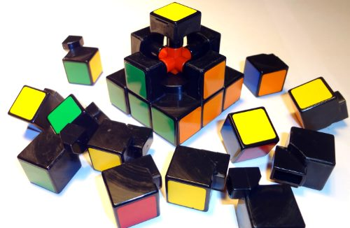

> https://www.google.com/url?sa=i&source=images&cd=&cad=rja&uact=8&ved=2ahUKEwjqks7ytJfgAhWgIjQIHQQGBBEQjRx6BAgBEAU&url=https%3A%2F%2Fruwix.com%2Fthe-rubiks-cube%2Fhow-take-apart-disassemble-the-rubiks-cube-and-put-back-together%2F&psig=AOvVaw0nfzxHwRtNjz26JijbiiSt&ust=1549003241523589

Note: If you take it apart and put it back, there's a 1 in 12 chance it's solvable, but if you give it to someone who speedsolves -- they'll notice exactly what they have to change before they finish solving

!!!

### Don't take off the stickers

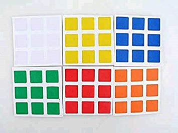

> https://images-na.ssl-images-amazon.com/images/I/51mxvqGRNDL._SX355_.jpg

Note: don't take the stickers off and put them back on randomly, you about 1 in 2.3 hexillion chance that it's solvable

!!!

### All methods

1. Intuition
2.  <!-- .element: class="fragment" data-fragment-index="1" --> Memorization <!-- .element: class="fragment" data-fragment-index="1" -->

Note: Essentially all methods are partitioned into two phases

!!!

### Fridrich method (CFOP)

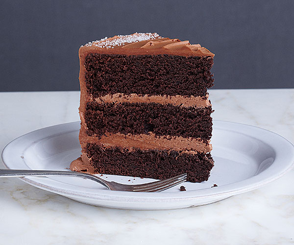

> https://s3.amazonaws.com/finecooking.s3.tauntonclud.com/app/uploads/2017/04/18122053/051141091-02-chocolate-cake-main.jpg

Note: Jessica Fridich popularized the notion of solving the cube layer by layer.

!!!

### Beginner's Fridrich

1. Cross - intuition
2. <!-- .element: class="fragment" data-fragment-index="1" --> First layer - memorization <!-- .element: class="fragment" data-fragment-index="1" -->
3. <!-- .element: class="fragment" data-fragment-index="2" --> Second layer - memorization <!-- .element: class="fragment" data-fragment-index="2" -->
4. <!-- .element: class="fragment" data-fragment-index="3" --> 2-look OLL - memorization <!-- .element: class="fragment" data-fragment-index="3" -->
5. <!-- .element: class="fragment" data-fragment-index="4" --> 2-look PLL - memorization <!-- .element: class="fragment" data-fragment-index="4" -->

!!!

### Cross (intuition)

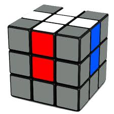

> https://static1.squarespace.com/static/54f2df67e4b079e94c291e4f/t/562c8927e4b0338f86818e67/1445759275666/rubiks+cube+cross+done?format=1500w

!!!

### First layer (memorization)

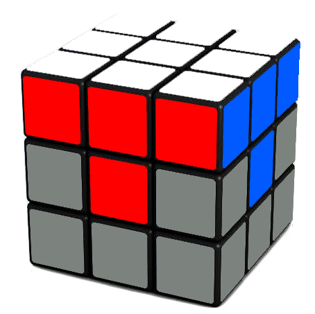

> https://static1.squarespace.com/static/54f2df67e4b079e94c291e4f/t/562c934be4b0bda067d64447/1445761872158/rubiks+cube+first+layer+done

!!!

### Second layer (memorization)

</img>

Note: See the algorithm

!!!

### E-OLL (memorization)

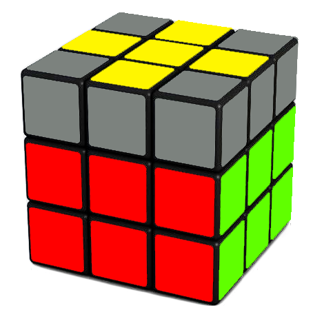

> https://static1.squarespace.com/static/54f2df67e4b079e94c291e4f/t/562c990ee4b0b7066cfa51fd/1445763346097/rubiks+cube+yellow+cross?format=1000w

!!!

### C-OLL (memorization)

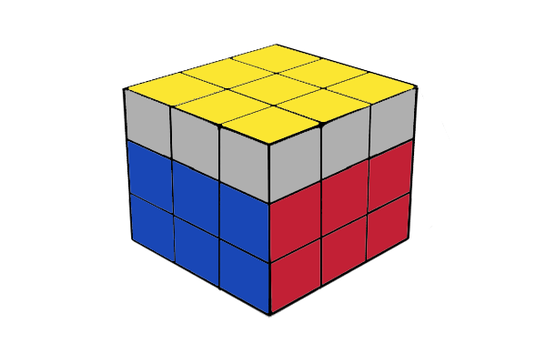

> http://3.bp.blogspot.com/-t8oe7wxLoHg/U_nQKPn0uoI/AAAAAAAAAG8/ueI2DsfRJp8/s1600/oll%2Bdone.png

!!!

### C-PLL (memorization)

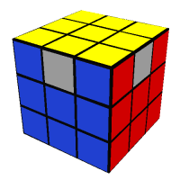

> https://solvethecube.com/img/cubes/yyyyyyyyybxbbbbbbbrxrrrrrrr.png

!!!

### E-PLL (memorization)

> https://static1.squarespace.com/static/54f2df67e4b079e94c291e4f/t/562ca0bae4b03f1a9735d069/1445765311003/solved+rubiks+cube

!!!

### Beginner's Fridrich

1. Cross - intuition
2. First layer - memorization
3. Second layer - memorization
4. 2-look OLL - memorization
5. 2-look PLL - memorization

!!!

### Badmephisto's Fridrich

<iframe width="80%"
style="height:500px;"
src="https://www.youtube.com/embed/609nhVzg-5Q">
</iframe>

!!!

### Badmephisto's Fridrich

1. Cross - intuition 
2. <!-- .element: class="fragment" data-fragment-index="1" --> F2L - intuition <!-- .element: class="fragment" data-fragment-index="1" -->
3. <!-- .element: class="fragment" data-fragment-index="2" --> 2-look OLL - memorization <!-- .element: class="fragment" data-fragment-index="2" -->
4. <!-- .element: class="fragment" data-fragment-index="3" --> 2-look PLL - memorization <!-- .element: class="fragment" data-fragment-index="3" -->

Note: We pushed more to intuition

!!!

### Demo solve

!!!

### Advanced Fridrich

* One-look OLL (57 algorithms)
* <!-- .element: class="fragment" data-fragment-index="1" --> One-look PLL (21 algorithms) <!-- .element: class="fragment" data-fragment-index="1" -->

Note: There are also other variants on the last layer

!!!

### Petrus Method

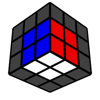

> https://www.speedsolving.com/wiki/images/e/e7/Petrus_method.gif

!!!

### Petrus Method

1. 2x2x2 - intuition
2. <!-- .element: class="fragment" data-fragment-index="1" --> 2x2x3 <!-- .element: class="fragment" data-fragment-index="1" -->
3. <!-- .element: class="fragment" data-fragment-index="2" --> 2x3x3 (only Rs and Us, very fast) <!-- .element: class="fragment" data-fragment-index="2" -->
4. <!-- .element: class="fragment" data-fragment-index="3" --> OLL <!-- .element: class="fragment" data-fragment-index="3" -->
5. <!-- .element: class="fragment" data-fragment-index="4" --> PLL <!-- .element: class="fragment" data-fragment-index="4" -->

Note: I never learned this one

!!!

### ZZ method

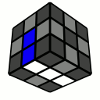

> http://cube.crider.co.uk/eoline.gif

Note: Invented by zbignew and zbrowski. See more at https://www.speedsolving.com/wiki/index.php/ZZ_method

!!!

### ZZ method

1. EO+line - intuition
2. <!-- .element: class="fragment" data-fragment-index="1" --> F2L - intuition (no F or B or D moves ever!) <!-- .element: class="fragment" data-fragment-index="1" -->
3. <!-- .element: class="fragment" data-fragment-index="2" --> LL (OLL/PLL, COLL/EPLL 42+4, one-shot) <!-- .element: class="fragment" data-fragment-index="2" -->

Note: Parity fix, so you don't have to do F, B, or D ever the whole solve

!!!

### AUF here

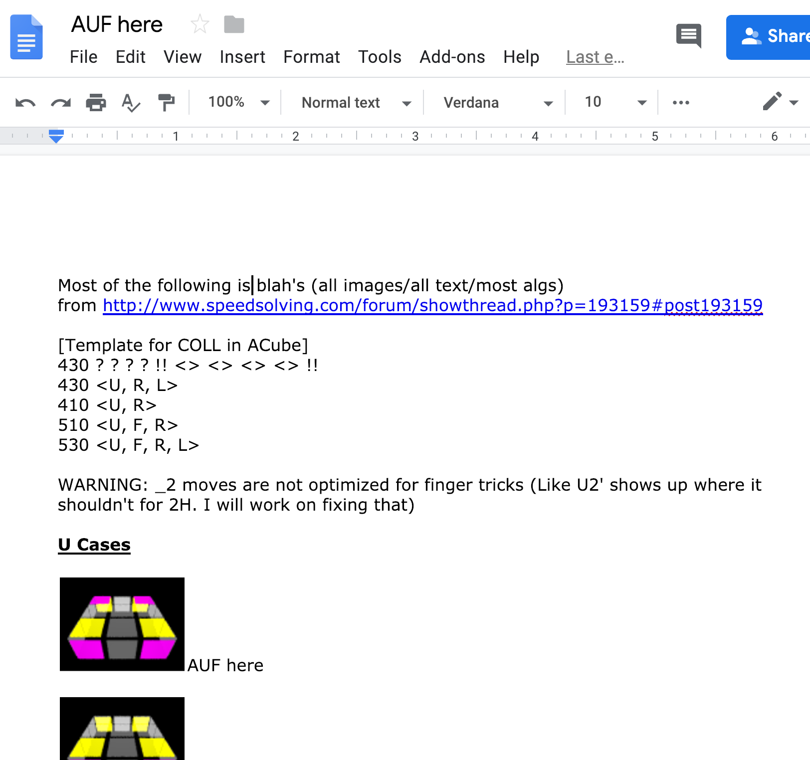</img>

Note: A google doc I made in 2012 of AUF for best COLL algs (11 people have asked me for edit access over the years)

!!!

### Other Twisty Puzzles

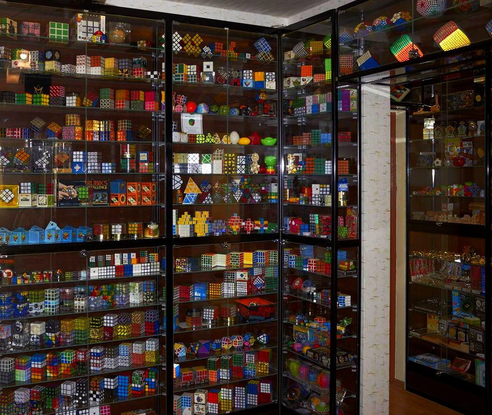</img>

> https://ruwix.com/the-rubiks-cube/my-rubiks-cube-collection-custom-twisty-puzzles/

Note: Rubik's puzzle collection

!!!

### 2010

<iframe width="80%"
style="height:500px;"
src="https://www.youtube.com/embed/dbNL6iYPkO8">
</iframe>

Note: I only asked for twisty puzzles for birthday and hannukah

!!!

### Cube Variants

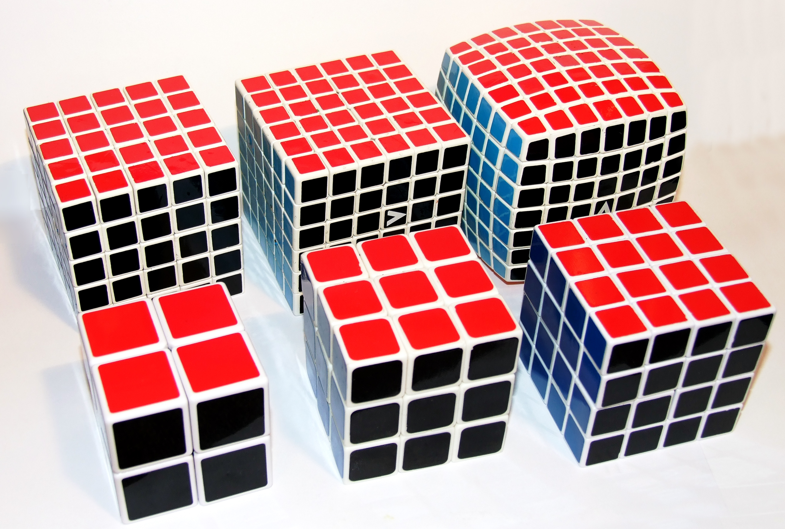</img>

> https://upload.wikimedia.org/wikipedia/commons/4/4f/Rubik%27s_cube%2C_variations_2%C3%972%C3%972_-_7%C3%977%C3%977.jpg

Note: We have different arities: 2x2x2 through 7x7x7 shown here

!!!

### Numbers

Number of permutations on a 3x3x3:

*~43 quintiliion* <!-- .element: class="fragment" data-fragment-index="1" -->

!!!

### Numbers

Number of permutations on a 7x7x7:

*~19.5 duiquinquagintillion* <!-- .element: class="fragment" data-fragment-index="1" -->

!!!

### Mirror cube

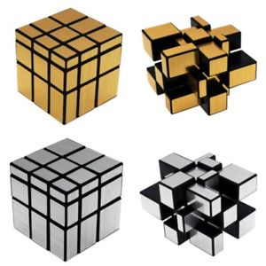

> https://www.google.com/url?sa=i&source=images&cd=&cad=rja&uact=8&ved=2ahUKEwjXnKXzhpfgAhVMIDQIHVtuAgYQjRx6BAgBEAU&url=https%3A%2F%2Fwww.ebay.com%2Fitm%2FNew-Magic-Mirror-Cube-3x3-Puzzle-Rubik-Educational-Brain-Trainer-Speed-Toy-Gift-%2F142966818604&psig=AOvVaw1ybGhBDQLKMEkk5gKZB5lt&ust=1548990853676441

!!!

### Square one

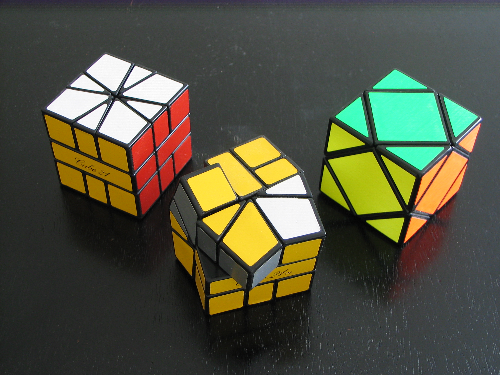</img>

> https://www.google.com/url?sa=i&source=images&cd=&cad=rja&uact=8&ved=2ahUKEwi51OGUh5fgAhVqJTQIHamBDMgQjRx6BAgBEAU&url=https%3A%2F%2Fcommons.wikimedia.org%2Fwiki%2FFile%3ASquare_One_and_Skewb.JPG&psig=AOvVaw1yL-KqDEsXp6a-WagDKlnc&ust=1548990936155389

!!!

### Megaminx Family (dodecahedrons)

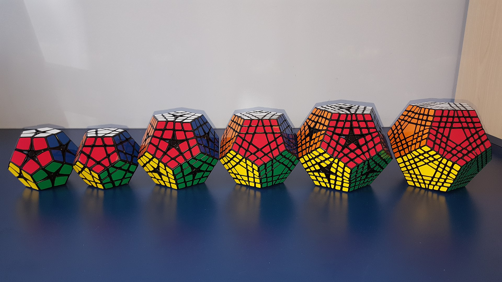

> https://en.wikipedia.org/wiki/Megaminx#/media/File:Megaminx_family.jpg

Note: Kilominx, megaminx, master kilominx, gigaminx, elite kilominx, terraminx

!!!

### Pyraminx (tetrahedron)

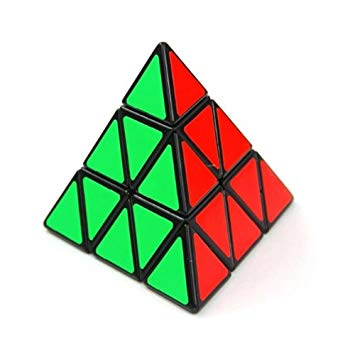

> https://www.google.com/url?sa=i&source=images&cd=&cad=rja&uact=8&ved=2ahUKEwiaw6vmh5fgAhXNoFsKHT1KBzkQjRx6BAgBEAU&url=https%3A%2F%2Fwww.amazon.ca%2FDayan-B00AEI58HI0810-Shengshou-Pyraminx-Speedcubing%2Fdp%2FB00AEI58HI&psig=AOvVaw14ykwFRRAG1_L5pLhQW37t&ust=1548991136026377

!!!

### Rubik's magic

<iframe width="80%"
style="height:500px;"
src="https://www.youtube.com/embed/J2RkhUDXM-Q">
</iframe>

!!!

### Math break

!!!

### Permutation Groups

A group G whose elements are permutations of a given set M

!!!

### Rubik's Cube

M = {1...54}

G = {U, U', U2, F, ...}

Note: Elements are the stickers, operations are the various rotations.

!!!

### Identity

No rotation

!!!

### Inverses

F <=> F'

!!!

### Rotations are associative

(R U) F <=> R (U F)

!!!

### God's number

The smallest number of moves to solve the cube from any position is 20

Note: calculated with 36-CPU years of compute in 2010

!!!

### Math break ends

!!!

### Speed Solving Scene

</img>

> https://previews.123rf.com/images/konstantynov/konstantynov1505/konstantynov150500005/39631988-serious-businessman-wearing-like-superhero-very-fast-running-over-light-grey-background.jpg

!!!

### Latest world record

<iframe width="80%"
style="height:500px;"
src="https://www.youtube.com/embed/YpHfPvuyMZk">
</iframe>

!!!

### World cubing association

> https://www.google.com/url?sa=i&source=images&cd=&cad=rja&uact=8&ved=2ahUKEwjs46yqrZfgAhVNITQIHWtvDisQjRx6BAgBEAU&url=https%3A%2F%2Fwww.worldcubeassociation.org%2F&psig=AOvVaw19oH5PNNGxCKGJ90Ifv061&ust=1549001207810703

!!!

### My stats

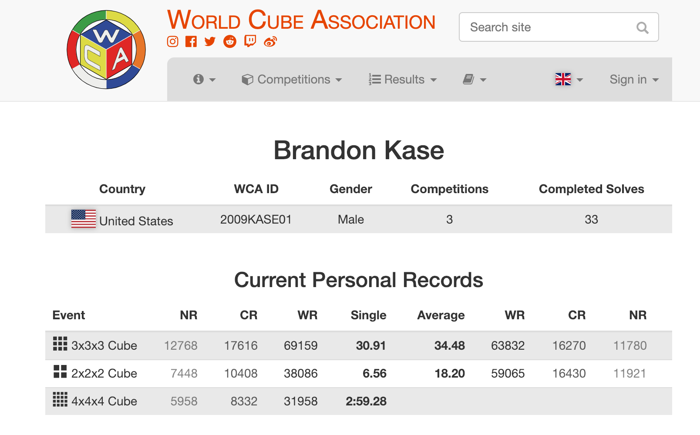

> https://www.worldcubeassociation.org/persons/2009KASE01

Note: People speedsolve all sorts of twisty puzzles, but also 3x3s in different ways (not shown here because I wasn't good enough at those)

!!!

### One-handed

<iframe width="80%"
style="height:500px;"
src="https://www.youtube.com/embed/MPH4Lbg6KPo?start=21">
</iframe>

!!!

### Blindfolded

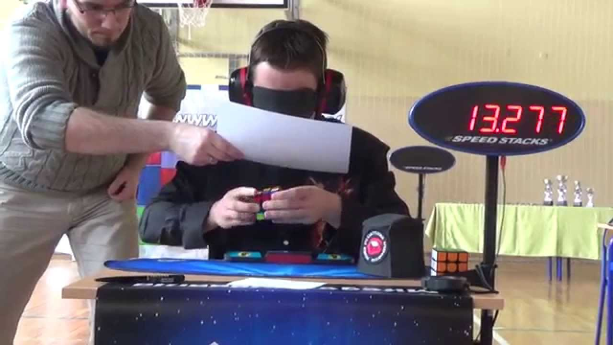

> https://www.google.com/url?sa=i&source=images&cd=&cad=rja&uact=8&ved=2ahUKEwjCn-z8rJfgAhXFIjQIHSbWDWoQjRx6BAgBEAU&url=https%3A%2F%2Fwww.youtube.com%2Fwatch%3Fv%3DPIXVKmr1oUA&psig=AOvVaw0ZRsJ030MaV3kubX4km11P&ust=1549001105886053

!!!

### Feet

<iframe width="80%"
style="height:500px;"
src="https://www.youtube.com/embed/8eBxqbY_b-w">
</iframe>

!!!

### You hyped me up

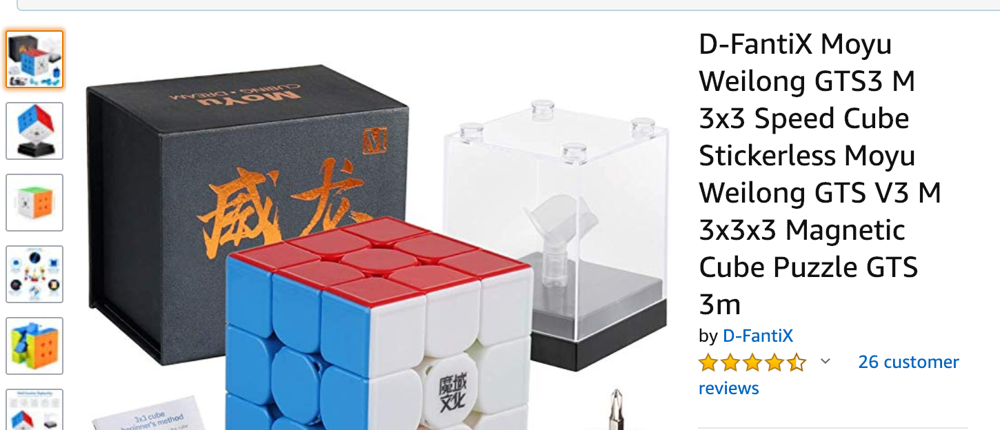

!!!

<!-- .slide: data-background="#2aa198" -->
<!-- .slide: data-state="terminal" -->
# Thanks!

By <a href="http://bkase.com">Brandon Kase</a> / <a href="http://twitter.com/bkase_">@bkase_</a>

Slide Deck: [https://is.gd/E69TRA](https://is.gd/E69TRA)

Succinct Datastructures: [https://is.gd/1q22MX](https://is.gd/1q22MX)

