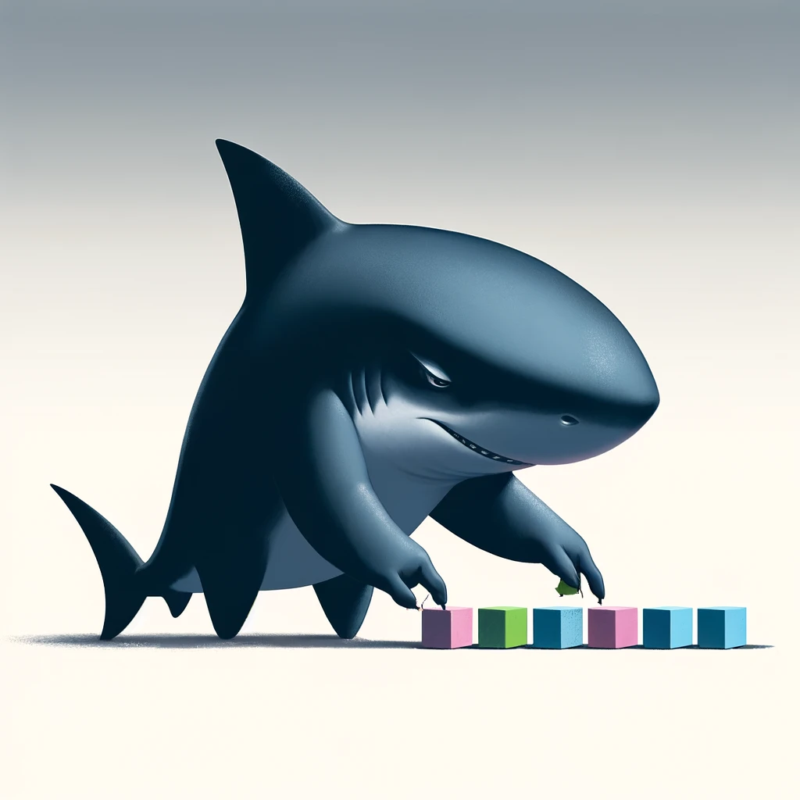

<!-- .slide: data-background="#071448" -->
<!-- .slide: data-state="terminal" -->

# Imagine the Ultimate zk platform

By <a href="http://bkase.com">Brandon Kase</a>  <a href="http://o1labs.org">CEO @ o1Labs</a> / <a href="http://twitter.com/bkase_">@bkase_</a>

Note: I'm brandon founding engineer & ceo at o1labs, maybe I'll tell you more about me at the end. lots to talk about!

!!!

### What might you want?

* <!-- .element: class="fragment" data-fragment-index="1" --> A platform that developers can build upon easily <!-- .element: class="fragment" data-fragment-index="1" -->
* <!-- .element: class="fragment" data-fragment-index="2" --> But powerful enough to really unlock the richest parts of the proof systems <!-- .element: class="fragment" data-fragment-index="2" -->
* <!-- .element: class="fragment" data-fragment-index="3" --> That anyone can participate in safely as operators or users <!-- .element: class="fragment" data-fragment-index="3" -->
* <!-- .element: class="fragment" data-fragment-index="4" --> Where devs can build applications using privacy <!-- .element: class="fragment" data-fragment-index="4" -->
* <!-- .element: class="fragment" data-fragment-index="5" --> But still interact with global shared state, even in a system with untrusted actors <!-- .element: class="fragment" data-fragment-index="5" -->
* <!-- .element: class="fragment" data-fragment-index="6" --> And can build on top of the shoulders of others through shared state <!-- .element: class="fragment" data-fragment-index="6" -->
* <!-- .element: class="fragment" data-fragment-index="7" --> Plus can scale <!-- .element: class="fragment" data-fragment-index="7" -->

Note: Here's one version of that

!!!

### In this talk

* ~~What might you want~~
* <!-- .element: class="fragment" data-fragment-index="1" --> Distilled down into properties <!-- .element: class="fragment" data-fragment-index="1" -->

!!!

### Distilled into properties

* Easy Composability
* <!-- .element: class="fragment" data-fragment-index="1" --> Privacy <!-- .element: class="fragment" data-fragment-index="1" -->
* <!-- .element: class="fragment" data-fragment-index="2" --> Decentralization <!-- .element: class="fragment" data-fragment-index="2" -->
* <!-- .element: class="fragment" data-fragment-index="3" --> Computational Efficiency <!-- .element: class="fragment" data-fragment-index="3" -->
* <!-- .element: class="fragment" data-fragment-index="4" --> Scaling <!-- .element: class="fragment" data-fragment-index="4" -->

Note: Easy for devs, composable under several vectors. Private. Decentralization -- of state, manner, devs, users and all components all the way up and down. Efficient; don't want to do redo computation or pay too much extra for work. And lots of people should be able to do lots of things.

!!!

### In this talk

* ~~What might you want~~
* ~~Distilled down into properties~~
* <!-- .element: class="fragment" data-fragment-index="1" --> How can we do it <!-- .element: class="fragment" data-fragment-index="1" -->

!!!

### How Easy Composability

Note: So we want _easy_ composability while still getting power and juice out of the underlying proof system

!!!

### What is Composability

* Composability lets you mix and match and build complex systems out of small simple lego-like building blocks

!!!

### Composability needs a recursive strangeloop

!!!

### How Composability: Proof Recursion

* Needs to be first-class
* <!-- .element: class="fragment" data-fragment-index="1" --> Unbounded limits for ultimate power <!-- .element: class="fragment" data-fragment-index="1" -->

Note:  Define first-class

!!!

### Recursive proofs are recursive functions

Note: Easy access for devs

!!!

### And in a language people know and understand

Javascript/TypeScript

!!!

### How Composability: Mix & match zkVMs

* If we have deep access to our proof system at the core of the system
* <!-- .element: class="fragment" data-fragment-index="1" --> We should be able to mix-in standard Rust/Go/C via a classic-style zkVM <!-- .element: class="fragment" data-fragment-index="1" -->
* <!-- .element: class="fragment" data-fragment-index="2" --> And through recursion combine with parts containing the deeper circuit-level exposure <!-- .element: class="fragment" data-fragment-index="2" -->

!!!

### How Composability: Mix & match zkVMs

Note: These days, it's powerful to give devs CPU-style zkVM capabilities, but the tradeoff is execution will be slower since we're at a higher-level of abstraction -- it must be woven in

!!!

### How Composability: Contract Composition & Tokens

!!!

### How Composability: Contract Composition & Tokens

* Contracts should call contracts!

!!!

### How Composability: Contract Composition & Tokens

Note: Get the code of all the composing proofs. we can even reuse the same circuit logic for both function calls and enforcing token rules -- Construct a call forest from a list of account updates, where the call-depth field of an account update encodes the Node-Left-Right depth-first traversal order of the update within a tree. A new tree within a forest is indicated by a call-depth of 0. Each successive account update can increase by 1, stay the same, or decrease by an arbitrary amount. Call-depth 0 defines a new tree in the forest, and a non-zero number defines a child of the most recently defined tree.

!!!

### How Easy Composability Total

* Easy composability
    * <!-- .element: class="fragment" data-fragment-index="1" --> via recursion <!-- .element: class="fragment" data-fragment-index="1" -->
    * <!-- .element: class="fragment" data-fragment-index="2" --> or contract/token composition <!-- .element: class="fragment" data-fragment-index="2" -->
    * <!-- .element: class="fragment" data-fragment-index="3" --> using JavaScript/TypeScript <!-- .element: class="fragment" data-fragment-index="3" -->
    * <!-- .element: class="fragment" data-fragment-index="4" --> with an ability to mix-in classical zkVM compute <!-- .element: class="fragment" data-fragment-index="4" -->

!!!

### How?

* ~~Easy Composability~~
* <!-- .element: class="fragment" data-fragment-index="1" --> Privacy <!-- .element: class="fragment" data-fragment-index="1" -->

!!!

### How Privacy: Client-side computation

* We can do this with zk!
* But only if we **prove client-side**

!!!

### How Privacy: Race-reconciliation

!!!

### How Privacy: Race-reconciliation via action/reducer

* Fire actions (increment, increment, increment)
* Reduce later (state=state+3)

!!!

### How?

* ~~Easy Composability~~
* ~~Privacy~~
* <!-- .element: class="fragment" data-fragment-index="1" --> Decentralization <!-- .element: class="fragment" data-fragment-index="1" -->

Note: There's a bunch of vectors that we'd want (i think) in this kind of platform

!!!

### How Decentralization: Retail hardware support

Note: This means expensive work needs to be broken into enough pieces so anyone can handle them.

!!!

### How Decentralization: Sequencing

Note: We need some kind of blockchain-like structure with some kind of consensus algorithm with desirable decentralization properties. Pick your favorite.

!!!

### How Decentralization: Proving

Note: Buffer proving work, farm to a marketplace

!!!

### How Decentralization: User interaction

Note: no middleware, no sacrificing trustlessness

!!!

### How Decentralization: User interaction

We need a single _proof of everything_

!!!

### Proof of Everything

Note: A small proof of everything could be used in the browser so end users could us it

!!!

### How Decentralization: Everything in a snark

* This means that the whole blockchain needs to be in a snark
    * <!-- .element: class="fragment" data-fragment-index="1" --> Every consensus rule <!-- .element: class="fragment" data-fragment-index="1" -->
    * <!-- .element: class="fragment" data-fragment-index="2" --> Every computation by every user <!-- .element: class="fragment" data-fragment-index="2" -->
* <!-- .element: class="fragment" data-fragment-index="3" --> _Aggregated_ incrementally and consistently forever <!-- .element: class="fragment" data-fragment-index="3" -->

!!!

### All consensus logic snarked

Note: Tricky bits like a VRF calculation that calls for real numbers can use a taylor series approxmiation

!!!

### How Decentralization Total

* Decentralization
    * <!-- .element: class="fragment" data-fragment-index="1" --> of participants <!-- .element: class="fragment" data-fragment-index="1" -->
    * <!-- .element: class="fragment" data-fragment-index="2" --> of sequencing (in a snark) <!-- .element: class="fragment" data-fragment-index="2" -->
    * <!-- .element: class="fragment" data-fragment-index="3" --> of proving <!-- .element: class="fragment" data-fragment-index="3" -->
    * <!-- .element: class="fragment" data-fragment-index="4" --> of end-user usage <!-- .element: class="fragment" data-fragment-index="4" -->

!!!

### How?

* ~~Easy Composability~~
* ~~Privacy~~
* ~~Decentralization~~
* <!-- .element: class="fragment" data-fragment-index="1" --> Computational Efficiency <!-- .element: class="fragment" data-fragment-index="1" -->

!!!

### How: Computational Efficiency

!!!

### How: Computational Efficiency

* If we have client-side compute
    * <!-- .element: class="fragment" data-fragment-index="1" --> Gas is predictable <!-- .element: class="fragment" data-fragment-index="1" -->
    * <!-- .element: class="fragment" data-fragment-index="2" --> Backend services evaporate <!-- .element: class="fragment" data-fragment-index="2" -->

!!!

### How?

* ~~Decentralization~~
* ~~Privacy~~
* ~~Easy Composability~~
* ~~Computational Efficiency~~
* <!-- .element: class="fragment" data-fragment-index="1" --> Scaling <!-- .element: class="fragment" data-fragment-index="1" -->

!!!

### How: Scaling

Note: If we have a proof of everything with first-class recursion, we can just make zk-rollups recursive on themselves ad-infinitum

!!!

### How Summary

* Easy Composability
    * <!-- .element: class="fragment" data-fragment-index="1" --> through recursion <!-- .element: class="fragment" data-fragment-index="1" -->
    * <!-- .element: class="fragment" data-fragment-index="2" --> through contract calls and tokens <!-- .element: class="fragment" data-fragment-index="2" -->
* <!-- .element: class="fragment" data-fragment-index="3" --> Privacy <!-- .element: class="fragment" data-fragment-index="3" -->
* <!-- .element: class="fragment" data-fragment-index="4" --> Decentralization <!-- .element: class="fragment" data-fragment-index="4" -->
    * <!-- .element: class="fragment" data-fragment-index="5" --> of participants <!-- .element: class="fragment" data-fragment-index="5" -->
    * <!-- .element: class="fragment" data-fragment-index="6" --> of sequencing (in a snark) <!-- .element: class="fragment" data-fragment-index="6" -->
    * <!-- .element: class="fragment" data-fragment-index="7" --> of proving <!-- .element: class="fragment" data-fragment-index="7" -->
    * <!-- .element: class="fragment" data-fragment-index="8" --> of end-user usage <!-- .element: class="fragment" data-fragment-index="8" -->
* <!-- .element: class="fragment" data-fragment-index="9" --> Computational Efficiency <!-- .element: class="fragment" data-fragment-index="9" -->
* <!-- .element: class="fragment" data-fragment-index="10" --> Scaling <!-- .element: class="fragment" data-fragment-index="10" -->

Note: Composability through recursion easily and clientside using recursive functions in javascript, contracts calls and tokens with clever circuit reuse. Privacy needs client-side compute. Decentralization of participants, through building with retail hardware, of sequencing using consnsus (in a snark!), with proving through a system for staging and farming proofs to a prover marketplace, and rolling everything up always and incrementally in a proof of everything.  Computational efficiency via edge compute, this means predictable gas. Scale through this proof of evyerhitng with zk rollup L2s, L3s, and Linfinities.

!!!

### In this talk

* ~~What might you want~~
* ~~Distilled down into properties~~
* ~~How can we do it~~
* <!-- .element: class="fragment" data-fragment-index="1" --> Surprise <!-- .element: class="fragment" data-fragment-index="1" -->

!!!

### Surprise, this is Mina

Note: If you knew me, you'd know I was shilling, but hopefully I surprised some of the room. We have designs and implementation of all that shit

!!!

### On Mina mainnet for last 3+ yrs

* proof of everything (for payments) using a pickled proof system (plonkish/halo2ish w/ IPA over Pasta)
* <!-- .element: class="fragment" data-fragment-index="1" --> Decentralized sequencing (ouroboros in a snark) <!-- .element: class="fragment" data-fragment-index="1" -->
* <!-- .element: class="fragment" data-fragment-index="2" --> Decentralized proving (snarketplace) <!-- .element: class="fragment" data-fragment-index="2" -->

!!!

### On Mina Mainnet soon: Client-side compute

Note: client-side compute with zkApps , off-chain composable through call forests , action/reducer-style race-reconciliation + more

!!!

### On Mina Mainnet soon: Powerful proof system

Pickled kimchi (plonkish/halo2ish w/ IPA over pasta)

Note: Better, faster, more powerful proof system

!!!

### On Mina Mainnet soon: Dapps w/ full-nodes in the browser/phone

Note: (after the initial upgrade sometime soon)

!!!

### On Mina Mainnet soon: Programmable

* Programmable with TypeScript framework o1js
    * <!-- .element: class="fragment" data-fragment-index="1" --> Recursive functions are recursive proofs <!-- .element: class="fragment" data-fragment-index="1" -->
    * <!-- .element: class="fragment" data-fragment-index="2" --> 2yr+ of iterations on usability w/ devs <!-- .element: class="fragment" data-fragment-index="2" -->
    * <!-- .element: class="fragment" data-fragment-index="3" --> Custom gates <!-- .element: class="fragment" data-fragment-index="3" -->
    * <!-- .element: class="fragment" data-fragment-index="4" --> Cool libraries like ECDSA + nullifiers etc. <!-- .element: class="fragment" data-fragment-index="4" -->

!!!

### On Mina Mainnet soon: Bridge proof-of-everything to EVM

Note: Mina blockchain proof of everything zk state bridging to evm (nil or Lambdaclass or via alignedlayer)

!!!

### On Mina Mainnet soon: Scale via rollups and rollup-sdks

Note: zeko and protokit

!!!

### Wen Soon

June 4th

Note: Mina ecosystem participants community and exchanges need to test on devnet, etc. 

!!!

### And beyond... Mina upgrade

* integrate o1vm (a high performance MIPS zkVM inside kimchi) into zkApps 
* <!-- .element: class="fragment" data-fragment-index="1" --> More performance <!-- .element: class="fragment" data-fragment-index="1" -->
* <!-- .element: class="fragment" data-fragment-index="2" --> More powerful capabilities to the zkApp system <!-- .element: class="fragment" data-fragment-index="2" -->
* <!-- .element: class="fragment" data-fragment-index="3" --> More bridges <!-- .element: class="fragment" data-fragment-index="3" -->
* <!-- .element: class="fragment" data-fragment-index="4" --> More L2s and app chains <!-- .element: class="fragment" data-fragment-index="4" -->

!!!

### o1Labs is cool

Note: We incubated Mina and still work on it. We do other zk stuff in and around Mina

!!!

### Join us: Open roles

* EM for Ecosystem Exploration Team
* ZK Applications Solutions Architect
* SDK Engineer
* Marketing & Communications Manager
* Protocol Product Manager

..and apply anyway even if you don't fit into one of these boxes <!-- .element: class="fragment" data-fragment-index="1" -->

!!!

<!-- .slide: data-background="#071448" -->
<!-- .slide: data-state="terminal" -->
# Thanks!

By <a href="http://bkase.com">Brandon Kase</a>  <a href="http://o1labs.org">CEO @ o1Labs</a> / <a href="http://twitter.com/bkase_">@bkase_</a>

O(1) Labs: [https://o1labs.org](https://o1labs.org)
Mina: [https://minaprotocol.com](https://minaprotocol.com)

Note: Join the community. Build zkApps with o1js. Contribute to Mina.

