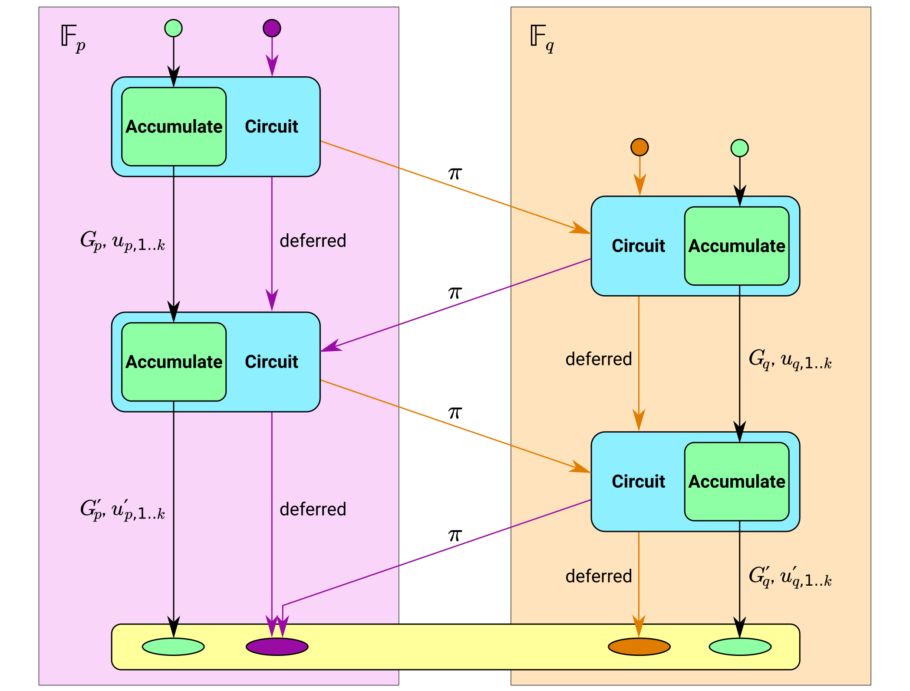
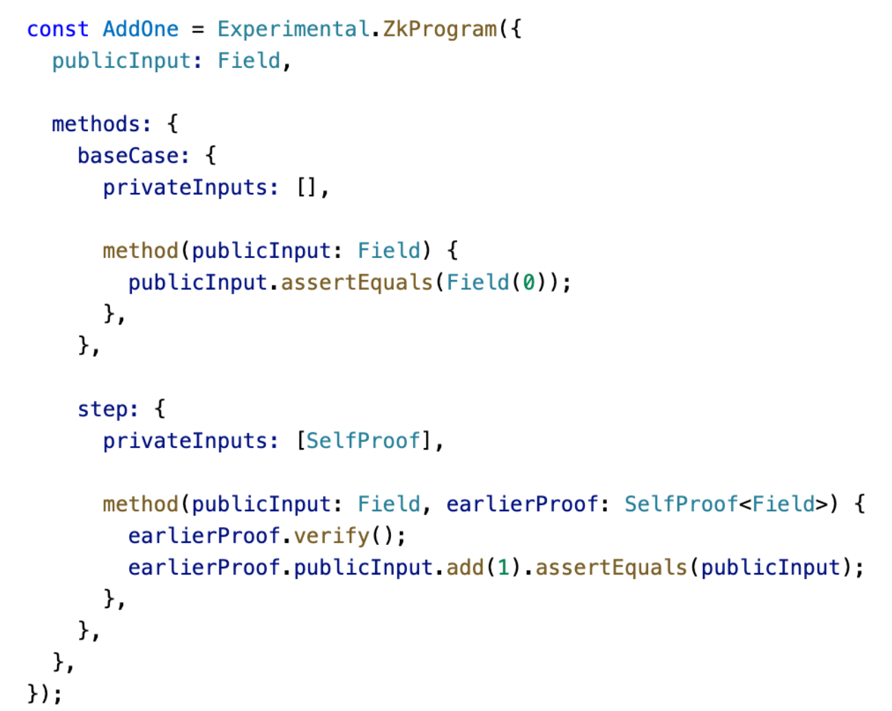
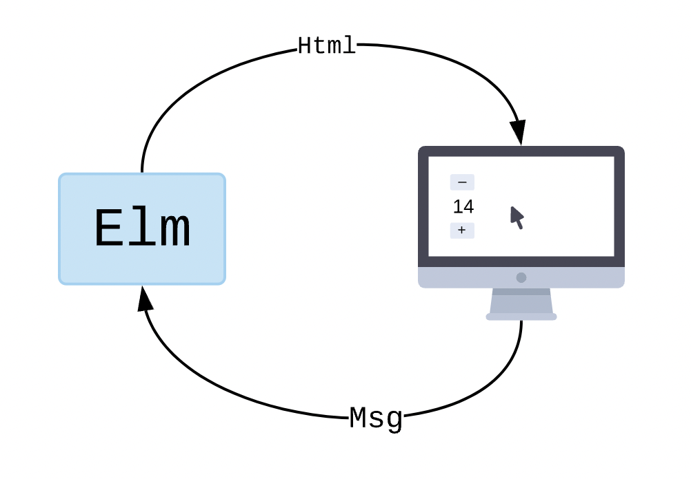

<!-- .slide: data-background="#071448" -->
<!-- .slide: data-state="terminal" -->

# ZK DSL Usability Challenges

By <a href="http://bkase.com">Brandon Kase</a>  <a href="http://o1labs.org">CTO @ O(1) Labs</a> / <a href="http://twitter.com/bkase_">@bkase_</a>

Note: 

!!!

### We build o1js (formerly SnarkyJS)

</img>

Note: And also the Mina Protocol and Kimchi proof system and other zk things

!!!

### We build o1js (formerly SnarkyJS)

a tool for building private applications (direct circuits + on top of Mina)

a ZK DSL (over zkSNARKs)
<!-- .element: class="fragment" data-fragment-index="1" -->

...and experienced challenges when thinking about usability
<!-- .element: class="fragment" data-fragment-index="2" -->

Note: A lot of my opinions about tradeoff spaces I'll discuss is reflected in the design of o1js so if you want to consume this in another form, go download o1js and play with it! Hence.. ZK DSL Usability Challenges 

!!!

### zkSNARK

* Zero
* Knowledge
* Succinct
* Non-interactive
* Argument of
* Knowledge

Note: Assuming folks in this room are familiar. Basically, we can argue that we know a thing, without a counterparty learning that thing, and they can check it fast

!!!

### SNARK statements

_There exists_ data _such that_ predicates hold on that data

Note: My mental model.. There exists DATA s.t. PROPERTY

!!!

### SNARKs at Runtime

Typically, this boils down to constraints in some kind of constraint&nbsp;system

Note: whether it be R1CS or a PLONKish constraint system

!!!

### SNARKs Representation Question

</img>

> http://maxpixel.freegreatpicture.com/Face-Female-Girl-Looking-Adult-Isolated-Cute-15814

Note: So something at some point needs to describe these constraints to represent some computation

!!!

### SNARKs Representation Choice

* Directly manipulate constraints
*  <!-- .element: class="fragment" data-fragment-index="1" --> (Close to) direct -- arkworks/halo2 <!-- .element: class="fragment" data-fragment-index="1" -->
* <!-- .element: class="fragment" data-fragment-index="2" -->Slightly higher level -- Circom <!-- .element: class="fragment" data-fragment-index="2" -->
* <!-- .element: class="fragment" data-fragment-index="3" --> Higher again -- o1js or Noir <!-- .element: class="fragment" data-fragment-index="3" -->
* <!-- .element: class="fragment" data-fragment-index="4" --> Indirect via a zkVM -- zkEVM, Cairo, RiscZero <!-- .element: class="fragment" data-fragment-index="4" -->

Note: In halo2 or arkworks, you're controlling proof system low level internals and building constraints or constraint-like constructs. In circom, you have little shorthands to express constraints more concisely, but you can't build up data; there's a notion of outputs as well as inputs. At the next level, we can build bijections between composite data types and field elements, we have real functions. Finally, we can use full languages that compile/interpret into low level code interpreted by the VM.

!!!

### To what extent do you abstract away the runtime?

</img>

Note: For 

!!!

### Abstraction Tradeoffs

* More indirect = more flexible interface choices
* More direct = deeper access to underlying proof system

Note: The further you get away from the runtime representation, the more flexibility you have for shaping the language, but the less power users have.

!!!

### Abstraction Tradeoffs: Recursion

</img>

> https://zcash.github.io/halo2/background/recursion.html

Note: Recursion directly at the halo2/arkworks level is powerful! A developer can tune many aspects to suit the problem domain. Typically it's done from scratch at this level, but you could imagine creating some pattern here, but is this really the right abstraction level for application developers?

!!!

### Abstraction Layer Choice: Recursion

Actual recursion at the zkVM layer (ie not just folding instructions), is an unexplored space


Note: Unexplored space, but it's not clear exactly how this would work and sitll expose all the features of recursive proofs. Performance? It requires working with more than one proof system -- requires a lot of effort to implement + we're pushing a lot of computation to the runtime.

!!!

### Abstraction Layer Choice: Recursion

</img>


Note: Recursive proofs are recursive functions. Cycles of curves are hidden from you (jump back immediately so circuits are all in one base Field). You can do all the nice things I mentioned before. -- Blockchains process transactions in blocks is an infinite processes that incrementally progresses over time. Maximize your computing power by farming incremental proof work to multiple machines to analyze large datasets and solve complex equations. In games like chess or social networks, different players incrementally take turns "making moves"--we can prove that these moves are correct at each step! 🌐

!!!

### Abstraction Layer Choice

</img>

> http://images.medicaldaily.com/sites/medicaldaily.com/files/styles/headline/public/2013/08/04/0/62/6242.jpg

Note: So for building private applications, we chose this point for o1js, and can go deep down to the guts but this leads...

!!!

### Open Challenge: Cleanly integrate zkVM and circuits all at once

</img>

> https://c1.staticflickr.com/2/1618/26663431642_3ee25eb693_b.jpg

Note: O(1) Labs has a MIPS zkVM prototype which is being further devloped for an OP Stack RFP. We want to integrate this back into o1js.

!!!

### Usability Axes

* Choose your abstraction layer

!!!

### DSL Structure

Now the question is what is the language class that you want to work with?

Note: DSL stands for Domain-specific-language

!!!

### Choices

* If you're making a zkVM, you can choose to target a real machine like we're doing with zkMIPS or RiscZero is doing with zkRISCV and others are experimenting with zkWASM
* Otherwise you'll need a new "language"...

!!!

### Tension: To embed, or not to embed

* External DSL -- a language with its own syntax/semantics/runtime
* Embedded DSL -- embedded in a host languages, leverage the syntax and features of the host language

Note: 

!!!

### External DSL

```html
<body>
    <div>
        <button>a button</button>
    </div>
</body>
```

Example: HTML is an external DSL for describing the content of web pages

!!!

### Embedded DSL

```js
$('div.test')
  .on('click', handleTestClick)
  .addClass('foo');
```

Example: jQuery is an embedded DSL for manipulating web UIs (inside of the host JavaScript)

!!!

### Strong opinion alert

</img>

> https://c1.staticflickr.com/4/3198/2683098551_d798ab5f4c.jpg

Note: sorry

!!!

### Rant part1

* <!-- .element: class="fragment" data-fragment-index="1" --> It's _fun_ to build new programming languages. <!-- .element: class="fragment" data-fragment-index="1" -->
* <!-- .element: class="fragment" data-fragment-index="2" --> I enjoy learning new programming languages because _I_ love studying programming language theory and its application to engineering <!-- .element: class="fragment" data-fragment-index="2" -->
* <!-- .element: class="fragment" data-fragment-index="3" --> and even with this background, I can't imagine _as a user_ any examples of preferring external DSLs with less than decades of person-engineering-years of effort <!-- .element: class="fragment" data-fragment-index="3" --> 

Note: sorry

!!!

### Rant part2

* ZK DSL authors immediately put themselves _years behind_ by choosing a standalone DSL 
* <!-- .element: class="fragment" data-fragment-index="1" --> The language itself is limited in scope. That's the "domain-specific" part, but that limits usages! Loops don't quite work, I can't quite assign this to a variable, etc. <!-- .element: class="fragment" data-fragment-index="1" -->
* <!-- .element: class="fragment" data-fragment-index="2" --> The tools around the language need to be rebuilt! Editor support, package management, build, etc <!-- .element: class="fragment" data-fragment-index="2" -->

!!!

### Rant part3


* Application developers _in general_ don't want to learn new languages, especially if they're trying to build and ship a product, and they sure as hell don't want to be stuck with something half-broken and with poor tools
* <!-- .element: class="fragment" data-fragment-index="1" --> And for what benefit even!? making if-statements slightly cleaner? Not worth it! <!-- .element: class="fragment" data-fragment-index="1" -->

!!!

### Rant part4

* This is true _always_ not just for ZK
* <!-- .element: class="fragment" data-fragment-index="1" --> ...so it's true for ZK DSLs <!-- .element: class="fragment" data-fragment-index="1" -->

!!!

### Usability Axes

* Choose your abstraction layer
* Choose to embed or not to embed (choose embed!)

!!!

### Embed where?

</img>

!!!

### Embed where?

* The question is who are you targeting, and what should those devs do?

!!!

### Web web web

* If you want to reach the most application developers, you need to target web developers.
* <!-- .element: class="fragment" data-fragment-index="1" --> If you are targeting (the most) web developers, you need to embed inside TypeScript/JavaScript <!-- .element: class="fragment" data-fragment-index="1" -->
* <!-- .element: class="fragment" data-fragment-index="2" --> If you want your developers to reach the most users, you need the runtime to support web browsers <!-- .element: class="fragment" data-fragment-index="2" -->

Note: You can't have private applications if you don't have at least PART of your runtime running client-side and you better run it in a web browser if you want desktop users to use it. And even on mobile, web seems to be the prime distribution runtime for web3

!!!

### Usability Axes

* Choose your abstraction layer
* Choose to embed or not to embed (embed!)
* Choose where you embed

!!!

### Now: Choose where and what and how you abstract

</img>

!!!

### Examples of abstraction choices

1. Provable vs circuit
1. Collapsing constants and constraint variables
1. Action/reducers

Note: Quick sampling of a few of these

!!!

### Nomenclature choice

Circuit -> Provable

Note: We decided to rename the "circuit" notion to instead a "provable" one. Circuit is an implementation detail while a "provable" block represents intent. The tradeoff here is hiding irrelevant details to make it more friendly for newcomers. Those curious could dig into docs to understand that circuits back provables.

!!!

### Collapsing constants and constraint variables

</img>

Note: Right now, our Field abstraction merges the concept of constants and constraint variables, and it's supposed to be simple, but it's confusing for people who want to understand if it's happening. More magical things are easier for folks to get something working quicker, but then harder when you get more advanced to understand what's happening. This is an active tension that we explore

!!!

### Action/Reducer

</img>

!!!

### Elm Architecture

</img>

Note: Representation of a state machine and system for managing concurrent interrupts (button presses, networking IO etc)

!!!

### Redux / useReducer

```js
const reducer = (state, action) => (
  { age: state.age + action.older }
)

const [state, dispatch] =
    useReducer(reducer, { age: 42 });
```

Note: This is instantiated in React and thus familiar to millions of develoeprs

!!!

### Client-side computation

Client-side ZK proving over shared state induces a concurrency issue

!!!

### Client-side computation @ action/reducer

Resolve conccurency issues by dispatching actions, and then resolve them against the state machine later

!!!

### Action/Reducer API

```js
const reducer = (state, action) => (
  state + action.older
)

let { state, actionState } = this.reducer.reduce(
  actions, stateType, reducer,
  { state: Field(42), actionState: /*...*/ }
);
```

Note: Make it feel like React!

!!!

### Action/Reducer

Moral: Design APIs similar to those that devs already know

!!!

### Usability Axes

* Choose your abstraction layer
* Choose to embed or not to embed (embed!)
* Choose where you embed
* Choose what, where, when, and how you abstract

!!!

<!-- .slide: data-background="#071448" -->
<!-- .slide: data-state="terminal" -->
# Thanks!

By <a href="http://bkase.com">Brandon Kase</a>  <a href="http://o1labs.org">CTO @ O(1) Labs</a> / <a href="http://twitter.com/bkase_">@bkase_</a>

O(1) Labs: [https://o1labs.org](https://o1labs.org)

!!!

## Appendix

